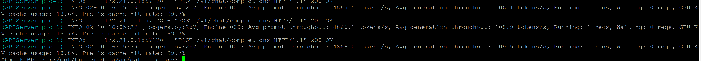
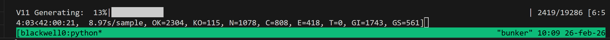
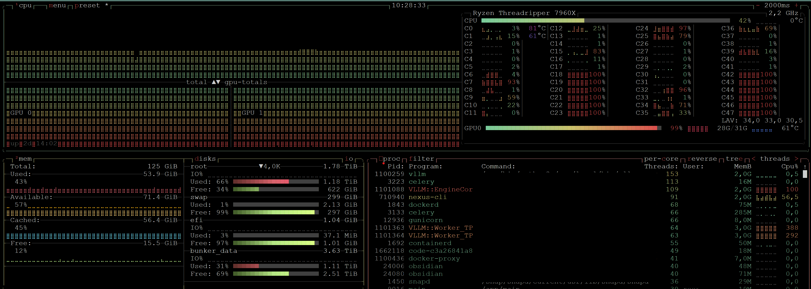

# Architect-Expert-Gap-Forge (AEGF) 🛠️🧠

**Bridging the LLM Knowledge Gap via Synthetic Data Synthesis & Specialized SFT.**

## 📌 Project Overview

AEGF is a high-performance pipeline designed to solve the **Knowledge Cutoff problem** in Large Language Models. While frontier models are excellent generalists, they often hallucinate or fail when dealing with rapidly evolving APIs, legacy-to-modern migrations, or domain-specific architectures (e.g., Home Assistant 2026 standards).

This project provides the infrastructure to:
1. **Extract "Gold Code"** from high-star production repositories.
2. **Inject "API Deltas"**: Real-time context from Changelogs and Breaking Changes.
3. **Synthesize "Platinum-Tier" Trajectories**: Generating `<think>` and `<tool_call>` datasets via a hybrid gold‑injection scheme (GI vs GS) that balances fidelity with corrective learning.
4. **MoE-Aware Fine-Tuning**: Specialized SFT protocols for Mixture-of-Experts architectures on NVIDIA Blackwell (sm_120).

---

## 🏗️ The Sovereign Data Factory: Architecture

AEGF is structured as a modular, **5-stage industrial pipeline**. The core engine is agnostic and driven by external configuration, although the current repository ships with Home Assistant–centric examples and master documents.  
> TODO: when repurposing the factory for other domains, replace or remove HA-specific references.

### Stage 1 — Discovery (`src/discovery/`)
**Engine:** `ingestor.py`

Purpose: Curated repository ingestion that builds the "Raw Gold" source corpus used by later synthesis stages. The engine is fully **domain-agnostic** — behaviour is driven exclusively by external YAML configuration files (`configs/*.yaml`).

#### Modes (set via `mode:` in the YAML config)

- **`static` (Primary / Recommended):** Clones a hand-picked list of vetted repositories defined under `static_repos` in the config. No GitHub token required.
- **`dynamic` (Experimental):** Queries the GitHub API to discover repositories. Automatically selects the `search/repositories` or `search/code` endpoint depending on the query syntax:
  - Queries containing `filename:` or `in:file` → **Code Search** (`search/code`)
  - All other queries → **Repository Search** (`search/repositories`), sorted by stars descending

#### YAML Config Fields

| Field | Type | Default | Description |
|-------|------|---------|-------------|
| `category` | str | *(required)* | Output subdirectory name under `raw_subdir` |
| `mode` | `static` \| `dynamic` | `static` | Ingestion mode |
| `static_repos` | list[str] | `[]` | `owner/repo` entries to clone (required in static mode) |
| `search_query` | str | `null` | GitHub search query (required in dynamic mode) |
| `min_stars` | int | `0` | Minimum stars filter appended to repo queries (`stars:>=N`) |
| `limit` | int | `50` | Maximum number of repositories to process |
| `per_page` | int | `100` | Results per GitHub API page (1–100) |
| `base_dir` | path | `cwd()` | Root directory of the project |
| `raw_subdir` | str | `data/raw` | Subdirectory under `base_dir` for cloned repos |

#### Output Structure

Repositories are cloned to:
```
{base_dir}/{raw_subdir}/{category}/{owner}/{name}/
```
Example: `data/raw/homeassistant/hacs/integration/`  
> TODO: swap this sample path for your own domain; the HA example is included for historical reasons.

#### GitHub Token (optional but recommended for dynamic mode)

The engine reads the token from the environment — **never put it in the YAML**:
```bash
export GITHUB_TOKEN=ghp_yourtoken
```
Without a token, the GitHub API is limited to 60 requests/hour. The engine handles rate-limit backoff automatically (`X-RateLimit-Reset` header).

#### Dynamic Search Query Examples

```
# Repository search (high-authority integrations):
topic:home-assistant stars:>1000

# Repository search (bleeding edge):
pushed:>2026-01-01 language:python topic:home-assistant

# Code search (detects filename:, switches to search/code endpoint):
"domain" filename:manifest.json path:custom_components
```

#### CLI Reference

```
python src/discovery/ingestor.py --config <path> [--dry-run]
```

| Argument | Description |
|----------|-------------|
| `--config`, `-c` | *(required)* Path to the YAML config file |
| `--dry-run` | Discover repos and log what would be cloned — no git operations performed |

> **Note:** `limit` and all other parameters are controlled via the YAML config, not the CLI.

#### Execution (quick)

1. Create or edit a config: `configs/stage_1_discovery/<your_domain>.yaml`
2. Run (static mode, no token needed):
```bash
python src/discovery/ingestor.py --config configs/stage_1_discovery/homeassistant.yaml
```
3. Preview without cloning (dry-run):
```bash
python src/discovery/ingestor.py --config configs/stage_1_discovery/homeassistant.yaml --dry-run
```
4. With GitHub token for dynamic mode:
```bash
GITHUB_TOKEN=ghp_xxx python src/discovery/ingestor.py --config configs/stage_1_discovery/homeassistant.yaml
```

**Note:** Static/manual ingestion is preferred to avoid low-signal bulk crawling and reduce architectural hallucinations at the source.

### Stage 1.5 — Processing & Repackaging (`src/discovery/processor.py`)
**Engine:** `processor.py` (Module-aware V2)

Purpose: Transform raw repository clones into per-module, typed `.txt` bundles (Logical Entities) that preserve architectural context for SFT.

💎 Key Features (V2):
- **Module-aware output:** Modules are discovered via `manifest.json` (strong anchor) or `__init__.py` (package anchor). Bundles are written into per-module directories under the configured `output_subdir/output_category` (e.g. `.../homeassistant-main_txt/camera/`).
- **Module Blueprint (TIPO 4):** Each module always receives a `MODULE_BLUEPRINT` bundle that aggregates anchor files and includes a dedicated `[README]` section. There is no separate TIPO 2 anymore; README content is folded into the blueprint.
- **README Inheritance (walk-up):** If a module has no README inside its folder, the processor walks up the tree toward the repository root and inherits the first `README.md|README.rst|README.txt` it finds; that README is associated to the module and included in the blueprint.
- **Anchors:** Files treated as anchors include `manifest.json`, `const.py`, `services.yaml`, `strings.json`, `icons.json`, `hacs.json` (and `.json/.yaml/.yml` by suffix). Anchor files are rendered into the blueprint (with `const.py` rendered to a `[VOCABULARY]` block and `services.yaml` to `[SCHEMA]`).
- **Tests-first RULE:** If an exact matching test is found for a logic file (namespace mirror, component test dir, or scored rglob), the file is emitted as `TIPO 1 — FUNCTIONAL_UNIT` (logic + test) and this emission bypasses the `MIN_SIZE` size gate so small utility functions with tests are preserved.
- **Size & Gold filters (legacy behavior):** For files without tests, `MIN_SIZE` and `GOLD_PATTERNS` are still applied; long logic files become `TIPO 3 — LOGIC_ONLY`.
- **Local-imports normalization:** `_extract_local_imports` now returns concrete filenames (e.g., `const.py`, `helpers.py`) instead of dotted module fragments; duplicates are suppressed. These filenames populate the bundle's `[ARCH_HEADER]` `LOCAL_IMPORTS` field.
- **INFRASTRUCTURE purged:** Loose root-level files are no longer emitted as a virtual `INFRASTRUCTURE` module — the processor only emits discovered modules (manifest/__init__).

Operational Flow (examples):

Run Ingestion (Stage 1):
```
python src/discovery/ingestor.py --config configs/stage_1_discovery/homeassistant.yaml
```

Run Processing (Stage 1.5):
```
python src/discovery/processor.py --config configs/stage_1_discovery/homeassistant.yaml
```

Notes:
- The processor writes bundles into a module-named directory and includes an `[ARCH_HEADER]` block in every bundle with `MODULE`, `FILE_ROLE`, `FRAGMENT_TYPE`, `LOCAL_IMPORTS`, and `NEIGHBORS`.
- If you relied on an `INFRASTRUCTURE` output previously, that behavior was intentionally removed — adjust downstream tooling to consume only module subfolders.
- No action is required for `production_v10.py` invocations; the `--raw-dir` default still targets the `*_main_txt` output category but downstream consumers should expect per-module subdirectories.
---

### Stage 1.75 — Master Documents (`data/Gap/`)

> ⚠️ **This is a manual curation step.** There is no script that generates these files automatically. They must be written, maintained, and updated by the human architect as the Home Assistant API evolves.

These three Markdown documents are the **API Delta knowledge base** of the entire factory. Both `production_v11.py` and `agentic_gen.py` load them at startup via `load_master_docs()` and inject them verbatim into every system prompt as `$master`, `$changelog`, and `$jinja_guide` using `string.Template.safe_substitute()`.  
> TODO: the sample documents reference here are Home Assistant–specific; substitute equivalent docs when adapting the pipeline to another ecosystem.

**If any file is missing, both scripts fail immediately** with a precise `FileNotFoundError` pointing to `--gap-dir`.

#### Required Files

| File | Variable | Purpose |
|------|----------|---------|
| `HA_MASTER_GUIDE_2026.md` | `$master` | Core HA integration standards for 2026: entry setup, CoordinatorEntity, ConfigFlow, state machine best practices |
| `technical_changelog_2026.md` | `$changelog` | Exhaustive API delta: every breaking change from HA 2023 → 2026.x with before/after migration examples |
| `HA_JINJA_YAML_GUIDE_2026.md` | `$jinja_guide` | Jinja2 & YAML template breaking changes from HA 2024.10 → 2026.2 (automations, templates, entities) |

All three files live in `data/Gap/` by default (override with `--gap-dir`).

#### How to Create / Maintain Them

These documents are the most important inputs that govern sample quality. The recommended approach per file:

**`HA_MASTER_GUIDE_2026.md`** — Domain standards reference:
- Synthesize from the official [Home Assistant Developer Docs](https://developers.home-assistant.io/) *(or your own platform's reference; this link is HA‑specific)*
- Focus on: entity lifecycle, async patterns, `CoordinatorEntity`, `ConfigFlow`, `EntityDescription`, unit enums
- Keep concise (5–15 KB). It is injected into every prompt — size directly affects token consumption.

**`technical_changelog_2026.md`** — Running API delta journal:
- Start with the official [Home Assistant Release Notes](https://www.home-assistant.io/blog/categories/release-notes/) from 2023.1 onward *(replace with your domain's changelog feed as needed)*
- For each breaking change, document: what changed, the old pattern, the new pattern, and the deprecation timeline
- Update after every HA major release. This is the primary anti-hallucination mechanism.
- The `homeassistant-main_txt/` bundles produced by Stage 1.5 are good source material — scan them for deprecated patterns.

**`HA_JINJA_YAML_GUIDE_2026.md`** — Jinja2/YAML migration guide:
- Source: HA release notes for `template`, `automation`, and `script` breaking changes
- Cover: `trigger:` → `triggers:`, `action:` → `actions:`, `platform:` removal, `value_template:` deprecation, `this` variable semantics, snake_case state normalization
- The `homeassistant-jinja_txt/` bundles from Stage 1.5 are ideal reference material.

#### CLI

```bash
# Default: auto-resolves to <project_root>/data/Gap
python src/factory/production_v10.py --workers 16

# Custom location
python src/factory/production_v10.py --gap-dir /path/to/master/docs --workers 16

# Verify all three files exist before a long run
python -c "
from pathlib import Path
from src.factory.production_v10 import load_master_docs
m, c, j = load_master_docs(Path('data/Gap'))
print(f'Master Guide:      {len(m):,} chars')
print(f'Changelog:         {len(c):,} chars')
print(f'Jinja/YAML Guide:  {len(j):,} chars')
"
```

---

### Stage 2 — Factory (`src/factory/`)
**Engines:** `production_v10.py` (Stable) & `agentic_gen.py` (Experimental)

Synthetic trajectory generation codebase with decoupled semantics (Prompts in external YAML Taxonomies) and Fail-Fast architectures.

#### 🔹 Gold Injection — `production_v10.py` (Stable)

The core production engine. Forces the model to reason (`<think>`) toward a pre-validated, existing code solution, eliminating syntactical hallucinations.

**Features:**
- Evol-Instruct diversification (50% nominal / 30% contrast 2023→2026 / 20% error recovery)
- Strict Anti-Schizophrenia legacy filter
- Async semaphore scaling (16-64 workers)
- Checkpoint/resume support for interrupted runs
- Dynamic CLI paths for Master Documents (`--gap-dir`)
- Jinja2/YAML template processing (`--extensions`)
- Theory mode for pure doctrine datasets
- Uses `prompts_taxonomy.yaml` (external YAML taxonomy)

**Common Usage Examples:**

```bash
# Test mode: quick validation with 10 fragments
python src/factory/production_v10.py --test 10 --workers 4

# Full production run: 24 workers, 50 raw files
python src/factory/production_v10.py --limit 50 --workers 24

# Process Jinja2/YAML templates with custom extension filter
python src/factory/production_v10.py --raw-dir data/raw/ha-jinja \
  --extensions .jinja .jinja2 .yaml .yml \
  --workers 16

# Theory mode: Generate 100 doctrine samples (teacher-student format)
python src/factory/production_v10.py --theory --theory-reps 100 --workers 8 \
  --output data/synthetic/theory_dataset.jsonl

# Resume interrupted run (auto-skips processed fragments)
python src/factory/production_v10.py --resume data/synthetic/v10_run_20260224.jsonl \
  --workers 16 --limit 50

# Custom gap directory + custom taxonomy path
python src/factory/production_v10.py --gap-dir /path/to/master/docs \
  --taxonomy /path/to/custom_taxonomy.yaml --workers 16
```

**Key Parameters:**

| Parameter | Type | Default | Description |
|-----------|------|---------|-------------|
| `--test` | int | None | Test mode: process only N fragments for validation |
| `--limit` | int | None | Limit processing to N raw input files |
| `--workers` | int | 8 | Number of parallel async workers (2-64 recommended) |
| `--model` | str | `qwen3-30b-a3b-thinking-fp8` | Inference model endpoint |
| `--base-url` | str | `http://localhost:8000/v1` | vLLM server URL |
| `--api-key` | str | `sk-master-bunker-2026` | Server API key |
| `--output` | str | Generated | Custom JSONL output path |
| `--seed` | int | 42 | Reproducibility seed |
| `--resume` | str | None | Path to previous JSONL to resume from checkpoint |
| `--raw-dir` | str | `data/raw/homeassistant-main_txt` | Input directory with `.txt` packs |
| `--extensions` | list | None | Filter by extensions (e.g., `.jinja .jinja2 .yaml .yml`) |
| `--theory` | flag | False | Enable theory/doctrine mode |
| `--theory-reps` | int | 3 | Repetitions per section in theory mode |
| `--gap-dir` | str | `data/Gap` (auto-resolved) | Directory with master documents |
| `--taxonomy` | str | Auto-resolved | Path to `prompts_taxonomy.yaml` |

**Output Structure (JSONL):**
Each line is a JSON sample with structure:
```json
{
  "id": "v10_nominal_a1b2c3d4e5f6",
  "conversation": [
    {"role": "user", "content": "...implement..."},
    {"role": "assistant", "content": "<think>...</think><write_action>..."}
  ],
  "metadata": {
    "example_type": "nominal|contrast|error_recovery",
    "evol_difficulty": "easy|medium|hard",
    "ldi": 1.234,
    "gold_injected": true,
    "legacy_detected": false,
    "checkpoint_key": "a1b2c3d4e5f6g7h8"
  }
}
```

---

#### 🔹 Agentic Multi-Turn — `agentic_gen.py` (Experimental)

Generates complex 4-turn tool-calling trajectories optimized for tool-use fine-tuning:
- Turn 1: User request with context
- Turn 2: Assistant writes code (with Gold Injection)
- Turn 3: Tool response (simulated success)
- Turn 4: Assistant closes with `attempt_completion`

**Features:**
- Pydantic-validated tool-call JSON
- 4-turn multi-turn conversation format
- Identical robustness to V10
- Driven by own taxonomy (`agentic_taxonomy.yaml`)
- Fail-fast master document loading

**Common Usage Examples:**

```bash
# Quick test: 5 fragments, 4 workers
python src/factory/agentic_gen.py --test 5 --workers 4

# Full production: 16 workers, all raw files
python src/factory/agentic_gen.py --workers 16

# Limit to 30 raw files with custom output path
python src/factory/agentic_gen.py --limit 30 \
  --output data/synthetic/agentic_run_20260224.jsonl \
  --workers 12

# Resume from checkpoint
python src/factory/agentic_gen.py --resume data/synthetic/agentic_v10mt_20260223.jsonl \
  --workers 16

# Custom model, API endpoint, and gap directory
python src/factory/agentic_gen.py --model qwen3-32b \
  --base-url http://vllm-server:8000/v1 \
  --api-key my-custom-key \
  --gap-dir /custom/master/docs \
  --workers 8

# Low-resource test (small worker pool, custom seed)
python src/factory/agentic_gen.py --test 3 --workers 2 --seed 123
```

**Key Parameters:**

| Parameter | Type | Default | Description |
|-----------|------|---------|-------------|
| `--test` | int | None | Test mode: process only N fragments |
| `--limit` | int | None | Limit to N raw input files |
| `--workers` | int | 8 | Parallel async workers (2-64 recommended) |
| `--model` | str | `qwen3-30b-a3b-thinking-fp8` | Inference model |
| `--base-url` | str | `http://localhost:8000/v1` | vLLM server URL |
| `--api-key` | str | `sk-master-bunker-2026` | Server API key |
| `--output` | str | Generated | Custom JSONL output path |
| `--seed` | int | 42 | Reproducibility seed |
| `--resume` | str | None | Path to previous JSONL for checkpoint resume |
| `--gap-dir` | str | `data/Gap` (auto-resolved) | Directory with master documents |
| `--taxonomy` | str | Auto-resolved | Path to `agentic_taxonomy.yaml` |

**Output Structure (JSONL):**
Each line contains a 4-turn conversation:
```json
{
  "id": "v10mt_nominal_xyz789",
  "conversation": [
    {"role": "user", "content": "Context: ... Task: ..."},
    {"role": "assistant", "content": "<think>Reasoning...</think><tool_call>{\"name\": \"write_to_file\", ...}"},
    {"role": "tool", "content": "{\"status\": \"success\", ...}"},
    {"role": "assistant", "content": "<think>Closing...</think><tool_call>{\"name\": \"attempt_completion\", ...}"}
  ],
  "metadata": {
    "example_type": "nominal|contrast|error_recovery",
    "evol_difficulty": "easy|medium|hard|null",
    "ldi": 1.567,
    "gold_injected": true,
    "checkpoint_key": "xyz789..."
  }
}
```

---

#### 📋 Master Documents & Taxonomies

> **Prerequisite:** Master documents must exist before running either factory script. See **[Stage 1.75](#stage-175--master-documents-datagap)** for how to create and maintain them. This is a **manual curation process** — no script generates these files.

Both scripts require the following inputs:

**Master Documents** (loaded via `load_master_docs()`, injected into every system prompt):

| # | File | Prompt Variable | Purpose |
|---|------|-----------------|---------|
| 1 | `data/Gap/HA_MASTER_GUIDE_2026.md` | `$master` | Core HA integration standards |
| 2 | `data/Gap/technical_changelog_2026.md` | `$changelog` | Full API delta 2023 → 2026 |
| 3 | `data/Gap/HA_JINJA_YAML_GUIDE_2026.md` | `$jinja_guide` | Jinja2/YAML breaking changes |

**Taxonomy YAMLs** (prompt templates, decoupled from code):
- `configs/taxonomy/home_assistant/hacs_expert/prompts_taxonomy.yaml` → `production_v10.py`
- `configs/taxonomy/home_assistant/hacs_expert/agentic_taxonomy.yaml` → `agentic_gen.py`

If any master document is missing, both scripts **fail-fast** with a clear `FileNotFoundError` that includes the missing path and directs you to use `--gap-dir`.

**Auto-Resolution Behavior:**
- Default gap directory: `<project_root>/data/Gap`
- Default taxonomy paths: `<project_root>/configs/taxonomy/home_assistant/hacs_expert/{prompts_taxonomy.yaml|agentic_taxonomy.yaml}`

Override with CLI params:
```bash
python src/factory/production_v10.py --gap-dir /custom/master/docs --taxonomy /custom/taxonomy.yaml
```

### Stage 3 — Curation (`src/curation/`)
**Engine:** `nemo_curator_suite.py` — Unified AEGF Curation Suite

A single, composable command-line engine combining **distributed quality filtering** (NeMo Curator + Ray) and **semantic deduplication** (MinHash-LSH) into a professional, agnóstic pipeline.

#### 🔹 Architecture

The suite implements two independent, composable phases:

1. **Phase 1 — Quality Filtering** (`--filter`):
   - Distributed via Ray + NeMo Curator Pipeline
   - Extracts assistant turns and applies a battery of NeMo text-quality filters
   - Removes low-quality responses (word count, symbol ratios, boilerplate, repeated n-grams, etc.)

2. **Phase 2 — Semantic Deduplication** (`--dedup`):
   - In-memory MinHash-LSH clustering (via `datasketch`)
   - Falls back to naive O(n²) Jaccard if `datasketch` unavailable
   - Heuristic quality scoring and exemplar selection (best quality → longest text → lowest index)

Both phases can run **independently or chained**:
```bash
# Phase 1 only
--filter --apply

# Phase 2 only
--dedup --apply

# Both phases, pipeline style (filter output → temp file → dedup → final output)
--filter --dedup --apply
```

#### 🔹 CLI Reference

**Required Arguments:**
```
--input    FILE      Path to source JSONL dataset
--output   FILE      Path to output JSONL dataset
```

**Phase Selection (at least one required):**
```
--filter             Activate NeMo Curator quality filtering (requires nemo-curator[ray])
--dedup              Activate semantic deduplication via MinHash-LSH
```

**Quality Filter Parameters** (`--filter`):

| Parameter | Type | Default | Description |
|-----------|------|---------|-------------|
| `--min-words` | int | 80 | Minimum word count for assistant text |
| `--max-symbol-ratio` | float | 0.10 | Max symbol-to-word ratio (10% = symbols are < 10% of text) |
| `--max-non-alpha-ratio` | float | 0.25 | Max non-alphanumeric-to-text ratio |
| `--max-url-ratio` | float | 0.20 | Max URL-to-text ratio |
| `--max-no-endmark-ratio` | float | 0.85 | Max fraction of sentences without terminal punctuation |
| `--max-boilerplate-ratio` | float | 0.40 | Max boilerplate-string ratio |
| `--max-repeated-lines` | float | 0.70 | Max fraction of repeated lines |
| `--max-ngram-ratio` | float | 0.08 | Max repeating top-N-gram ratio |
| `--ngram-size` | int | 3 | N-gram order for repetition filter |

**Dedup Parameters** (`--dedup`):

| Parameter | Type | Default | Description |
|-----------|------|---------|-------------|
| `--dedup-threshold` | float | 0.85 | MinHash similarity threshold for near-duplicate clustering (0.0–1.0) |
| `--quality-cutoff` | float | 0.30 | Minimum heuristic quality score to retain (0.0–1.0) — below this, samples are removed |
| `--minhash-perms` | int | 128 | Number of MinHash permutations (higher = more accurate, slower) |
| `--shingle-k` | int | 5 | Character shingle size for MinHash signatures |

**Execution & Reporting:**

| Parameter | Type | Default | Description |
|-----------|------|---------|-------------|
| `--reports-dir` | str | `data/reports` | Directory for JSON statistics and removed-item preview |
| `--apply` | flag | — | Write output file. Without this, runs in dry-run mode (statistics only) |
| `--sample` | int | 0 | Process only first N records for testing (0 = all) |

#### 🔹 Usage Examples

**Example 1: Filter Only (NeMo Curator)**
```bash
python src/curation/nemo_curator_suite.py \
    --input  data/synthetic/CLEAN.jsonl \
    --output data/synthetic/FILTERED.jsonl \
    --filter \
    --min-words 100 \
    --max-symbol-ratio 0.08 \
    --apply
```
Output: Filtered dataset with quality-curated samples. Stats saved to `data/reports/nemo_curator_suite_dedup_report.json`.

**Example 2: Deduplicate Only (Dry-Run)**
```bash
python src/curation/nemo_curator_suite.py \
    --input  data/synthetic/FILTERED.jsonl \
    --output data/synthetic/CURATED.jsonl \
    --dedup \
    --dedup-threshold 0.90 \
    --quality-cutoff 0.35
```
Output: Statistics printed, NO file written (dry-run mode). Useful for estimating dedup impact.

**Example 3: Both Phases (Filter → Dedup)**
```bash
python src/curation/nemo_curator_suite.py \
    --input  data/synthetic/CLEAN.jsonl \
    --output data/synthetic/CURATED.jsonl \
    --filter --dedup \
    --min-words 80 \
    --dedup-threshold 0.85 \
    --quality-cutoff 0.30 \
    --reports-dir data/reports \
    --apply
```
Operation:
1. Filters via NeMo to intermediate temp file
2. Deduplicates temp → final output
3. Cleans up temp file automatically
4. Saves report + removed-items preview to `data/reports/`

**Example 4: Quick Testing (Sampling)**
```bash
python src/curation/nemo_curator_suite.py \
    --input  data/synthetic/LARGE.jsonl \
    --output /tmp/test_curated.jsonl \
    --filter --dedup \
    --sample 1000 \
    --apply
```
Processes first 1,000 records for validation before full run.

#### 🔹 Output & Reports

After running with `--apply`, the suite generates:

1. **Curated JSONL** (`--output`):
   - High-quality records with metadata annotation: `metadata.curation = {kept: true, quality_score: <float>}`

2. **Statistics Report** (`data/reports/nemo_curator_suite_dedup_report.json`):
   ```json
   {
     "total_input": 10000,
     "filtered_low_quality": 1500,
     "removed_semantic_duplicates": 2000,
     "final_total": 6500
   }
   ```

3. **Removed Items Preview** (`data/reports/nemo_curator_suite_removed_preview.jsonl`):
   - All low-quality and duplicate records (useful for inspection and debugging)

#### 🔹 Dependency Requirements

**For `--filter` (NeMo Curator + Ray):**
```bash
pip install 'nemo-curator[ray]'
```

**For `--dedup` (MinHash-LSH — optional but recommended):**
```bash
pip install datasketch
```

If `datasketch` is absent, the suite falls back to exact O(n²) Jaccard clustering. For large datasets (> 5K records), installing `datasketch` is highly recommended for performance.

#### 🔹 Dry-Run vs. Persistent Modes

**Dry-Run** (default — no `--apply`):
```bash
python src/curation/nemo_curator_suite.py \
    --input data/CLEAN.jsonl --output /tmp/out.jsonl --dedup
# → Prints statistics only; no output file written
# → Useful for estimating dedup impact before committing
```

**Persistent** (with `--apply`):
```bash
python src/curation/nemo_curator_suite.py \
    --input data/CLEAN.jsonl --output data/CURATED.jsonl --dedup --apply
# → Writes curated JSONL + reports
```

#### 🔹 Legacy Scripts

The original scripts are preserved for reference:
- `src/curation/nemo_advanced_curation.py` — Quality filtering only
- `src/curation/nemo_semantic_dedup.py` — Dedup only

The unified suite (`nemo_curator_suite.py`) is the recommended interface for all new curation workflows.

### Stage 4 — Training _(In Progress)_
**Engine:** Axolotl on Dual RTX 5090 (Blackwell, `sm_120`)

**Protocol:** Rank-64 RSLoRA (Rank-Stabilized LoRA) over Qwen3-30B-A3B-MoE. Optimized for `sm_120` kernels and `bf16` precision. Docker stack defined in `deploy/docker/`.

### Stage 5 — Merger (`src/merger/`)
**Engine:** `surgical_merge.py`

Low-level `safetensors` weight fusion. A "surgical" fallback approach to ensure model integrity where standard merging fails due to architectural complexity in MoE layers.

---

## 🚀 Key Methodologies

#### 🔹 Hybrid Gold Injection (GI vs GS)
Rather than asking the model to invent code, we selectively inject production‑grade "gold" implementations when the fragment is clean (GI). For snippets flagged as legacy or toxic, we **skip gold (GS)** and rely on the model's own corrected output. This dual protocol preserves high fidelity while enabling remediation of outdated patterns.

### 🔹 API Delta Injection (The Gap Bridge)
We mitigate hallucinations by injecting a **Temporal Context Layer**. By comparing the model's cutoff date with current `CHANGELOG.md` and `Breaking Changes` files, we train the agent to recognize and correct outdated patterns.

### 🔹 Logic Density Index (LDI) Filtering
Our curation pipeline filters out "cognitive noise" by enforcing a minimum ratio of reasoning tokens to execution tokens. Earlier iterations used a saturating formula with a K‑factor (1200), but the current implementation is simply:

```
LDI = tokens(reasoning) / tokens(code)
```

This ratio ensures the model "thinks" before it "acts."  (See `src/factory/*` for the dynamic threshold logic.)

### 🔹 Anti-Schizophrenia Legacy Filter
Fragments containing 2023/2024 deprecated patterns are detected via regex before Gold Injection. If legacy patterns are found, the sample is forced into `contrast` or `error_recovery` mode — never `nominal` — preventing the model from learning contradictory reasoning-to-code mappings.

---

## 🔬 Quality Control & Observability

### Argilla Human-in-the-Loop
The pipeline integrates **Argilla** (`deploy/docker/docker-compose.yml`, port **6900`) for real-time dataset auditing:

> NOTE: Argilla configuration is presently tailored to the Home Assistant prompt examples; adjust labels/tags when porting to other domains. TODO: Remove home assistant reference

- **LDI Analyzer**: Visualizes the "Reasoning Density" of each sample via `src/utils/upload_master_platinum.py`.
- **ChatField Interface**: Allows manual verification of agentic trajectories before committing to the training phase.
- **Dataset Management**: Force-clear and re-upload utilities in `src/utils/` for iterative curation cycles.

Access at: `http://localhost:6900` — credentials defined in `deploy/docker/docker-compose.yml`.

---

## Technical Implementation of the Synthesis Loop

The Synthesis Loop implemented in `production_v10.py` serves as the core of the synthesis and curation pipeline. The process iterates over source files, applies chunking preprocessing, and generates training trajectories via calls to the remote model client; the `system_prompt` injects both the `MASTER_GUIDE` and the `TECHNICAL_CHANGELOG` to force the agent to explicitly reason about temporal deltas (contrast between the old and the new version) before producing a write action.

For code chunking the Python `ast` module is used: the `get_fragments` function parses content with `ast.parse`, extracts imports and top-level definitions (including `AsyncFunctionDef`) and constructs skeletons where bodies are replaced by placeholders. Each fragment is accompanied by metadata (`context`, `skeleton`, `original`, `virtual_filename`) that enable generating coherent implementations with the minimal necessary context.

The integration of Qwen3 reasoning tags is implemented via a controlled hybrid format: the system requires the agent to place its reasoning in the `<think>` tag and the resulting action in `<write_action>` (or `<tool_call>` for compatibility with the gold-injection step). The `parse_raw_response` function robustly extracts the reasoning block and the final content; the logical density (`LDI`) is then validated and a retry loop (`MAX_RETRIES`) is applied before accepting the sample. This design ensures traceability between the architectural reasoning and the generated code, facilitating auditability and automated curation.

---

## ⚡ Validated Infrastructure & Reference Performance: "The Bunker"

While AEGF is architected to be **hardware-agnostic** and fully portable via Docker/vLLM, the pipeline has been rigorously stress-tested and optimized for high-throughput synthesis on the following reference environment. This setup demonstrates the engine's capability to leverage next-gen **Blackwell (sm_120)** features and aggressive memory offloading.

| Component | Specification (Reference) | Role in Architecture |
| :--- | :--- | :--- |
| **Compute** | 2x NVIDIA RTX 5090 (Blackwell) | Parallel Inference & `sm_120` Fused Kernel optimization. |
| **VRAM** | 64GB GDDR7 (P2P DMA-BUF) | High-speed tensor exchange for MoE (Mixture-of-Experts). |
| **System RAM** | 128GB DDR5 | Orchestration & vLLM Master Context management. |
| **Storage/Swap** | 300GB NVMe Gen4 | DeepSpeed ZeRO-3 Parameter & Optimizer Offloading. |
| **Throughput** | **110.1 tokens/s** (Stable) | Benchmarked on Qwen3-30B-A3B-Thinking (FP8). |

> [!TIP]
> **Scalability Note:** All resource-intensive parameters (VRAM bucket sizes, offloading thresholds, and worker concurrency) are exposed via `configs/stage_4_training/*`. This ensures the pipeline can be downscaled to Ampere/Ada architectures or upscaled to H100/B200 clusters without code modification.

### 📊 Dataset Generation Metrics
All three images below belong to the dataset‑generation pipeline: measured throughput, the end‑to‑end workflow, and the BTOP schematic.



*Figure 1: Measured inference throughput on Blackwell hardware.*



*Figure 2: End‑to‑end dataset generation workflow.*



*Figure 3: BTOP Build‑dataset.*

## 🛠️ Roadmap & Development Status

- [x] **Phase 1: Infrastructure.** Stable NVIDIA Blackwell vLLM stack with native `sm_120` support and 300GB NVMe Offloading.
- [x] **Phase 2: Architecture.** Implementation of the modular 5-stage factory (Discovery to SFT) with NeMo Curator integration.
- [x] **Phase 3: Data Synthesis.** Production of **67k+ high-density trajectories** using the V11 Diversified Engine (GI/GS Protocol).
- [x] **Phase 4: Expert SFT.** Deep-scale training of Qwen3-30B-MoE using **RSLoRA** and **Selective Loss Masking** (sm_120 optimized).
- [ ] **Phase 5: Validation & Merging.** Local expert-inference auditing and weights merging (FP8/AWQ) for production-ready deployment.

## 📄 License
Apache License 2.0.

---
**Lead Architect:** [Joao Maria Arranz Aparicio / informatico-madrid](https://github.com/informatico-madrid)  
**Location:** Spain - Sovereign AI Infrastructure.