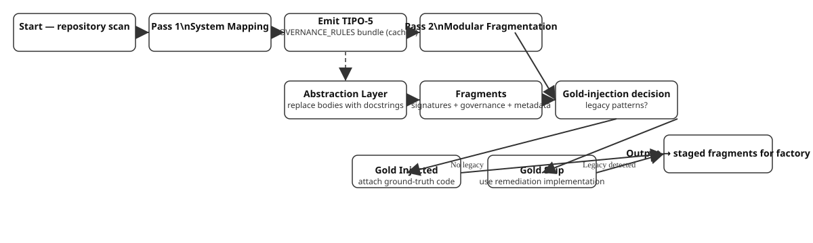

# AEGF Methodology: Agnostic Synthetic Data & Modular Systems Alignment
**Technical Whitepaper - Architect-Expert-Gap-Forge (AEGF) 🛠️🧠**

## 1. The Context-Aware Synthesis Engine

### 1.1. Structural Blueprint Ingestion
The V11.0 pipeline employs a **Context-Aware Dual-Pass Scanner** to resolve cross-file dependencies within complex hardware-software interfaces:
- **Pass 1 (System Mapping):** Analyzes the directory structure to identify Central Coordinators, Functional Entities, and Configuration Logic.
- **Pass 2 (Modular Fragmentation):** Extracts functional units using Abstract Syntax Tree (AST) parsing, maintaining the structural hierarchy of the automation component.
- **Abstraction Layer:** Implementation bodies are replaced by high-seniority docstrings. This forces the generative model to derive the 2026 architectural standards from signatures, imports, and global system governance rather than rote copying.



<details>
<summary>Fuente Mermaid (si el SVG no carga)</summary>

```mermaid
flowchart TD
	S([Start — repository scan])
	P1[Pass 1\\nSystem Mapping\\n(directory & coordinator detection)]
	GOV([Emit governance_cache bundle])
	P2[Pass 2\\nModular Fragmentation\\n(AST parsing → fragments)]
	AB[Abstraction Layer\\n(replace bodies with docstrings)]
	FR[Fragments\\n(signatures + governance + metadata)]
	DEC{Gold‑injection decision\\n(multi‑condition)}
	LEGACY{Legacy patterns\\ndetected?}
	POISON{Poison patterns\\nin output?}
	TYPE{Example type\\n== error_recovery?}
	GI[Gold Injected\\n(attach ground‑truth code)]
	GS[Gold Skip\\n(use model‑generated 2026 code)]
	OUT([Output → staged fragments for factory])

	S --> P1 --> GOV --> P2 --> AB --> FR --> DEC
	GOV -.-> AB
	DEC --> LEGACY
	LEGACY -->|Yes| GS
	LEGACY -->|No| POISON
	POISON -->|Yes| GS
	POISON -->|No| TYPE
	TYPE -->|Yes| GS
	TYPE -->|No| GI
	GI --> OUT
	GS --> OUT

	classDef gov fill:#f9f,stroke:#333,stroke-width:1px;
	class GOV gov;
```

</details>

### 1.2. Hybrid Gold-Injection Protocol (GI vs. GS)
To ensure maximum fidelity while allowing for the remediation of legacy technical debt, we implement a **multi-condition** injection logic:

**GI (Gold Injected):** The pipeline attaches the original ground-truth code ONLY when ALL of these conditions are met:
1. Source code has NO legacy patterns detected
2. Generated output has NO poison patterns (no "CoT schizophrenia" — the reasoning says 2026 but the code contains legacy)
3. Example type is NOT `error_recovery` (these must preserve the teacher's fix)

**GS (Gold Skip):** The pipeline uses the model's generated 2026 code (not the repository code) when ANY of these conditions hold:
1. Legacy patterns detected in source code
2. Poison patterns detected in output (CoT schizophrenia)
3. Example type is `error_recovery` (teacher's fix must be preserved)

*Outcome: The dataset maintains a "Platinum Grade" standard — gold injection is conservative and avoids training the model on mismatched reasoning/code pairs.*

### 1.3. Configuration Staging & Governance
A recent refactor introduced a **staged configuration tree** (stage_1_discovery → stage_2_factory → stage_3_curation → stage_4_training → inference) to decouple the discovery, generation, curation and training phases. Each stage contains copies of the necessary taxonomy, prompt templates and runtime settings; original files are retained for backwards compatibility.

The scanner now emits **governance_cache** bundles for repository‑scoped files such as `CLAUDE.md`, `AGENTS.md` or `.cursorrules`. These bundles are cached during Pass 1 of the generator and injected as the final, highest‑authority system prompt (`system.python.governance_context`). This ensures that repo‑specific coding standards are enforced across all modules.

(The engine itself remains agnostic; the staged tree is simply a convenient way to organize inputs.)

---

## 2. Taxonomical Diversification (N/C/E/T)

### 2.1. Quadrant Distribution
We enforce a strict 50/30/20 distribution to ensure a balanced Supervised Fine-Tuning (SFT) profile for distributed systems:
1. **Nominal (50%):** Standard "Best-Practice" implementation of hardware drivers and logic from scratch.
2. **Contrast (30%):** Challenging the model to explicitly reject obsolete patterns in favor of modern, high-concurrency paradigms.
3. **Error Recovery (20%):** Diagnosing and resolving real-world tracebacks (Runtime Exceptions, Logic Warnings) generated during hardware interaction.
4. **Theory (Global):** Theoretical validation and architectural auditing based on the **Universal Architecture Manifest**.

### 2.2. Validation Tándem Synthesis
V11.0 utilizes **Parallel Tool Calling**. For every logical fragment synthesized, the engine concurrently generates:
- **Logic:** The production-ready system interface code.
- **Validation:** A high-fidelity testing suite utilizing Hardware Mocks, State Snapshots, and Virtual Time-Simulation.

---

## 3. Metrics & High-Reliability Governance

### 3.1. Dynamic Logic Density Index (LDI)
LDI audits the "Thought-to-Execution" ratio. We filter out records where the reasoning length fails to match the complexity of the hardware task, ensuring the model "thinks" structurally before it "acts" on the system.
$$LDI = \frac{Tokens(Thought)}{Tokens(Execution)}$$

### 3.2. Universal Future-Anchoring
We bridge the knowledge gap by using a **Core Architecture Manifest** as the primary truth source. This enforces three universal laws of modern automation:
- **Async Parallelism Mandate:** Requirement for pluralized, non-blocking initialization flows to prevent system-wide event loop congestion.
- **Typed Context Architecture:** Mandatory strict typing for all runtime states, eliminating the use of untyped global dictionaries.
- **Semantic Type Enforcement:** Replacement of string-based categorization with canonical Enumerations (Enums) to ensure compile-time safety and data integrity across modular boundaries.

### 3.3. Cognitive Entropy & Thought-Loop Filtering
Reasoning models (e.g., Qwen3-Thinking) are prone to "thought loops" and cognitive degradation when generating long-context trajectories. AEGF implements a rigorous Heuristic Health Audit to detect and purge these failure modes prior to NeMo Curation:
- **Thought-Loop Detection (Semantic RLE):** We employ a Run-Length Encoding approach on normalized reasoning sentences. If a model repeats the exact semantic phrase consecutively (or if it dominates >50% of the thought block), the sample is flagged for cognitive looping.
- **Lazy-Code Penalization:** The auditor actively scans generated code for evasive developer patterns, such as literal `...` in function bodies, empty functions containing only `pass`, or comments like `# implement here`. 
- **Zero-Entropy Detection:** Samples where the reasoning block is merely a semantic echo of the user prompt (zero added entropy) are identified and purged.

### 3.4. Semantic Thought Distillation (Inline Stream Distillation)
To maximize the "Signal-to-Noise" ratio in reasoning trajectories, AEGF employs a custom **Distillation Pipeline** (`distill_v11.py`). Unlike naive length-trimming, this process uses semantic similarity analysis (SequenceMatching) to:
- **Iterative Cycle Pruning:** Identifies redundant revision loops where the model restarts its internal analysis, retaining only the final, most refined reasoning path.
- **Code-Block Deduplication:** Eliminates repetitive intermediate code fences within the `<think>` block that match the final `<tool_call>` output.
- **Refinement Preservation:** By implementing a "Keep Last" strategy, we ensure the training data represents a model that successfully self-corrects and converges on a solution.
- **real-time entropy filter** that prunes redundant reasoning trajectories on-the-fly. This ensures that the expert model learns from the most refined iteration of a thought process, eliminating cognitive loops before they reach the persistent storage layer.

### 3.5. Self-Correction & Backtracking Alignment
Standard SFT datasets present reasoning as a clean, linear chain of thought. In practice, advanced reasoning models naturally explore multiple approaches, encounter dead ends, and self-correct before arriving at a solution. Training exclusively on idealized linear trajectories creates a **distribution mismatch** between the training data and the model's inference-time behavior, reducing robustness on real-world problems.

AEGF addresses this gap through a dedicated **Backtracking Alignment** stage (`src/curation/backtracking_rewriter.py`) that post-processes curated datasets. This stage rewrites the `<think>` block of eligible records to embed realistic self-correction patterns while enforcing a **sacred constraint**: the action code after `</think>` is preserved byte-for-byte.

#### Strategy Classification

Record strategy is determined by `classify_rewrite_strategy` in the code. The priority (highest → lowest) implemented by the rewriter is:

- `example_type == "theory"` → `skip`
- `metadata.legacy_detected == True` → `full_backtracking`
- `metadata.gold_injected == True` → `trace_reconstruction`
- `example_type == "error_recovery"` → `error_first`
- `example_type == "contrast"` → `contrast_backtracking`
- default → `pass_through`

| Strategy | Eligibility | Resulting Think Pattern |
|----------|-------------|------------------------|
| `full_backtracking` | `metadata.legacy_detected == True` | Full backtracking: name the legacy impulse, self-evaluate, backtrack and produce a modern solution. |
| `trace_reconstruction` | `metadata.gold_injected == True` | Reconstruct the expert reasoning trace that leads to the exact provided code. |
| `error_first` | `example_type == "error_recovery"` | Start from an error scenario, present a wrong fix, then identify and correct it. |
| `contrast_backtracking` | `example_type == "contrast"` | Present both old and new approaches and explicitly reject the legacy one with technical justification. |
| `pass_through` | default (clean nominal examples) | Preserve the original think block. |
| `skip` | `example_type in config.excluded_types` (e.g. `theory`) | Record is not processed. |

Note: The rewriter does **not** use any LDI metric or a minimum-think-character threshold. Any references to LDI or a "<200 chars" rule are inaccurate for the current implementation.

#### Eligibility & Filtering

Eligibility is computed by `passes_backtracking_filter`. A record is excluded if any of the following hold:

- `metadata.example_type` is listed in `config.excluded_types` (e.g. `theory`).
- Estimated total tokens for the conversation (chars // 4) exceed `config.max_tokens`.
- The assistant content does not contain a closing `</think>` tag.

These three checks are the gatekeepers before any rewrite is attempted.

#### Post-rewrite Validation

After generation the rewriter performs a conservative rejection-sampling step implemented in `_validate_resolution_no_legacy`:

1. Split the generated `new_think` approximately in half to avoid penalizing the intentional "Legacy Impulse" that may appear in the first half.
2. From the resolution half, extract only executable code fragments (fenced code blocks and `<tool_call>` JSON payloads) using `_extract_executable_code`.
3. Strip Python single-line comments from the extracted code via `_strip_python_comments` so explanatory comments (e.g. `# FIX: migrated from hass.data`) do not trigger false positives.
4. Apply the legacy regex patterns (from `configs/stage_5_evaluation/ha_patterns.yaml`) to the cleaned resolution code and to the sacred `code_rest` after `</think>`. If a legacy pattern matches, the record is rejected.

This validation aims to ensure the *executable* resolution is free of legacy usages while allowing the reasoning text to name or discuss legacy APIs for the purpose of rejection.

#### Token limits and generation

- `config.max_tokens` is a pre-filter: records whose estimated tokens (chars//4) exceed this value are skipped before generation.
- `config.max_generation_tokens` is the maximum number of tokens requested from the model for a single think-block rewrite.

#### Output & Auditing

- The pipeline accumulates rewritten records in memory and writes the final JSONL atomically at the end of the run (`save_jsonl` writes to a `.tmp` file and renames it). If the process is interrupted, the final JSONL will not be produced.
- When `--audit-dir` is provided the rewriter writes one pretty-printed JSON (or `.txt`) per processed record into a timestamped run subdirectory as the job proceeds (`_emit_audit_file`). These audit files are useful to monitor progress in real time or to recover work if the main run is interrupted.

#### Theoretical Basis

The approach is grounded in three complementary research findings:
1. **Exploration-Exploitation Trade-off** (OpenCodeReasoning): Models trained on trajectories that include exploration and backtracking develop more robust internal search strategies, improving performance on novel problems.
2. **Explicit Error-Correction Signals** (AgentMathPlus): Exposing the model to its own mistakes during training teaches it to recognize and recover from errors at inference time.
3. **Distribution Alignment**: Matching the training data distribution to the model's natural inference-time behaviour (which includes backtracking) reduces the train-test mismatch.

#### Quality Guarantees

- The rewriter uses the same vLLM-compatible inference backend as the factory by default; a Gemini backend is used only when the `google-genai` SDK is available and `GOOGLE_API_KEY` is set and the router is configured to prefer Gemini.
- Post-rewrite validation rejects outputs that still contain legacy patterns in executable code.
- Token limits and extraction heuristics are conservative: they prioritise avoiding false positives (e.g., comments or descriptive reasoning mentioning legacy APIs are not used as evidence of legacy code).

---

## 4. Operational Orchestration

### 4.1. Blackwell Hardware Acceleration
- **Orchestration:** 40+ Asynchronous workers with dynamic rate-limiting.
- **Reasoning Engine:** Qwen3-30B-Thinking optimized for deep structural analysis.
- **Prefix Caching:** >90% Cache Hit Rate by pinning the **Agnostic Governance Context** in the KV Cache, minimizing redundant compute for recurring architectural rules.

### 4.2. Integrity & Data Sanitization
Post-generation, all samples undergo a **Sanitization Pass** to ensure that no real-world laboratory secrets, specific network identifiers, or private credentials migrate into the public dataset, replacing them with standardized agnostic placeholders.

### 4.3. Deterministic ID Mapping & Resume Resilience
To prevent data contamination and ensure 100% unique training samples, AEGF V11 implements a deterministic ID generation protocol:
- **Collision-Proof IDs:** IDs are derived from a composite hash of the functional unit name and its virtual file path, ensuring uniqueness across large-scale repositories.
- **Atomic Resume Protocol:** The factory strictly decouples the checkpoint source from the output stream, allowing for stateful interruptions and safe dataset merging without record duplication.

### 4.4. Quality Gate — Dual-Inference Evaluation

Before weight consolidation (merger), every training run passes through an automated **Quality Gate** (`src/audit/model_evaluator.py`). This mandatory checkpoint ensures that the LoRA adapter demonstrably improves upon the base model.

#### Protocol

1. **Stratified Sampling:** A deterministic sample (seed=42) is drawn from the training dataset, balanced across all four example types (nominal, contrast, error\_recovery, theory). The sample is persisted so both inference passes use identical prompts.

2. **Dual Inference:** The same prompts are sent to both the base model (control group) and the LoRA adapter (treatment group) via the vLLM OpenAI-compatible API.

3. **Multi-Dimensional Scoring:** Each response pair is scored across five dimensions:
   - **Structural Fidelity (30%):** Code-level similarity to the gold reference using SequenceMatcher.
   - **API Modernity (25%):** Ratio of modern HA 2026 API patterns (`entry.runtime_data`, `SensorDeviceClass`, `async_forward_entry_setups`) versus legacy patterns (`hass.data`, singular `async_forward_entry_setup`).
   - **Reasoning Depth (20%):** Quality indicators within `<think>` blocks — structured reasoning, technical terminology, edge-case awareness.
   - **Completeness (15%):** Coverage of all functions and classes present in the gold reference.
   - **Style Consistency (10%):** Adherence to AEGF structural conventions (`<think>` → `<tool_call>`, no AI apologies, docstrings).

4. **Verdict:** A composite score (0–100) determines the gate outcome:
   - **≥ 80 → PASS:** Safe to merge.
   - **60–79 → CONDITIONAL:** Manual review recommended.
   - **40–59 → WARN:** Additional training or data review needed.
   - **< 40 → FAIL:** Do NOT merge.

#### Artifacts

The evaluator produces:
- `eval_sample.json` — Frozen sample with record IDs for reproducibility.
- `inference_baseline.json` / `inference_adapter.json` — Raw model responses with latency metrics.
- `audit_report_v11.md` — Human-readable comparative report with per-record scorecards.
- `audit_report_v11.json` — Machine-readable structured report for CI integration.

This stage prevents regression leaks — if the adapter has not learned the modern API patterns from the training data, the gate catches it before weights are permanently merged.