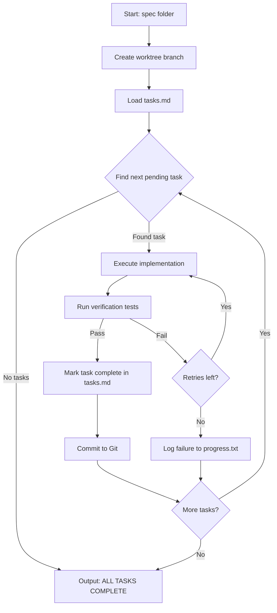

# Orchestration Quickstart

> A concise guide for operators and stakeholders to understand and launch the autonomous development pipeline.

---

## The Task Lifecycle

Understanding the three core files that drive the system:

| File | Role | Persistence |
|------|------|-------------|
| `prd.json` | **Intent** — What business goal are we achieving? | Long-term |
| `tasks.md` | **Execution** — What specific tasks need doing? | Medium-term |
| `progress.txt` | **Memory** — What did we learn while doing it? | Short-term |

### How They Connect

```
prd.json (Intent)
       │
       ▼
tasks.md (Execution Checklist)
       │
       ├── [ ] Task 1 → Ralph Loop executes → [x] Task 1
       ├── [ ] Task 2 → Ralph Loop executes → [x] Task 2
       └── [ ] Task 3 → Ralph Loop executes → [x] Task 3
              │
              ▼
       progress.txt ( learnings logged per task )
```

---

## Task Lifecycle Diagram



---

## Launching the System

### Basic Execution

```bash
# Execute a specification
./.ralph/ralph-loop.sh specs/001-stage1-discovery

# With iteration cap
./.ralph/ralph-loop.sh specs/001-feature --max 50
```

### Recovery Mode

```bash
# Resume from last state
./.ralph/ralph-loop.sh --resume
```

The `--resume` flag is a critical feature for operators. It allows the system to:
- Pick up from the last completed task
- Avoid redoing work after interruptions
- Continue after test failures without losing progress

---

## Sovereign Infrastructure Dependencies

The system requires the following self-hosted components:

| Component | Purpose | Sovereignty |
|-----------|---------|-------------|
| **vLLM** | Local inference engine for dataset generation | ✅ Your bunker |
| **Claude CLI** | Code execution agent | External service |
| **Goose** | Alternative autonomous agent | External service |

### Why "Sovereign"?

- **vLLM runs locally** — Your inference stays within your infrastructure
- **No external API dependency** for dataset generation
- **Full control** over model selection and optimization

---

## Quick Reference

| Command | Description |
|---------|-------------|
| `./.ralph/ralph-loop.sh specs/NAME` | Start execution |
| `./.ralph/ralph-loop.sh --resume` | Resume from state |
| `RALPH_MAX_ITER=50` | Cap iterations |
| `RALPH_YOLO=true` | Enable autonomous commits |

---

## Key Principles

1. **Spec First** — Never code without a specification
2. **Verify Always** — Tasks must pass verification before marking complete
3. **Commit Frequently** — Each task completion is a commit
4. **Recover Gracefully** — Use `--resume` to handle interruptions

---

*For agent context files, see `.github/agents/` and `.specify/memory/`.*
