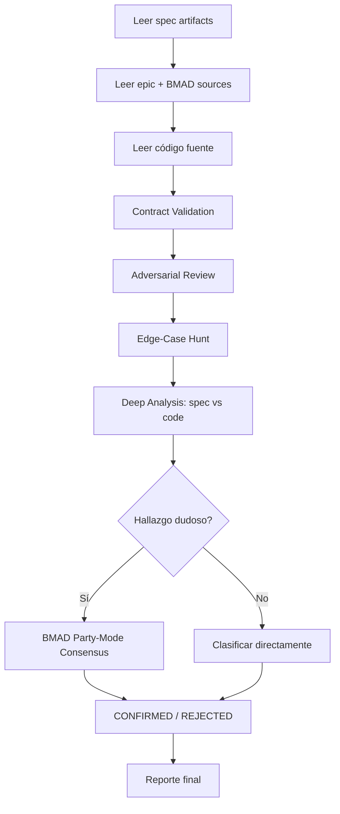

# Smart-Ralph Review: dspy-integration

**Fecha**: 2026-04-27  
**Spec**: `specs/dspy-integration/`  
**Epic**: `specs/_epics/aegf-dspy-integration/`  
**Método**: Multi-layer review (Contract Validation, Adversarial, Editorial, Edge-Case, Deep Analysis) + BMAD Party-Mode Consensus (Winston/Amelia/Mary)  
**Alcance**: research.md, requirements.md, design.md, tasks.md vs código fuente vs intenciones BMAD

---

## Resumen Ejecutivo

La spec dspy-integration está **funcionalmente completa** — las 3 DSPy Signatures están definidas, los consumidores están cableados con dual-path, los 7 bugs están corregidos, y 2315+ tests pasan. Sin embargo, se encontraron **12 hallazgos** de los cuales **5 son confirmados** como problemas reales que requieren atención, **4 son documentation stale** de baja prioridad, y **3 son rechazados** como falsos positivos.

---

## ✅ Hallazgos Confirmados (Consensuados)

### F-02: Validación de JudgeSignature contra tipo equivocado [MEDIUM]

**Problema**: Existen DOS definiciones de `NormalizedJudgeResponse` en el codebase:

| Ubicación | Definición | `total` | `reasoning` |
|-----------|-----------|---------|-------------|
| [`src/schemas/common.py:67`](src/schemas/common.py:67) | `TypedDict, total=False` | False | `NotRequired[str]` |
| [`src/audit/schema.py:81`](src/audit/schema.py:81) | `TypedDict` | True | `str` (requerido) |

El bloque de validación en [`judge_signature.py:85`](src/audit/judge_signature.py:85) importa desde `src.schemas.common` (versión permisible), pero el consumidor real en [`judge.py:41`](src/audit/judge.py:41) importa desde `src.audit.schema` (versión estricta). La validación prueba contra un tipo más permisivo que el que usa el consumidor.

**Impacto**: No causa crash en runtime (TypedDicts no enforcean), pero si se añade validación runtime en el futuro, la validación de judge_signature.py daría falsos positivos.

**Fix**: Cambiar [`judge_signature.py:85`](src/audit/judge_signature.py:85) de:
```python
from src.schemas.common import NormalizedJudgeResponse
```
a:
```python
from src.audit.schema import NormalizedJudgeResponse
```

**Votos BMAD**: Winston CONFIRM · Amelia CONFIRM · Mary CONFIRM → **UNÁNIME**

---

### F-08: Test de Spearman es un stub, no verifica NFR-001 [MEDIUM]

**Problema**: NFR-001 requiere "Spearman correlation > 0.8 between old and new judge outputs on same inputs". El [`test_spearman_correlation.py`](tests/factory/test_spearman_correlation.py) solo verifica:
1. scipy es importable
2. `spearmanr` funciona con datos sintéticos `[0.8, 0.6, 0.9, 0.5, 0.7]`
3. JudgeSignature tiene campos `baseline`/`adapter`

**No compara** outputs del judge viejo vs nuevo. El [`design.md:293-308`](specs/dspy-integration/design.md:293) especifica un harness con `load_anchor_samples()`, `run_old_judge()`, `run_new_judge()` que no fue implementado.

**Contexto**: Sin LM configurado, ambos paths producen el mismo output (template fallback), haciendo imposible una comparación real. Pero el test podría stub ambos paths con outputs conocidos y verificar correlación.

**Impacto**: NFR-001 no está verificado por test. T3.9 marcado completo pero criterio "Done when" no cumplido.

**Fix**: Añadir test que stubbee ambos paths (old PromptManager + new JudgeSignature) con outputs conocidos y verifique `spearmanr > 0.8`.

**Votos BMAD**: Winston CONFIRM · Amelia NEEDS_CONTEXT · Mary CONFIRM → **CONFIRMED (2/3)**

---

### F-11: Test de integración Judge DSPy es insuficiente [MEDIUM]

**Problema**: T3.8 especifica: "Stub `dspy.Predict(JudgeSignature)` to return shaped JSON matching `NormalizedJudgeResponse`". El [`test_judge_dspy_integration.py`](tests/audit/test_judge_dspy_integration.py) solo tiene 2 tests, ambos afirmando que `get_predict()` retorna `None` sin LM. **No stubbea el predictor** ni prueba el path DSPy.

**Impacto**: El path DSPy de `llm_judge_score()` no tiene test de integración con stub. Si el path DSPy tiene un bug de parsing, no se detectaría.

**Fix**: Añadir test que mockee `get_predict()` para retornar un predictor stubbeado con JSON shaped como `NormalizedJudgeResponse`, y verificar que `llm_judge_score()` retorna la estructura correcta.

**Votos BMAD**: Winston CONFIRM · Amelia NEEDS_CONTEXT · Mary CONFIRM → **CONFIRMED (2/3)**

---

### F-09: HardQueryBuilder crea Signature nueva en cada llamada [LOW]

**Problema**: [`hard_query_builder.py:233`](src/factory/hard_query_builder.py:233) crea `dspy.Signature("category: str, context: str -> abstract_objective: str")` en cada invocación de `_transform_to_abstract()`. Esto genera una nueva clase Python cada llamada, desperdiciando memoria y potencialmente interfiriendo con caching de DSPy.

**Fix**: Mover a constante de módulo:
```python
_HARD_QUERY_SIG = dspy.Signature("category: str, context: str -> abstract_objective: str")
```

**Votos BMAD**: Winston CONFIRM · Amelia CONFIRM · Mary REJECT → **CONFIRMED (2/3, minor)**

---

### F-03: BacktrackingResult dataclass es dead code [LOW]

**Problema**: [`backtracking_detector.py:16`](src/factory/backtracking_detector.py:16) define `BacktrackingResult(detected, indices, reason)` pero `detect()` retorna `tuple[bool, list[int], str]` (línea 28), NO `BacktrackingResult`. El requirements.md AC-3.1 dice "returns a BacktrackingResult" pero la API real retorna tuple.

**Impacto**: BacktrackingResult es dead code. Inconsistencia spec-vs-código en la API.

**Fix**: O usar `BacktrackingResult` como retorno de `detect()`, o eliminar la dataclass y actualizar AC-3.1.

---

## 📝 Documentation Stale (Baja Prioridad)

### F-01: design.md/tasks.md dicen output field `use_case` pero código tiene `inferred_use_case`

- [`design.md:65`](specs/dspy-integration/design.md:65) y [`tasks.md:24`](specs/dspy-integration/tasks.md:24) dicen `use_case: str`
- [`trajectory_signature.py:94`](src/factory/trajectory_signature.py:94) tiene `inferred_use_case: str`
- Root cause: DSPy/Pydantic field deduplication (mismo nombre no puede ser InputField y OutputField)
- El código es CORRECTO, los docs están desactualizados

### F-04: epic.md Interface Contracts son incorrectos

- [`epic.md:75-91`](specs/_epics/aegf-dspy-integration/epic.md:75) lista campos que no existen en el código (e.g., `tool_usage_patterns`, `coherence`, `overall`)
- La spec correctamente divergió basándose en análisis del codebase (ver [`research.md:66-77`](specs/dspy-integration/research.md:66))
- Solo el epic.md está desactualizado; los artefactos de spec son correctos

### F-05: epic.md status "not_started" pero spec está completa

- [`epic.md:6`](specs/_epics/aegf-dspy-integration/epic.md:6): `status: not_started`
- Las 38 tareas están completas, `.ralph-state.json` fue eliminado

### F-06 + F-07: design.md mislabels integration pattern; epic.md MIPROv2 scope

- [`design.md:200`](specs/dspy-integration/design.md:200): dice "(C) Parallel then switch" pero implementación es "(B) Dual path with fallback"
- [`epic.md:50`](specs/_epics/aegf-dspy-integration/epic.md:50): lista MIPROv2 como IN Scope, pero spec lo scoping OUT correctamente

---

## ❌ Hallazgos Rechazados (Falsos Positivos)

### F-10: Test de invarianza conductual es "minimal"

**Razón del rechazo**: El test suite existente (`test_trajectory_generator.py`) ya cubre turn counts, error injection, y ChatML format para el path de templates. El test de invarianza es ADICIONAL — verifica que el dual-path no rompe el template path. NFR-003 se cumple por el conjunto completo de tests, no por un solo archivo.

**Votos BMAD**: Winston NEEDS_CONTEXT · Amelia REJECT · Mary NEEDS_CONTEXT → **REJECTED**

### FR-001 a FR-010: Todos implementados correctamente

Verificación contra código fuente confirma que todos los functional requirements están implementados. Los 7 bugs están corregidos. Dead code eliminado.

### Bug #5 (false positive): Correctamente identificado

La spec acertadamente identificó que Python vs Jinja output protocol es un false positive. Ambos paths usan `_render()` idéntico.

---

## 📊 Tabla Resumen

| ID | Hallazgo | Severidad | Veredicto | Requiere Fix? |
|----|----------|-----------|-----------|---------------|
| F-02 | JudgeSignature valida contra tipo equivocado | MEDIUM | ✅ CONFIRMED | Sí — 1 línea |
| F-08 | Spearman test es stub, no verifica NFR-001 | MEDIUM | ✅ CONFIRMED | Sí — añadir test con stubs |
| F-11 | Judge DSPy integration test insuficiente | MEDIUM | ✅ CONFIRMED | Sí — añadir test con predictor stub |
| F-09 | Signature creada por llamada en HardQueryBuilder | LOW | ✅ CONFIRMED (minor) | Sí — mover a módulo |
| F-03 | BacktrackingResult dataclass dead code | LOW | ✅ CONFIRMED | Sí — usar o eliminar |
| F-01 | docs stale: use_case vs inferred_use_case | LOW | 📝 STALE DOCS | Opcional |
| F-04 | epic.md Interface Contracts incorrectos | LOW | 📝 STALE DOCS | Opcional |
| F-05 | epic.md status not_started | LOW | 📝 STALE DOCS | Opcional |
| F-06 | design.md mislabels pattern | LOW | 📝 STALE DOCS | Opcional |
| F-07 | epic.md MIPROv2 scope | LOW | 📝 STALE DOCS | Opcional |
| F-10 | Invarianza conductual "minimal" | — | ❌ REJECTED | No |

---

## 🎯 Plan de Acción Recomendado

### Prioridad 1 — Fixes de código (MEDIUM)

1. **F-02**: Cambiar import en [`judge_signature.py:85`](src/audit/judge_signature.py:85) → `from src.audit.schema import NormalizedJudgeResponse`
2. **F-08**: Añadir test en [`test_spearman_correlation.py`](tests/factory/test_spearman_correlation.py) que stubbee ambos paths con outputs conocidos
3. **F-11**: Añadir test en [`test_judge_dspy_integration.py`](tests/audit/test_judge_dspy_integration.py) que mockee `get_predict()` con predictor stubbeado

### Prioridad 2 — Code quality (LOW)

4. **F-09**: Mover Signature a constante módulo en [`hard_query_builder.py`](src/factory/hard_query_builder.py)
5. **F-03**: Decidir: usar `BacktrackingResult` en `detect()` o eliminar dataclass

### Prioridad 3 — Documentation updates (opcional)

6. **F-01**: Actualizar [`design.md:65`](specs/dspy-integration/design.md:65) y [`tasks.md:24`](specs/dspy-integration/tasks.md:24): `use_case` → `inferred_use_case`
7. **F-04**: Actualizar [`epic.md:75-91`](specs/_epics/aegf-dspy-integration/epic.md:75) Interface Contracts
8. **F-05**: Actualizar [`epic.md:6`](specs/_epics/aegf-dspy-integration/epic.md:6) status → `complete`
9. **F-06**: Corregir label en [`design.md:200`](specs/dspy-integration/design.md:200): "(C)" → "(B)"
10. **F-07**: Mover MIPROv2 a OUT of Scope en [`epic.md:50`](specs/_epics/aegf-dspy-integration/epic.md:50)

---

## Metodología



**Agentes BMAD consultados**: Winston 🏗️ Architect, Amelia 💻 Developer, Mary 📊 Business Analyst  
**Modo**: Solo (roleplay por LLM)  
**Criterio de consenso**: Mayoría 2/3 para CONFIRM/REJECT
