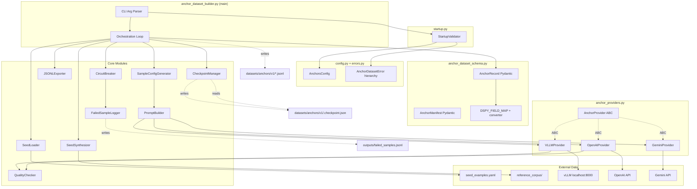
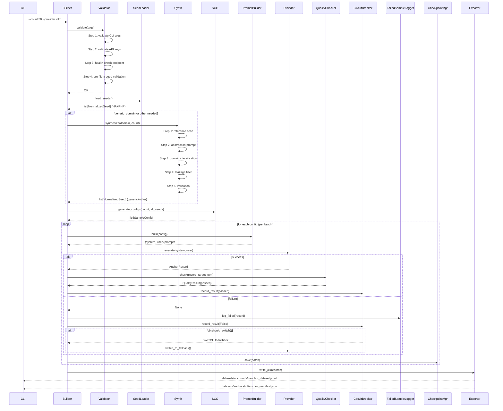

# Design: Anchor Dataset Builder

## Overview

A Python CLI tool that generates 100-200 domain-specific anchor samples with ground truth labels from seed fixtures and LLM API calls, outputting atomic JSONL files with manifests. The tool uses a strategy-pattern provider abstraction (vLLM primary, OpenAI fallback) with automated quality circuit breaker to maintain >=80% pass rate.

## Architecture



## Components

### AnchorRecord / AnchorManifest / DSPY_FIELD_MAP

**File**: `infrastructure/anchor_dataset/anchor_dataset_schema.py`

**Purpose**: Pydantic v2 models for data validation, serialization, and DSPy integration.

**AnchorRecord fields**:

| Field | Type | Constraints |
|-------|------|-------------|
| `id` | `str` | Regex `^anchor_\d+_\d+$` |
| `domain` | `Literal["home_assistant", "php_legacy", "generic_domain", "other"]` | — |
| `difficulty` | `Literal["easy", "medium", "hard"]` | — |
| `turn_count` | `int` | `gt 0` |
| `legacy_pattern` | `str` | `min_length 1` |
| `domain_context` | `str` | `min_length 1` |
| `expected_trajectory` | `str` | `min_length 1` |
| `expected_tool_usage_patterns` | `list[str]` | — |
| `expected_coherence` | `float` | `ge 0.0, le 1.0` |
| `expected_overall` | `float` | `ge 0.0, le 1.0` |
| `expected_optimized_parameters` | `dict[str, Any]` | `default_factory=dict` |
| `expected_quality_score` | `float` | `ge 0.0, le 1.0` |
| `verified` | `bool` | `default False` |
| `verified_by` | `str` | `default ""` |

**Key patterns from existing codebase**:
- Use `model_config = {"frozen": True}` (consistent with all existing Pydantic models)
- Use `Field(description="...")` on every field
- Use Python 3.10+ `str | None` syntax
- **Do NOT** use extra validators — Pydantic v2 built-in constraints suffice (range via `ge`/`le`, regex via `Pattern`, min_length via `Field(min_length=...)`)
- For `id` field: use `Field(pattern=r"^anchor_\d+_\d+$")`

**AnchorManifest fields**:

| Field | Type | Constraints |
|-------|------|-------------|
| `version` | `str` | `"v1"` |
| `created` | `str` | ISO8601 format |
| `total_samples` | `int` | `gt 0` |
| `domain_distribution` | `dict[str, int]` | — |
| `difficulty_distribution` | `dict[str, int]` | — |
| `provider_used` | `str` | — |
| `circuit_breaker_triggered` | `bool` | `default False` |
| `failed_sample_count` | `int` | `default 0` |

**DSPY_FIELD_MAP constant**:

```python
DSPY_FIELD_MAP: Final[dict[str, list[str]]] = {
    "inputs": [
        "domain_context",
        "expected_trajectory",
        "difficulty",
        "turn_count",
        "legacy_pattern",
    ],
    "labels": [
        "expected_tool_usage_patterns",
        "expected_coherence",
        "expected_overall",
        "expected_quality_score",
        "expected_optimized_parameters",
    ],
}
```

**`jsonl_to_dspy_examples(path: str) -> list[dspy.Example]`**:
- Reads JSONL file line-by-line
- Validates each against `AnchorRecord`
- For each valid record, creates `dspy.Example(**{k: record[k] for k in DSPY_FIELD_MAP["labels"]})` then chains `.with_inputs(*DSPY_FIELD_MAP["inputs"])`
- Raises `ValueError` on any `AnchorRecord` validation error
- Returns `[]` for empty file
- If `dspy` import fails, raise `ImportError("Install dspy with 'pip install dspy' to use this function")`

### AnchorsConfig (Centralized Configuration)

**File**: `infrastructure/anchor_dataset/config.py`

**Purpose**: Single source of truth for all thresholds and parameters. All components import from this module instead of defining their own constants.

```python
@dataclass(frozen=True, slots=True)
class AnchorsConfig:
    """Centralized configuration for anchor dataset generation."""

    # Sample configuration
    total_samples: int = 50          # v0.1 default (1-200)
    output_dir: str = "datasets/anchors/v1/"
    seed: int | None = None

    # Provider configuration
    provider: str = "vllm"
    vllm_url: str = "http://localhost:8000/v1"
    vllm_model: str = "qwen3-5-35b-a3b-nvfp4"
    openai_model: str = "gpt-4o"
    gemini_model: str = "gemini-2.0-flash"
    temperature: float = 0.4
    max_tokens: int = 8192
    request_timeout: int = 60
    max_retries: int = 3

    # Distribution configuration
    domain_distribution: dict[str, int] = field(default_factory=lambda: {
        "home_assistant": 40,
        "php_legacy": 30,
        "generic_domain": 20,
        "other": 10,
    })
    difficulty_distribution: dict[str, int] = field(default_factory=lambda: {
        "easy": 30,
        "medium": 50,
        "hard": 20,
    })

    # Quality configuration (immutable defaults)
    quality_score_threshold_default: float = 0.3   # per-sample self-assessed minimum
    circuit_breaker_threshold: float = 0.2          # 20% failure rate
    evaluation_batch_size: int = 10                 # quality check interval
    consecutive_pass_threshold: int = 10            # for auto-reset

    # Paths
    seed_file: str = "tests/fixtures/seed_examples.yaml"
    failed_samples_log: str = "outputs/failed_samples.jsonl"
    checkpoint_path: str = "datasets/anchors/v1/.checkpoint.json"
    reference_corpus_path: str = "tests/fixtures/reference_corpus/homeassistant/"
```

**Mutable QualitySettings** (for calibration phase adjustments — separate from frozen AnchorsConfig):

```python
@dataclass
class QualitySettings:
    """Mutable quality thresholds adjusted during calibration phase."""
    quality_score_threshold: float = 0.3       # adjusted by calibration decision tree
    calibration_adjustments_applied: int = 0
```

**Calibration decision tree** (standalone function — modifies a `QualitySettings` instance, NOT `AnchorsConfig`):

```python
def apply_calibration(settings: QualitySettings, scores: list[float]) -> QualitySettings:
    """Run calibration decision tree on observed scores. Returns updated settings in-place."""
    pct_above_03 = sum(1 for s in scores if s >= 0.3) / len(scores) if scores else 0
    pct_above_07 = sum(1 for s in scores if s >= 0.7) / len(scores) if scores else 0

    if pct_above_07 > 0.7:
        settings.quality_score_threshold = 0.4  # tighten
        settings.calibration_adjustments_applied += 1
    elif pct_above_03 < 0.3:
        settings.quality_score_threshold = 0.2  # loosen
        settings.calibration_adjustments_applied += 1
    # else: keep threshold at 0.3
    return settings
```
```

**Environment variable validation** (during construction):
- `VLLM_API_KEY` required for `provider="vllm"`
- `OPENAI_API_KEY` required for `provider="openai"`
- `GOOGLE_API_KEY` required for `provider="gemini"`
- Missing key raises `ConfigValidationError` with specific env var name

**CLI mapping**: Each `--count`, `--provider`, `--batch-size`, etc. maps to one field in this dataclass.

### StartupValidator (FR-006a — 4-step sequence)

**File**: `infrastructure/anchor_dataset/startup.py`

**Purpose**: Execute pre-flight checks in strict order before generation begins. All four steps must pass.

| Step | Check | Failure action |
|------|-------|---------------|
| 1. Validate CLI args | Count 1-200, provider in {vllm,openai,gemini}, distribution JSON parses | Exit 1 with specific error |
| 2. Validate API keys | Required env var exists for provider | Exit 1 with env var name |
| 3. Health-check endpoint | If vLLM: HTTP GET `vllm_url + "/v1/models"`. If OpenAI/Gemini: skip (cloud providers) | Exit 1 with message suggesting `--provider openai` |
| 4. Pre-flight seed validation | Load seeds; warn if generic_domain/other requested but reference corpus empty | Warning only, continue (synthesis handles it) |

```python
class StartupValidator:
    """4-step pre-flight validation (strict ordering)."""

    def validate(self, config: AnchorsConfig) -> None:
        self._validate_cli_args(config)       # Step 1
        self._validate_api_keys(config)       # Step 2
        self._health_check(config)            # Step 3
        self._validate_seeds(config)          # Step 4

    def dry_run(self, config: AnchorsConfig) -> None:
        """Like validate() but does not exit — returns warnings instead."""
        ...
```

### AnchorProvider Interface + Implementations

**File**: `infrastructure/anchor_dataset/anchor_providers.py`

**Purpose**: Strategy-pattern abstraction for LLM API backends. Reuses underlying HTTP clients (httpx, google-genai) but has separate abstraction from `TeacherProvider` — different error handling (validation failures -> None + failed log, not retry).

**Interface**:

```python
class AnchorProvider(ABC):
    @property
    @abstractmethod
    def name(self) -> str: ...

    @abstractmethod
    def generate(
        self,
        system_prompt: str,
        user_prompt: str,
        *,
        temperature: float = 0.4,
        max_tokens: int = 8192,  # 170% headroom over ~6500 total tokens (2000 system + 1500 user + 3000 response)
        timeout: int = 60,
    ) -> AnchorRecord | None:
        """Generate a single anchor record. Returns None on validation failure."""
        ...
```

**Key design decisions**:
- **Return `AnchorRecord | None`** (not raised exception) — caller decides routing (success -> export, None -> failed log)
- **No retry on semantic failures** — only retry on network errors (requests.ConnectionError, requests.Timeout, httpx.ConnectError)
- **Temperature 0.3-0.5** recommended (0.4 default for deterministic output)
- **No inheritance from TeacherProvider** — separate concern (static data vs agentic execution)
- **Retry logic**: Each provider implements its own retry loop inside `generate()`. Retry on network errors (connection refused, timeout, 5xx) up to `config.max_retries` times with exponential backoff (1s, 2s, 4s). Do NOT retry on: 400 Bad Request, 429 rate limit (handled by external rate limiter), semantic validation failure (JSON parse succeeds but AnchorRecord validation fails). **Exception scope**: The retry loop catches only `requests.ConnectionError` and `requests.Timeout` (NOT `requests.HTTPError`). `resp.raise_for_status()` in `_api_call()` raises `HTTPError` for 4xx/5xx — this bubbles up past the retry loop, so `generate()` returns None and the orchestration handles it.

**JSON parse -> AnchorRecord pipeline** (inside each provider's `generate()`):

```python
def generate(self, system_prompt: str, user_prompt: str, ...) -> AnchorRecord | None:
    """Full pipeline: API call -> JSON parse -> Pydantic validation -> return or None."""
    # 1. API call: send chat completion request
    resp = self._api_call(system_prompt, user_prompt, ...)

    # 2. JSON parse: extract JSON from response text
    try:
        data = json.loads(resp.text)
    except (json.JSONDecodeError, AttributeError):
        # Non-JSON response (truncated, malformed)
        return None

    # 3. Pydantic validation: construct AnchorRecord
    try:
        record = AnchorRecord(**data)
    except (ValidationError, ValueError, TypeError, KeyError):
        # Schema mismatch: missing fields, wrong types, extra fields
        return None

    return record
```

**Each provider-specific `_api_call()` implementation**:

```python
# VLLMProvider
def _api_call(self, system, user, *, temperature, max_tokens, timeout) -> requests.Response:
    resp = requests.post(
        url=self._base_url + "/chat/completions",
        headers={"Authorization": f"Bearer {self._api_key}", "Content-Type": "application/json"},
        json={"model": self.model, "messages": [...], "temperature": temperature,
              "max_tokens": max_tokens, "response_format": {"type": "json_object"}},
        timeout=timeout,
    )
    resp.raise_for_status()
    return resp
```

**VLLMProvider**:
- Base URL: `http://localhost:8000/v1`
- Auth: `VLLM_API_KEY` env var (with fallback "sk-master-bunker-2026" for dev)
- Model: `qwen3-5-35b-a3b-nvfp4` (matches `src/factory/config.py:36 DEFAULT_MODEL`)
- Uses `requests.post()` (sync, consistent with existing `VLLMClient` pattern in `src/audit/inference.py`)
- Payload: `"response_format": {"type": "json_object"}`
- Timeout: passed as `timeout` parameter to `requests.post()`

**OpenAIProvider**:
- Base URL: `https://api.openai.com/v1` (or configurable `OPENAI_BASE_URL`)
- Auth: `OPENAI_API_KEY` env var
- Model: `gpt-4o` (configurable)
- Uses `httpx.Client` (sync) — consistent with ABC `generate()` sync signature
- Payload: `"response_format": {"type": "json_object"}`
- For test stubs: use `unittest.mock.patch.object(OpenAIProvider, "_http", ...)` or `monkeypatch` to replace `_http` attribute with a test client

**GeminiProvider**:
- Uses `google-genai` SDK (`genai.Client` is synchronous)
- Auth: `GOOGLE_API_KEY` env var
- Model: `gemini-2.0-flash` (configurable)
- Config: `"response_mime_type": "application/json"`
- `_client` attribute: `self._client = genai.Client(api_key=os.environ["GOOGLE_API_KEY"])` (for testability)
- API call: `self._client.models.generate_content(model=self.model, contents=[user_prompt], config=...)`
- Returns `response.text` which MUST be valid JSON (the provider parses it as described in the pipeline above)

**Provider selection** (factory function in builder):

```python
PROVIDER_MAP: Final[dict[str, type[AnchorProvider]]] = {
    "vllm": VLLMProvider,
    "openai": OpenAIProvider,
    "gemini": GeminiProvider,
}
```

**vLLM pre-flight check** (FR-006a): Before generating, make HTTP GET to `localhost:8000/health` (or `/v1/models`). If unreachable, log warning and suggest `--provider openai`. If no fallback key available, exit 1.

### AnchorDatasetError Exception Hierarchy

**File**: `infrastructure/anchor_dataset/errors.py`

**Purpose**: Domain-specific exceptions for the anchor dataset module. Consistent with existing exception pattern in `src/utils/exceptions.py`.

```python
class AnchorDatasetError(RuntimeError):
    """Base exception for all anchor dataset errors."""
    pass

class ValidationError(AnchorDatasetError):
    """Pydantic validation or schema mismatch."""
    pass

class ProviderError(AnchorDatasetError):
    """API call failure (network, rate limit, timeout)."""
    pass

class SerializationError(AnchorDatasetError):
    """JSON parse failure or atomic write failure."""
    pass

class ConfigurationError(AnchorDatasetError):
    """Missing API key, invalid CLI args, config validation failure."""
    pass

class SeedError(AnchorDatasetError):
    """Seed loading, synthesis, or reference corpus access failure."""
    pass

class CheckpointError(AnchorDatasetError):
    """Checkpoint read/write/corruption failure."""
    pass
```

**Mapping to existing pattern**: Uses same inheritance style as `CheckpointError` (extends `IOError`) and `TeacherAPIError` (extends `RuntimeError`) in `src/utils/exceptions.py`. The base `AnchorDatasetError` extends `RuntimeError` for consistency.

### SeedLoader

**File**: `infrastructure/anchor_dataset/seed_loader.py`

**Purpose**: Load, parse, and normalize seed data from YAML fixtures.

**Input**: `tests/fixtures/seed_examples.yaml` (8 HA + 5 PHP seeds, 13 total)

**Normalized seed structure**:

```python
@dataclass(frozen=True, slots=True)
class NormalizedSeed:
    seed_id: str       # Original seed_id from YAML (e.g., "ha_seed_001")
    domain: str        # "home_assistant" or "php_legacy"
    category: str
    context: str       # Technical background
    question: str      # User request
    complexity: str    # "nominal_easy", "nominal_medium", "nominal_hard", etc.
    expected_patterns: list[str]
```

**Key patterns**:
- Use `pyyaml` for YAML parsing (already available)
- **Idempotent**: multiple loads produce identical `NormalizedSeed` objects
- **Graceful degradation**: if file missing, log warning at INFO level, return empty list, continue
- Seeds tagged by domain during loading: `ha_seed_*` -> `home_assistant`, others with PHP context -> `php_legacy`

### SeedSynthesizer (generic_domain / other)

**File**: `infrastructure/anchor_dataset/seed_synthesizer.py`

**Purpose**: Generate seed data for `generic_domain` and `other` categories via an automated LLM pipeline. These categories have 0 seeds in fixtures.

**5-step synthesis pipeline** (from research.md, R14-04):

| Step | Input | Process | Output |
|------|-------|---------|--------|
| 1. Reference scan | `tests/fixtures/reference_corpus/homeassistant/` (5 repos) | Read code files, extract architecture patterns | Raw pattern descriptions |
| 2. Abstraction prompt | Raw patterns | LLM call: "Extract code patterns and reframe as domain-agnostic problems. Forbidden words: home_assistant, HA, IoT, smart_home, zigbee, zwave, mqtt." | Abstracted seed descriptions |
| 3. Domain classification | Abstracted descriptions | LLM call: classify each seed as `generic_domain` or `other` (and sub-category) | Seeded with domain label |
| 4. Leakage filter | Classified seeds | Regex check against forbidden word list | Seeds with no HA/IoT strings |
| 5. Validation | Filtered seeds | Acceptance test: "Would this problem be recognizable to a non-HA developer?" | Final seed pool |

**Implementation**:

```python
class SeedSynthesizer:
    """Generates seeds for domains with 0 seed data (generic_domain, other)."""

    FORBIDDEN_STRINGS: Final[frozenset[str]] = frozenset([
        "home_assistant", "ha", "iot", "smart_home",
        "zigbee", "zwave", "mqtt",
    ])

    def __init__(self, provider: AnchorProvider, reference_corpus_path: Path) -> None:
        self._provider = provider
        self._reference_corpus_path = reference_corpus_path

    def synthesize(self, domain: str, count: int) -> list[NormalizedSeed]:
        """Generate `count` seeds for a domain with 0 existing seeds.

        Pipeline:
        1. reference_scan() -> list[str]
        2. abstract_seeds(patterns) -> list[AbstractSeed]
        3. classify_domains(abstracts) -> list[SeededDomain]
        4. filter_leakage(classified) -> list[SeededDomain]
        5. validate_freshness(filtered) -> list[NormalizedSeed]
        """
        ...

    def validate_no_leakage(self, seeds: list[NormalizedSeed]) -> bool:
        """Check that no seed contains forbidden HA/IoT strings."""
        for seed in seeds:
            text = (seed.context + seed.question).lower()
            if any(s in text for s in self.FORBIDDEN_STRINGS):
                return False
        return True

    # Step 1
    def reference_scan(self) -> list[str]:
        """Read code files from reference_corpus, extract architecture patterns."""
        ...

    # Step 2 — LLM call
    _ABSTRACTION_PROMPT: Final[str] = """\
Extract {count} code patterns from the following reference materials and
reframe them as domain-agnostic programming problems.

Return a JSON array (use valid JSON, nothing else). Each object MUST match this schema:
[
  {{
    "context": "string (2-3 sentences, domain-agnostic technical background)",
    "question": "string (1 sentence, realistic programming question)",
    "complexity": "string (one of: nominal_easy, nominal_medium, nominal_hard)",
    "expected_patterns": ["string (1-2 relevant code patterns)"]
  }}
]

FORBIDDEN WORDS (do not use in any output): home_assistant, HA, IoT,
smart_home, zigbee, zwave, mqtt, HomeAssistant

REFERENCE MATERIALS:
{patterns}
"""

    def abstract_seeds(self, patterns: list[str]) -> list[dict]:
        """Step 2: LLM call to abstract concrete patterns into generic seeds.
        Returns list[dict] with keys: context, question, complexity, expected_patterns.
        The `count` parameter comes from synthesize(domain, count) and is passed via prompt template."""
        ...

    # Step 3 — LLM call
    _CLASSIFICATION_PROMPT: Final[str] = """\
Classify each of the following domain-agnostic programming problems
into one of two categories:

- generic_domain: Problems that apply to general software development
  (e.g., API design, data parsing, configuration management)
- other: Problems that apply to niche or legacy systems
  (e.g., COBOL migration, mainframe integration, SOAP APIs)

FORBIDDEN WORDS: home_assistant, HA, IoT, smart_home, zigbee, zwave, mqtt

INPUT:
{seeds}

Return a JSON array (use valid JSON, nothing else). Each object MUST include:
- The original fields from input (context, question, complexity, expected_patterns)
- "category": one of "generic_domain" or "other"
- "subcategory": one of "api", "data", "config", "legacy", "migration", "other"
"""

    def classify_domains(self, abstracts: list[dict]) -> list[dict]:
        """Step 3: LLM call to classify each abstracted seed into a domain."""
        ...

    # Step 4
    def filter_leakage(self, seeds: list[dict]) -> list[dict]:
        """Step 4: Remove seeds containing forbidden words."""
        ...

    # Step 5
    def validate_freshness(self, seeds: list[dict]) -> list[NormalizedSeed]:
        """Step 5: Final acceptance — would this be recognizable to a non-HA developer?"""
        ...
```

**Failure chain**: If step 2 (abstraction) fails (API error, non-JSON response):
- Retry up to `max_retries` times (same as provider retry policy)
- If exhausted: raise `SeedError("Abstraction step failed after retries")`
- Builder catches `SeedError` and falls back to template-based generation (graceful degradation)
- Synthesized seed count is logged: "Synthesis failed, falling back to templates"

**Return types for LLM steps**:
- Step 2 returns `list[dict]` with keys: `context`, `question`, `complexity`, `expected_patterns`
- Step 3 returns `list[dict]` with added keys: `category`, `subcategory`
- These are intermediate data structures, NOT `NormalizedSeed` — conversion happens in step 5

**Output seed format**: Same as `NormalizedSeed` dataclass from `seed_loader.py`. `domain` field set to `generic_domain` or `other`.

**When synthesis runs**: Before generation loop (pre-generation phase). If synthesis produces fewer than requested seeds, the generator falls back to template-based generation with progressively varied prompts.

**Key constraint**: Synthesis is a **pre-generation** step, not inline. It runs once at startup (or when resuming with missing seeds). Synthesized seeds are cached in memory and reused across batches.

### SampleConfigGenerator

**File**: `infrastructure/anchor_dataset/sample_generator.py`

**Purpose**: Generate `SampleConfig` dicts that define what to generate, respecting domain and difficulty distributions.

**SampleConfig structure**:

```python
@dataclass(frozen=True, slots=True)
class SampleConfig:
    domain: str
    difficulty: str
    turn_count: int
    legacy_pattern: str
    seed_id: str | None      # Original seed_id from YAML (e.g., "ha_seed_001"), None for generic_domain/other
    seed_pool: int           # Numeric pool index for ID generation (1-8 HA, 9-13 PHP, 100-119 generic, 200-219 other)
    variant_index: int
    domain_context: str
    generation_instruction: str
```

**Domain distribution** (FR-003, AC-3.2):

| Domain | % | 110 samples | 50 samples (v0.1) |
|--------|---|-------------|-------------------|
| home_assistant | 40% | 44 | 20 |
| php_legacy | 30% | 33 | 15 |
| generic_domain | 20% | 22 | 10 |
| other | 10% | 11 | 5 |

Rounding: use `math.floor` for first N domains, remainder goes to last domain to ensure total matches exactly.

**Difficulty distribution per domain** (FR-002.7, AC-3.5):

| Difficulty | % |
|------------|---|
| easy | 30% |
| medium | 50% |
| hard | 20% |

**Turn count by difficulty** (FR-004.5):
- easy: 3 turns
- medium: 4 turns
- hard: 5-6 turns (use 5 for consistency, configurable)

**Seed exhaustion handling**:
- When all seeds for a domain are exhausted (e.g., after 5 variants per HA seed), switch to template-based synthesis using reference corpus patterns
- For `generic_domain` and `other`: always template-based (no seeds)
- Template contexts derived from `tests/fixtures/reference_corpus/homeassistant/` repos

**Note on frozen `SampleConfig`**: The dataclass is frozen, but `generation_instruction` varies between variants because `SampleConfigGenerator` creates a NEW `SampleConfig` instance for each variant with a distinct instruction string. The instruction is computed from `variant_index` (e.g., different reference corpus excerpts, different seed pairings) — it is never mutated after construction.

**Deterministic ordering** (FR-004.6): Given the same seed (`--seed` argument), configs are generated in the same order for reproducibility.

### PromptBuilder

**File**: `infrastructure/anchor_dataset/sample_generator.py` (co-located with SampleConfigGenerator)

**Purpose**: Construct system and user prompts for anchor generation, including few-shot examples.

**System prompt structure**:
```
You are a domain expert tasked with generating training anchor samples
for AI model optimization (DSPy MIPROv2).

DOMAIN: {domain}
DIFFICULTY: {difficulty}
EXPECTED TURN COUNT: {turn_count}
LEGACY PATTERN: {legacy_pattern}

OUTPUT FORMAT:
Generate a JSON object matching this schema:
{{
  "id": "anchor_XXX_YY",
  "domain": "...",
  "difficulty": "...",
  ... (all fields) ...
}}

FEW-SHOT EXAMPLES:
{2-3 examples from seeds matching the domain}

QUALITY CONSTRAINTS:
- Complete implementations (no stubs or placeholders)
- No lazy patterns: no "...", no "# TODO", no "pass # implement"
- Tool calls must be valid and executable
- {domain}-specific best practices
```

**User prompt structure**:
```
Generate an anchor sample for this scenario:

{generation_instruction}

Include:
1. A realistic domain_context
2. Expected trajectory (multi-turn conversation)
3. Tool usage patterns
4. Ground truth labels (coherence, overall, quality_score)
```

**Few-shot selection**:
- For HA domain: select 2-3 seeds from HA seeds by matching `complexity` to target `difficulty`
- For PHP domain: select 2-3 seeds from PHP seeds
- For generic_domain/other: select from reference corpus patterns as generic code examples

**Template variable mapping** (SampleConfig fields to template placeholders):

| Template placeholder | Source | Description |
|---------------------|--------|-------------|
| `{domain}` | `config.domain` | Domain string (e.g., "home_assistant") |
| `{difficulty}` | `config.difficulty` | "easy", "medium", or "hard" |
| `{turn_count}` | `config.turn_count` | Integer (3, 4, or 5) |
| `{legacy_pattern}` | `config.legacy_pattern` | Pattern description string |
| `{generation_instruction}` | `config.generation_instruction` | Full generation instruction |
| `{few_shot}` | `_select_few_shot(domain, difficulty)` | Formatted few-shot examples string |
| `{{` / `}}` | Literal `{{` / `}}` | Python `.format()` escaping for JSON braces in schema example |

**Few-shot output format** (G2.8 fix): `_select_few_shot()` returns a human-readable string, NOT JSON:
```
--- Example 1 ---
Context: {seed.context}
Question: {seed.question}
Expected Patterns: {', '.join(seed.expected_patterns)}

--- Example 2 ---
...
```

**Class definition**:

```python
class PromptBuilder:
    """Constructs system and user prompts for anchor generation."""

    SYSTEM_TEMPLATE: Final[str] = """\
You are a domain expert tasked with generating training anchor samples
for AI model optimization (DSPy MIPROv2).

DOMAIN: {domain}
DIFFICULTY: {difficulty}
EXPECTED TURN COUNT: {turn_count}
LEGACY PATTERN: {legacy_pattern}

OUTPUT FORMAT:
Generate a JSON object matching this schema:
{{
  "id": "anchor_XXX_YY",
  "domain": "...",
  "difficulty": "...",
  ... (all fields) ...
}}

FEW-SHOT EXAMPLES:
{few_shot}

QUALITY CONSTRAINTS:
- Complete implementations (no stubs or placeholders)
- No lazy patterns: no "...", no "# TODO", no "pass # implement"
- Tool calls must be valid and executable
- {domain}-specific best practices
"""

    USER_TEMPLATE: Final[str] = """\
Generate an anchor sample for this scenario:

{generation_instruction}

Include:
1. A realistic domain_context
2. Expected trajectory (multi-turn conversation, {turn_count} turns)
3. Tool usage patterns
4. Ground truth labels (coherence, overall, quality_score)
"""

    def __init__(self, seeds: list[NormalizedSeed]) -> None:
        self._seeds = seeds

    def build(self, config: SampleConfig) -> tuple[str, str]:
        """Build (system_prompt, user_prompt) tuple for a sample config.

        Pipeline:
        1. Select few-shot examples matching config.domain + config.difficulty
        2. Format few-shot into human-readable string
        3. Render SYSTEM_TEMPLATE with config fields + few_shot
        4. Render USER_TEMPLATE with config fields
        """
        few_shot = self._select_few_shot(config.domain, config.difficulty)
        system_prompt = self.SYSTEM_TEMPLATE.format(
            domain=config.domain,
            difficulty=config.difficulty,
            turn_count=config.turn_count,
            legacy_pattern=config.legacy_pattern,
            few_shot=few_shot,
        )
        user_prompt = self.USER_TEMPLATE.format(
            generation_instruction=config.generation_instruction,
            turn_count=config.turn_count,
        )
        return system_prompt, user_prompt

    def _select_few_shot(self, domain: str, difficulty: str) -> str:
        """Select 2-3 seed examples matching domain + difficulty.
        Returns human-readable formatted string (not JSON)."""
        ...
```

### QualityChecker

**File**: `infrastructure/anchor_dataset/quality.py`

**Purpose**: Separate, testable class that evaluates individual samples against quality criteria. `CircuitBreaker` and `QualityChecker` are independent — `QualityChecker.check()` evaluates per-sample quality, `CircuitBreaker.record_result()` receives a boolean from the caller (who called QualityChecker). This separation makes both components independently testable.

**Quality check criteria** (FR-007.2, per sample):
1. All required fields present (check `AnchorRecord.model_fields_set` — if called after construction, Pydantic validation is assumed; this check exists for raw dict input pre-construction)
2. Anti-laziness: no `...`, `# TODO`, `pass # implement`, `# resto del codigo` in `expected_trajectory`
3. Turn count within +/-1 of target
4. Tool call syntactic validity (parse tool call blocks — see format below)
5. Self-assessed quality >= self._threshold (default 0.3, adjustable via constructor)

**Note**: Step 1 is a pre-construction guard — `QualityChecker.check_raw_dict()` accepts `dict | str` and returns `QualityResult | ValidationError`. The main `check()` method receives a constructed `AnchorRecord`, so Pydantic validation has already passed.

```python
@dataclass(frozen=True, slots=True)
class QualityResult:
    passed: bool
    reasons: list[str]        # Why it failed, if not passed (e.g., ["anti_laziness", "turn_count_mismatch"])
    quality_score: float      # Self-assessed quality_score from the record
    turn_count_target: int    # For logging
    turn_count_actual: int    # For logging

class QualityChecker:
    """Evaluates a single sample against quality criteria.

    Accepts an optional threshold parameter — the calibration decision tree
    adjusts this value during calibration phase.  Defaults to 0.3.
    """

    ANTI_LAZINESS_PATTERNS: Final[frozenset[str]] = frozenset([
        "...", "# TODO", "pass # implement", "# resto del codigo",
    ])

    def __init__(self, threshold: float = 0.3) -> None:
        self._threshold = threshold

    def check(self, record: AnchorRecord, target_turn_count: int) -> QualityResult:
        """Evaluate a sample. Returns QualityResult with pass/fail and reasons.

        Uses self._threshold (default 0.3) — adjustable via constructor during
        calibration phase (apply_calibration returns updated settings in-place;
        caller recreates QualityChecker with new threshold:
        `checker = QualityChecker(threshold=settings.quality_score_threshold)`).
        """
        ...

    def check_raw(self, raw: dict | str, target_turn_count: int) -> QualityResult | ValidationError:
        """Pre-construction check: accepts raw dict or JSON string.
        Returns ValidationError if Pydantic validation fails, otherwise QualityResult."""
        ...
```

**Turn delimiter format in `expected_trajectory` string**:
```
[ROLE:user]\n{user message text}\n\n[ROLE:assistant]\n{assistant message text}\n[TOOL_CALL:tool_name]\n{tool input JSON}\n\n[ROLE:tool]\n{tool result}\n\n...
```
- Uses **uppercase** markers (`[ROLE:...]`, `[TOOL_CALL:...]`) to minimize collision with natural text
- Turn boundaries marked by `\n\n` (double newline)
- Role changes: `[ROLE:<role_name>]` prefix at start of line
- Tool calls: `[TOOL_CALL:<tool_name>]` prefix, followed by JSON on the next line (single-line JSON only)
- Tool results: `[ROLE:tool]` prefix, followed by result text

**Turn counting algorithm** (G2.2 fix):
- Count `[ROLE:user]` markers using regex: `re.findall(r'^\[ROLE:user\]', trajectory_text, re.MULTILINE)`
- This counts user turns only (each user turn initiates a conversation round)
- `turn_count_actual` = number of `[ROLE:user]` occurrences
- Does NOT count `[ROLE:assistant]` or `[ROLE:tool]` as separate turns
- Does NOT count `[TOOL_CALL:...]` as turns (tool calls are part of an assistant turn)

**Edge case mitigation** (G2.3 fix):
- All regex matching uses `re.MULTILINE` mode and `^` anchor to match start-of-line only
- If the trajectory text contains `[ROLE:...]` as literal text within a message body, it is NOT at the start of a line (preceded by message content), so it is correctly ignored

**Tool call syntactic validation** (QualityChecker step 4):
1. Find all `[TOOL_CALL:<name>]` markers at start of line: `re.findall(r'^\[TOOL_CALL:\w+\]', trajectory_text, re.MULTILINE)`
2. For each marker, find the immediately following line (single line only)
3. Parse the next line as JSON — if it contains `...` or is empty, flag as invalid
4. If JSON is valid, proceed; otherwise flag `tool_call_invalid` reason

**Note**: Tool call JSON must be single-line. Multi-line JSON after `[TOOL_CALL:...]` is considered a validation failure (G2.4 fix).

### QualityCircuitBreaker

**File**: `infrastructure/anchor_dataset/quality.py` (co-located with QualityChecker)

**Purpose**: Monitor batch-level quality, trigger fallback provider if failure rate exceeds threshold. Receives boolean `passed` from the caller (who called `QualityChecker` for per-sample evaluation). These are independent, separately testable classes.

**Two batch sizes** (independent parameters):
| Parameter | Default | Purpose |
|-----------|---------|---------|
| `evaluation_batch_size` | 10 | How many samples evaluated before circuit breaker check |
| `generation_batch_size` | 10 (default) | How many samples generated per checkpoint save |

**State**:

```python
@dataclass
class CircuitBreaker:
    threshold: float = 0.2              # 20% failure rate triggers switch
    batch_size: int = 10                 # evaluation batch size
    failures_in_batch: int = 0
    passes_in_batch: int = 0
    consecutive_passes: int = 0          # for auto-reset after consecutive_pass_threshold
    consecutive_pass_threshold: int = 10 # synced from AnchorsConfig.consecutive_pass_threshold
    active_provider: str = "vllm"
    fallback_provider: str = "openai"
    triggered: bool = False
    reason: str = ""
    phase: str = "warmup"               # "warmup" -> "calibration" -> "production"
    _total_samples: int = 0             # cumulative count for phase transitions
```

**Methods** (single public API — all entry through `record_result`):

```python
class CircuitBreaker:
    def record_result(self, passed: bool) -> None:
        """Record pass/fail. Increments counters, checks phase transitions."""
        self._total_samples += 1

        if passed:
            self.consecutive_passes += 1
            self.passes_in_batch += 1
        else:
            self.consecutive_passes = 0
            self.failures_in_batch += 1

        # Reset batch when full
        if (self.failures_in_batch + self.passes_in_batch) >= self.batch_size:
            self._evaluate_batch()
            self.failures_in_batch = 0
            self.passes_in_batch = 0

        # Phase transition (internal) — uses self._total_samples directly
        self._transition_phase()

    def should_switch(self) -> bool:
        """Only triggers in production phase with sufficient failures."""
        if self.phase != "production":
            return False
        rate = self.failures_in_batch / self.batch_size if self.batch_size else 0
        return rate >= self.threshold

    def try_reset(self) -> bool:
        """If consecutive_pass_threshold consecutive passes while triggered, switch back to primary."""
        if self.consecutive_passes >= self.consecutive_pass_threshold and self.triggered:
            self.triggered = False
            return True
        return False

    def get_failure_rate(self) -> float:
        """Current batch failure rate."""
        total = self.failures_in_batch + self.passes_in_batch
        return self.failures_in_batch / total if total else 0.0

    def _evaluate_batch(self) -> None:
        """Run batch evaluation, trigger switch if needed."""
        if self.should_switch():
            self.triggered = True
            self.reason = f"{self.failures_in_batch}/{self.batch_size} failures ({self.get_failure_rate():.0%})"

    def _transition_phase(self) -> None:
        if self._total_samples < 5:
            self.phase = "warmup"
        elif self._total_samples < 20:
            self.phase = "calibration"
        else:
            self.phase = "production"
```

**Note**: `CircuitBreaker` does NOT delegate to `QualityChecker`. These are separate, independent classes. `QualityChecker.check()` evaluates per-sample quality. `CircuitBreaker.record_result()` receives a boolean `passed` from the caller (who called QualityChecker) and tracks batch-level failure rates.

**Phase transition thresholds** (based on `self._total_samples`):
- 0-4 samples: **warmup** — no circuit breaker checks. Log scores for baseline.
- 5-19 samples: **calibration** — run checks, log failure rate, log score distribution. Do NOT switch provider. Apply calibration decision tree from research.md.
- 20+ samples: **production** — full circuit breaker behavior. Trigger switch if threshold breached.

**Note**: `should_switch()` only returns True when `phase == "production"` — warmup and calibration phases never trigger a provider switch even if failure rate exceeds threshold.

**Phases**:
| Phase | Samples | Behavior |
|-------|---------|----------|
| Warmup | 0-4 | No circuit breaker checks. Log scores for baseline. |
| Calibration | 5-19 | Run checks, log failure rate, log score distribution. Do NOT switch provider. |
| Production | 20+ | Full circuit breaker behavior — trigger switch if threshold breached. |

**Calibration decision tree** (from research.md, applied during calibration phase):
1. If >70% of scores >0.7: tighten `quality_score_threshold` to 0.4
2. If <30% of scores >0.3: loosen `quality_score_threshold` to 0.2
3. If 30-70% >0.3: keep `quality_score_threshold` at 0.3

**Applying calibration to QualityChecker**: After `apply_calibration(settings, scores)` mutates the `QualitySettings`, the builder recreates `QualityChecker` with the new threshold:
`checker = QualityChecker(threshold=settings.quality_score_threshold)`. This keeps the threshold change explicit and atomic.

**Provider switching flow**:
1. During batch evaluation, if `failures_in_batch / batch_size >= threshold` AND phase == "production":
2. Log: `Circuit breaker triggered: {failures}/{batch_size} failures ({rate:.0%}). Switching from {active} to {fallback}.`
3. Set `triggered = True`, `active_provider = fallback_provider`
4. Builder switches provider instance for remaining samples
5. After `consecutive_passes >= consecutive_pass_threshold` (default 10, configurable), log reset and switch back

**Rate limit coordination** (research.md R14-01): If cross-model judge calls use the same API key as generation calls, both must serialize through a shared `RateLimitCoordinator`. Implementation: single `httpx.Client` per API key with request queue. Judge calls are lower priority and wait behind generation calls.

### FailedSampleLogger

**File**: `infrastructure/anchor_dataset/failed_sample_logger.py`

**Purpose**: Log failed samples with reason codes for manual review.

**Entry structure**:

```python
@dataclass(frozen=True, slots=True)
class FailedSampleEntry:
    sample_id: str
    domain: str
    difficulty: str
    failure_reason: str  # enum-like string
    provider: str
    attempt: int         # 0 = first attempt
    raw_response: str    # truncated to 2000 chars
```

**Failure reason codes**:

| Code | Meaning | Auto-retry |
|------|---------|------------|
| `schema_validation` | Pydantic validation failed | No (manual review) |
| `field_incomplete` | Required field missing | No (manual review) |
| `anti_laziness` | Lazy code patterns found | No (manual review) |
| `turn_count_mismatch` | Turn count outside tolerance | No (manual review) |
| `self_assessed_quality` | Self-assessed quality < threshold (default 0.3, calibrated) | No (manual review) |
| `tool_call_invalid` | Invalid tool call syntax | No (manual review) |
| `json_parse_error` | API returned non-JSON | Yes (fallback provider) |
| `api_error` | HTTP/network error | Yes (fallback provider) |

**Implementation**:
- Append to `outputs/failed_samples.jsonl` (one JSON object per line)
- File at project root (not in dataset directory)
- Atomic write: temp file in same directory, then rename

### CheckpointManager

**File**: `infrastructure/anchor_dataset/checkpoint.py`

**Purpose**: Save generation progress for resume support.

**Checkpoint structure**:

```python
@dataclass
class CheckpointData:
    completed_ids: set[str]         # Sample IDs that succeeded
    failed_ids: dict[str, str]      # ID -> failure_reason
    provider_active: str            # Currently active provider name
    sample_counter: int             # Total samples attempted
    domain_allocation_remaining: dict[str, int]  # Remaining count per domain
    timestamp: str                  # ISO8601
    circuit_breaker_triggered: bool
    next_variant_map: dict[str, int]  # seed_id -> next variant index
```

**Methods**:
- `save(path: Path, data: CheckpointData) -> None`: atomic write (temp + rename + fsync)
- `load(path: Path) -> CheckpointData | None`: parse JSON, return data or None if missing/corrupted
- Resume logic: skip IDs in `completed_ids`, re-attempt IDs in `failed_ids` (with fallback provider if reason is auto-retryable)

**Error contract on rename/fsync failure** (addressing Winston R14-03):
1. Write to `.tmp` file — if this fails, raise `SerializationError`
2. `os.rename(tmp, path)` — if this fails (e.g., cross-device link), raise `CheckpointError` and clean up `.tmp`
3. `os.fsync(fd)` — if this fails (e.g., disk full), raise `CheckpointError` and note that data may be incomplete
4. Any error leaves no corrupt state: `.tmp` is always cleaned up on failure

**Checkpoint-JSONL co-atomicity** (addressing Winston R14-03):
The JSONL file and checkpoint file must be kept consistent. If the process crashes between updating JSONL and checkpoint, the next run will regenerate samples with IDs that were already written to JSONL. This is safe because:
- Sample IDs are deterministic (idempotent by ID)
- Regeneration wastes API cost but does NOT corrupt data
- The checkpoint is the source of truth for "what was completed"
- Resume will skip completed IDs even if JSONL shows them (duplicate detection)
- The `.tmp` files for both JSONL and checkpoint are cleaned up on failure, so no corrupt partial files exist

**Implementation pattern in builder**:
```python
# After completing a batch:
# 1. Append to in-memory records list
# 2. Save checkpoint (source of truth for resume)
checkpoint_mgr.save(checkpoint_path, checkpoint_data)
# 3. At the very end (not per-batch): write JSONL atomically
exporter.write_all(records, output_path)
```

### JSONLExporter

**File**: `infrastructure/anchor_dataset/exporter.py`

**Purpose**: Write generated samples to JSONL with atomic writes and manifest generation.

**Output files**:
- `datasets/anchors/v1/anchor_dataset.jsonl` — one JSON per line
- `datasets/anchors/v1/anchor_manifest.json` — metadata

**Atomic write pattern** (FR-010.4, NFR-005):
```python
def atomic_write_jsonl(path: Path, records: list[AnchorRecord]) -> None:
    tmp_path = path.with_suffix(".tmp")
    try:
        with open(tmp_path, "w", encoding="utf-8") as f:
            for record in records:
                f.write(record.model_dump_json() + "\n")
            f.flush()
            os.fsync(f.fileno())
        os.rename(tmp_path, path)
    except OSError:
        if tmp_path.exists():
            tmp_path.unlink()  # Clean up .tmp on failure
        raise SerializationError(f"Atomic write failed for {path}") from None
```

**Manifest generation**:
```python
def generate_manifest(
    records: list[AnchorRecord],
    provider_name: str,
    cb_triggered: bool,
    failed_count: int,
) -> AnchorManifest:
    domain_dist = Counter(r.domain for r in records)
    difficulty_dist = Counter(r.difficulty for r in records)
    return AnchorManifest(
        version="v1",
        created=datetime.now(timezone.utc).isoformat(),
        total_samples=len(records),
        domain_distribution=dict(domain_dist),
        difficulty_distribution=dict(difficulty_dist),
        provider_used=provider_name,
        circuit_breaker_triggered=cb_triggered,
        failed_sample_count=failed_count,
    )
```

### DSPyConverter (integrated into schema module)

**File**: `infrastructure/anchor_dataset/anchor_dataset_schema.py`

**Purpose**: Convert JSONL to `dspy.Example` format.

```python
def jsonl_to_dspy_examples(path: str) -> list[dspy.Example]:
    """Convert JSONL anchor dataset to DSPy Example objects."""
    import dspy
    examples = []
    with open(path, encoding="utf-8") as f:
        for line_num, line in enumerate(f, 1):
            if not line.strip():
                continue
            data = json.loads(line)
            record = AnchorRecord(**data)  # validates + raises ValueError
            label_fields = DSPY_FIELD_MAP["labels"]
            input_fields = DSPY_FIELD_MAP["inputs"]
            example = dspy.Example(
                **{field: getattr(record, field) for field in label_fields}
            ).with_inputs(*input_fields)
            examples.append(example)
    return examples
```

### AnchorDatasetBuilder (Main Script)

**File**: `infrastructure/anchor_dataset/anchor_dataset_builder.py`

**Purpose**: CLI orchestration of the entire generation pipeline.

**CLI arguments** (12 total, FR-002.2):

| Argument | Type | Default | Description |
|----------|------|---------|-------------|
| `--count` | `int` | `50` | Total samples to generate (v0.1 default, max 200) |
| `--provider` | `"vllm" \| "openai" \| "gemini"` | `"vllm"` | Primary API provider |
| `--batch-size` | `int` | `10` | Quality check interval |
| `--output-dir` | `str` | `"datasets/anchors/v1/"` | Output directory |
| `--resume` | `flag` | `False` | Resume from checkpoint |
| `--dry-run` | `flag` | `False` | Validate and exit without writing |
| `--seed` | `int` | `None` | Random seed for reproducibility |
| `--timeout` | `int` | `60` | API request timeout (seconds) |
| `--max-retries` | `int` | `3` | Max retries for rate-limited responses |
| `--no-overwrite` | `flag` | `False` | Exit 1 if output exists |
| `--domain-distribution` | `str` | N/A | JSON string override, e.g. `'{"home_assistant":50,"php_legacy":25}'` |
| `--difficulty-distribution` | `str` | N/A | JSON string override, e.g. `'{"easy":30,"medium":50,"hard":20}'` |

**Orchestration flow** (with FR-006a 4-step startup):
```
PHASE 1: Startup validation (StartupValidator — strict ordering)
  1a. Validate CLI args — parse and validate all arguments (count 1-200, valid provider)
  1b. Validate API keys — check required env var for requested provider
  1c. Health-check provider endpoint — if vLLM, HTTP GET /v1/models
  1d. Pre-flight seed validation — load seeds, warn if generic_domain/other without reference corpus

PHASE 2: Pre-generation
  2a. If --resume: load checkpoint, skip completed IDs
  2b. Synthesize seeds for generic_domain/other (SeedSynthesizer — if needed)
  2c. Generate sample configs (SampleConfigGenerator) with domain/difficulty distribution

PHASE 3: Execution
  3a. If --dry-run: log planned generation, exit 0
  3b. Check --no-overwrite: exit 1 if output exists
  3c. For each SampleConfig:
      a. Build prompt (PromptBuilder)
      b. Call provider (AnchorProvider.generate)
      c. If result is None: log to failed sample log, call CB.record_result(False)
      d. If result is AnchorRecord: append to output list, mark completed in checkpoint
      e. After batch_size samples: run QualityChecker, then circuit breaker
      f. If circuit breaker triggered: switch provider, log event
      g. Save checkpoint after each batch

PHASE 4: Export
  4a. Export to JSONL (JSONLExporter) with manifest
  4b. Log summary statistics
```

**Error handling**:
- `KeyboardInterrupt`: save checkpoint, log "Clean shutdown. Run with --resume to continue.", exit 1
- Provider unreachable: fail fast with clear message suggesting fallback provider
- Missing API key: fail fast with clear message listing required env var
- Validation error during conversion: raise `ValueError` with record details

**Dry-run mode** (FR-002.10):
- Load seeds, generate configs, compute expected distribution
- Log: "Would generate N samples: HA=44, PHP=33, Generic=22, Other=11"
- Log: "Would use provider: vllm, batch size: 10"
- Exit 0 without writing any files

**--no-overwrite interaction with --dry-run**: `--dry-run` never overwrites (it doesn't write). `--no-overwrite` only applies when generating (not dry-run).

## Data Flow



## Technical Decisions

| Decision | Options Considered | Choice | Rationale |
|----------|-------------------|--------|-----------|
| Provider abstraction pattern | Strategy vs inheritance from TeacherProvider | Strategy (separate ABC) | TeacherProvider handles agentic execution with side effects; anchor generation is static data production with different error handling |
| JSON mode vs function calling | JSON mode, JSON Schema, function calling, structural tags | JSON mode (`json_object`) | Simpler, works across all 3 providers, reliable structured output for static data |
| Primary provider | OpenAI, vLLM, Gemini | vLLM (localhost:8000) | Cost-free after hardware, project already runs the server, good JSON mode on configured model |
| Fallback provider | OpenAI, Gemini | OpenAI GPT-4o | Strongest structured output guarantees, guided decoding, project has API key available |
| Concurrency model | Sequential, threading, asyncio | Sequential | Simplicity first — API rate limits are the bottleneck, not local CPU. All providers are synchronous. Can add parallel later if needed. |
| Atomic write | temp+rename, context manager, shutil.move | temp+rename+fsync | Proven pattern in existing codebase, guarantees crash safety |
| Checkpoint format | JSON, YAML, protobuf, msgpack | JSON | Human-readable, already used in project patterns, no extra dependency |
| Failed sample log | JSONL, JSON array, SQLite, DLQ system | JSONL | One-off task, simple to read/write, supports grep/jq for manual review |
| Trajectory format | Structured conversation array, single string, XML | Single string | Simpler to validate, matches existing AgenticTrajectory string serialization, less API payload |
| Seed gap handling | Reference corpus mining, template synthesis, generic prompts | Template synthesis from reference corpus | No seeds for generic_domain/other; reference corpus provides domain context inspiration |
| ID format | UUID, hash, deterministic index | `anchor_{seed_pool:03d}_{variant:02d}` | Deterministic, human-readable, reproducible across runs. `seed_pool` is a numeric index: 1-8 for HA seeds, 9-13 for PHP seeds, 100-119 for synthetic generic_domain, 200-219 for synthetic other |
| Turn count per difficulty | Fixed values, random within range, configurable | Fixed (easy=3, medium=4, hard=5) | Simpler, predictable, matches existing trajectory patterns |

## Error Handling Strategy

### Exception Hierarchy

```
AnchorDatasetError (RuntimeError)
  ├── ValidationError (Pydantic validation, schema mismatch)
  ├── ProviderError (API network/rate-limit/timeout)
  ├── SerializationError (JSON parse, atomic write, fsync failure)
  ├── ConfigurationError (Missing API key, invalid CLI args)
  ├── SeedError (Seed loading, synthesis, reference corpus)
  └── CheckpointError (Checkpoint read/write/corruption)
```

### Error Scenario Mapping

| Error Scenario | Exception Type | Handling Strategy | User Impact |
|----------------|---------------|-------------------|-------------|
| vLLM server unreachable | ConfigurationError | Pre-flight health check, exit 1 with message suggesting `--provider openai` | Clear guidance on next step |
| Missing API key | ConfigurationError | Pre-flight env var check, exit 1 with specific env var name | No confusion about what's missing |
| API rate limit (429) | — | Provider does NOT retry 429 (per design: "no retry on 429 rate limit (handled by external rate limiter)"). Orchestration calls CB.record_result(False). | Rate limit handled externally |
| Non-JSON API response | — | Provider catches JSON decode error, returns None. Orchestration logs to failed_samples.jsonl with reason `json_parse_error`, calls CB.record_result(False). | Automatic recovery (fallback provider retry at provider level), manual review at orchestration level |
| Pydantic validation failure | — | Provider catches ValidationError, returns None. Orchestration logs to failed_samples.jsonl with reason, calls CB.record_result(False). | Sample lost from output, quality monitored |
| Anti-laziness filter triggered | — | QC catches anti-laziness, returns QualityResult(passed=False). Orchestration logs with reason `anti_laziness`, calls CB.record_result(False). | Sample rejected, quality gate enforced |
| Circuit breaker triggered | — | Orchestration calls `CB.should_switch()`, if True switches provider instance, logs event, continues generation with fallback | Higher cost (OpenAI), but quality maintained |
| KeyboardInterrupt | — | Save checkpoint, log clean shutdown message, exit 1 with resume instruction | Progress saved, can resume |
| Corrupted checkpoint | CheckpointError | Log warning, start from scratch | May regenerate some samples (idempotent by ID) |
| Empty seed file | SeedError | Log warning, continue with empty seed list for that domain | Template-based generation kicks in |
| Output file exists + --no-overwrite | ConfigurationError | Exit 1 immediately | Protects against accidental overwrite |
| Rename/fsync failure | CheckpointError / SerializationError | Clean up .tmp file, raise domain exception with clear message | No corrupt files left on disk |
| Disk full during write | SerializationError | Catch OSError, clean up .tmp, log with disk space info | No corrupt files, user knows why |
| Model hot-swap during calibration | — | Orchestration detects model change, logs warning, continues generation. Samples with failed QC get re-attempted. | Brief pause, then continue |
| Provider retry exhausted | — | Provider returns None after exhausting max_retries on network errors. Orchestration logs `api_error`, calls CB.record_result(False). | Automatic recovery via CB fallback |
| Corrupted seed data | SeedError | Log warning with file position, skip malformed seed, continue with remaining | Partial seed set used |

## Edge Cases

- **Seed exhaustion for generic_domain/other**: Template-based synthesis uses reference corpus patterns. If reference corpus is also missing, generation still proceeds with generic programming knowledge prompts (graceful degradation).
- **vLLM JSON mode failure**: Circuit breaker triggers on first batch of failures, immediately falls back to OpenAI. Subsequent samples use OpenAI.
- **Partial completion (e.g., 30/50 samples)**: Checkpoint saves at last completed batch. Resume skips the 30 completed IDs. The JSONL file may contain samples not yet reflected in checkpoint if crash happened between JSONL write and checkpoint save — resume handles this by regenerating (safe, idempotent by ID).
- **Duplicate seed usage**: Same seed produces same `seed_id`, but `variant_index` ensures unique sample IDs (`anchor_001_00`, `anchor_001_01`, ...).
- **Malformed API responses** (503, timeout, empty body): Caught as `httpx.TimeoutException` / `httpx.RemoteProtocolError`, counted as `api_error`, auto-retried with fallback provider.
- **Provider fails for all samples in a batch**: Circuit breaker switches provider. If fallback also fails, both providers are marked as unhealthy and user must provide alternative.
- **Dry-run with no seeds**: Still valid — generates expected distribution from templates, logs "No seeds available, will use template synthesis."
- **Synthesis produces fewer seeds than requested**: Falls back to template-based generation with varied prompts. Logs warning: "Synthesized N seeds, requested M. Using N seeds + templates."
- **Checkpoint+JSONL divergence after crash**: Safe because resume regenerates samples with already-written IDs (idempotent). No data corruption — just wasted API calls.

## Test Strategy

### Testing Discovery Checklist

**Step 1 — Runner detection**: pytest 9.0.2 installed with pytest-cov, pytest-randomly, pytest-asyncio. Runner is ready.

**Step 2 — Execution command inventory**:

| Test Type | Command | Status |
|-----------|---------|--------|
| Unit | `python -m pytest tests/ -m unit -v` | EXISTS |
| Integration | `python -m pytest tests/ -m integration -v` | EXISTS |
| All tests | `python -m pytest tests/ -v` | EXISTS |
| With coverage | `python -m pytest tests/ --cov=infrastructure --cov-report=term-missing -v` | TO CREATE |
| Coverage config | `[tool.coverage.run]` in pyproject.toml | EXISTS |

**Step 3 — Smoke run**: pytest collected 1982 tests, runner is healthy. Proceed.

### Test Double Policy

| Principle | Application |
|-----------|-------------|
| **Stub** | Replace HTTP API calls with predefined responses. Use when only the SUT's return value matters. |
| **Fake** | In-memory data store for checkpoint/resume testing. Use when real behavior needed without real filesystem. |
| **Mock** | Only when verifying interactions: e.g., assert `checkpoint.save()` was called with correct data. |
| **Fixture** | Pre-built `AnchorRecord` instances with known fields for testing schema validation and DSPy conversion. |

> **Own wrapper != external dependency.** `AnchorProvider` is our code — test it real (stub the HTTP layer beneath it). Do NOT stub `AnchorProvider` itself.

### Mock Boundary

| Component (from this design) | Unit test | Integration test | Rationale |
|---|---|---|---|
| `AnchorDatasetError` hierarchy | Real | N/A | Own exception classes — test class hierarchy and inheritance |
| `VLLMProvider` | Stub HTTP response | Stub HTTP response | External HTTP — isolate from real vLLM server |
| `OpenAIProvider` | Stub HTTP response | Stub HTTP response | External HTTP — isolate from real OpenAI API |
| `GeminiProvider` | Stub SDK response | Stub SDK response | External SDK — isolate from real Gemini API |
| `SeedSynthesizer` | Stub provider calls | Stub provider calls | Own code but wraps LLM calls — stub provider to test pipeline steps |
| `AnchorRecord` | Real validation + serialization | N/A | Own Pydantic model — test real validation and model_dump_json round-trip |
| `AnchorsConfig` | Real validation | N/A | Own dataclass — test default values and env var loading |
| `StartupValidator` | Real (stub provider) | N/A | Own code — test 4-step sequence ordering |
| `SeedLoader` | Real | Fake file | Own code — test real YAML parsing, fake filesystem |
| `SampleConfigGenerator` | Real | Real | Own code — test real distribution logic |
| `PromptBuilder` | Real | Real | Own code — test real prompt construction |
| `QualityChecker` | Real | Real | Own code — test real quality check criteria |
| `CircuitBreaker` | Real | Real | Own code — test real state transitions |
| `FailedSampleLogger` | Real | Real | Own code — test real JSONL writing |
| `CheckpointManager` | Real | Real | Own code — test real atomic write and resume logic |
| `JSONLExporter` | Real | Real | Own code — test real serialization and manifest generation |
| `jsonl_to_dspy_examples` | Real (if dspy installed) | Real | Own code — test real field mapping |

### Fixtures & Test Data

| Component | Required state | Form |
|---|---|---|
| `AnchorRecord` | Valid record with all fields, record missing fields, record with out-of-range floats | Factory fn `build_anchor_record(**overrides)` in `tests/factories.py` |
| `VLLMProvider` / `OpenAIProvider` | Successful JSON response, malformed JSON response, HTTP 503, HTTP 429, empty body | Inline fixture dicts in test module |
| `SeedSynthesizer` | Stub provider returning abstracted seeds, stub provider returning seeds with forbidden strings | Inline fixture dicts in test module |
| `SeedLoader` | Valid YAML content, missing file, empty file, malformed YAML | Test fixture files in `tests/fixtures/` |
| `SampleConfigGenerator` | Distribution config for 50 samples (default), 200 samples (max), edge cases (1 domain, 0 seeds) | Inline constants in test module |
| `QualityChecker` | Record passing all checks, record failing anti-laziness, record with wrong turn count, record with quality below threshold (0.3 default) | Inline state construction |
| `CircuitBreaker` | Batch with 0 failures, batch with 2 failures (threshold), batch with consecutive_pass_threshold passes (default 10), warmup/calibration/production phases | Inline state construction |
| `StartupValidator` | Valid CLI args, missing API key, unreachable vLLM, empty reference corpus | Stub network calls, use real validation |
| `CheckpointManager` | Valid checkpoint file, corrupted checkpoint file, missing file, .tmp file on disk | `tmp_path` fixture with JSON content |
| `JSONLExporter` | Valid records list, empty list, manifest with domain counts | `tmp_path` fixture with JSONL content |
| `jsonl_to_dspy_examples` | JSONL file with valid records, empty file, file with invalid record | `tmp_path` fixture with JSONL content |
| `PromptBuilder` | System prompt for HA medium difficulty, PHP hard difficulty, generic_domain, other | Inline expected strings in test module |

### Test Coverage Table

| Component / Function | Test type | What to assert | Test double |
|---|---|---|---|
| `AnchorDatasetError` hierarchy | unit | All subclasses exist and extend `AnchorDatasetError`; `isinstance(e, AnchorDatasetError)` for all variants | none |
| `AnchorRecord` validation | unit | Valid record passes; out-of-range float raises; invalid id pattern raises; extra field raises | none |
| `AnchorRecord.model_dump_json()` | unit | Round-trips to valid AnchorRecord | none |
| `DSPY_FIELD_MAP` | unit | Keys are "inputs" and "labels"; inputs has 5 fields; labels has 5 fields | none |
| `jsonl_to_dspy_examples()` | unit | Returns `list[dspy.Example]`; input fields are inputs; label fields are attributes; empty file returns `[]`; invalid record raises `ValueError` | none (dspy available in test env) |
| `VLLMProvider.generate()` | unit | Returns AnchorRecord on valid JSON; returns None on parse error; retries on connection error; auth fallback works | `patch.object(requests, 'post', return_value=Mock(...))` |
| `OpenAIProvider.generate()` | unit | Returns AnchorRecord on valid JSON; returns None on parse error; retries on connection error | `monkeypatch.setattr(OpenAIProvider, '_http', Mock(...))` — mock `_http` attribute, `mock_post.return_value.text = '{"id":"anchor_001_00",...}'` |
| `GeminiProvider.generate()` | unit | Returns AnchorRecord on valid JSON; returns None on parse error | `monkeypatch.setattr(google.genai.Client, '__init__', lambda self, api_key=None: None)`, then `provider._client.models.generate_content.return_value.text = '{"id":"anchor_001_00",...}'` (the `.text` attribute IS the JSON string, not a field containing JSON) |
| `SeedSynthesizer.synthesize()` | unit | Returns seeds with domain labels; validates no forbidden strings | Stub provider calls |
| `SeedSynthesizer.validate_no_leakage()` | unit | Returns True for clean seeds; False for seeds with "home_assistant" | none |
| `AnchorsConfig` construction | unit | Defaults are correct (count=50, threshold=0.2); env var validation works | none |
| `StartupValidator.validate()` | unit | All 4 steps executed in order; fails at step 2 if API key missing | Stub network calls |
| `SeedLoader.load_seeds()` | unit | Returns list[NormalizedSeed] with correct fields; graceful on missing file | Fake filesystem (`tmp_path`) |
| `SampleConfigGenerator.generate_configs()` | unit | Total matches --count (50 default); domain distribution exact (within rounding); difficulty distribution applied; deterministic order | none |
| `PromptBuilder.build()` | unit | System prompt contains schema definition; user prompt contains generation instruction; few-shot examples included for HA/PHP | none |
| `QualityChecker.check()` | unit | Returns passed=True for valid record; returned reasons list for failures; turn_count_tolerance enforced; respects configurable threshold | none |
| `QualityChecker(check_threshold=0.4)` | unit | Quality result uses 0.4 threshold instead of default 0.3 | none |
| `CircuitBreaker.record_result()` | unit | Increments failure count; triggers switch at threshold (2/10); phase-aware (no switch in warmup) | none |
| `CircuitBreaker.try_reset()` | unit | Returns True after `consecutive_pass_threshold` (default 10) consecutive passes; does not reset after 9 | none |
| `CircuitBreaker.__init__` | unit | Syncs `consecutive_pass_threshold` from `AnchorsConfig`; defaults to 10 if not provided | none |
| `CircuitBreaker.get_failure_rate()` | unit | Returns correct float; handles 0 total | none |
| `CircuitBreaker._transition_phase()` | unit | warmup for <5, calibration 5-19, production 20+ (uses self._total_samples) | none |
| `CircuitBreaker._evaluate_batch()` | unit | Sets triggered=True when failure rate >= threshold; does not set when below threshold | none |
| `QualitySettings` | unit | Default threshold 0.3; calibration decision tree modifies threshold; frozen config unaffected | none |
| `VLLMProvider` | unit | Auth fallback: uses "sk-master-bunker-2026" when VLLM_API_KEY missing | Mock `requests.post` |
| `FailedSampleLogger.log()` | unit | Appends JSON object to JSONL file with correct structure; truncates raw_response to 2000 chars | Fake filesystem (`tmp_path`) |
| `CheckpointManager.save()` / `load()` | unit | Atomic write; resume skips completed IDs; corrupted checkpoint returns None | Fake filesystem (`tmp_path`) |
| `JSONLExporter.atomic_write()` | unit | .tmp file created then renamed; output file contains valid JSONL; error contract (clean up .tmp on failure) | Fake filesystem (`tmp_path`) |
| `JSONLExporter.generate_manifest()` | unit | Manifest has correct counts; domain_distribution matches actual records; manifest is valid JSON | none |
| `AnchorDatasetBuilder` dry-run | unit | Exits without writing; logs planned distribution (HA=20, PHP=15, Generic=10, Other=5 for count=50) | Stub providers |
| `AnchorDatasetBuilder` generation flow | integration | Full pipeline: load seeds -> generate configs -> build prompts -> call providers -> export | Stub providers |

### Test File Conventions

- **Test runner**: pytest 9.0.2 with pytest-cov, pytest-randomly, pytest-asyncio
- **Test file location**: co-located `test_*.py` under `tests/` directory
- **Integration test pattern**: `test_*.py` with `@pytest.mark.integration` marker (same directory, differentiated by marker)
- **Mock cleanup**: `pytest` auto-cleanup with `monkeypatch`; use `patch.stop()` for `unittest.mock.patch` context managers
- **Fixture/factory location**: `tests/factories.py` (factory functions like `build_anchor_record()`); `tests/fixtures/` (static test data)
- **pytest markers**: `@pytest.mark.unit`, `@pytest.mark.integration`, `@pytest.mark.slow`
- **Async tests**: `pytest-asyncio` auto mode (already configured in `pyproject.toml`)

## Performance Considerations

- **Sequential processing**: One sample per API call. NFR-001 requires >= 120 samples/hour on vLLM (~30s per sample including API latency). At 5s per sample with vLLM, sequential processing yields 720 samples/hour theoretical max. With quality checks and circuit breaker overhead, ~600/hour is expected.
- **Batch quality checks**: After every `--batch-size` (default 10) samples, run quality checks. Check overhead is minimal (Pydantic validation + string checks).
- **API timeout**: Default 60s per request (`--timeout`). Long trajectories may need more; short ones less.
- **Memory**: JSONL export accumulates all records in memory before atomic write. For 200 samples at ~20KB each, ~4MB peak memory. Acceptable.
- **Checkpoint frequency**: After each batch (default 10 samples). Checkpoint write overhead: ~1ms (atomic write). Negligible.

## Security Considerations

- **API keys**: Read from environment variables only (`OPENAI_API_KEY`, `GOOGLE_API_KEY`, `VLLM_API_KEY`). Never hardcoded. vLLM uses local `localhost:8000` with optional API key.
- **No secrets in output**: `AnchorRecord` fields do not include API keys, tokens, or credentials.
- **File permissions**: Output files written with default umask. No special permissions needed.
- **Input sanitization**: Seed data from YAML is trusted (ship fixture). No user input beyond CLI arguments.

## Existing Patterns to Follow

Based on codebase analysis:
- **Pydantic v2**: Use `model_config = {"frozen": True}`, `Field(description="...")`, `str | None` syntax. No extra validators needed.
- **CLI**: Use `argparse` (not click/typer). Consistent with all existing CLI tools in the project.
- **License header**: 4-line Apache-2.0 header (`#!/usr/bin/env python3`, copyright line, SPDX tag).
- **Atomic writes**: temp file + `os.rename()` + `os.fsync()` pattern.
- **Logging**: Use `logging` module. Rich console output optional for CLI (consistent with existing CLI tools that use Rich).
- **Error handling**: Use domain-specific exceptions (e.g., `AnchorDatasetError`) for user-facing errors; let Python built-ins for programming errors.
- **Seed data**: Read-only from `tests/fixtures/seed_examples.yaml`. Seeds are never modified.
- **Underlying HTTP clients**: Reuse patterns from `src/audit/inference.py` (VLLMClient uses `requests`, GeminiClient uses `google-genai`).

## Implementation Steps

All modules go under `infrastructure/anchor_dataset/` subpackage (to avoid namespace collision with existing `infrastructure/` baseline modules). Each module includes an `__init__.py` that exports public symbols.

**Phase 1 — Foundation (no dependencies)**
1. Create `infrastructure/anchor_dataset/__init__.py` — package init, version
2. Create `infrastructure/anchor_dataset/errors.py` with `AnchorDatasetError` exception hierarchy
3. Create `infrastructure/anchor_dataset/config.py` with `AnchorsConfig` dataclass
4. Create `infrastructure/anchor_dataset/anchor_dataset_schema.py` with `AnchorRecord`, `AnchorManifest`, `DSPY_FIELD_MAP`, and `jsonl_to_dspy_examples()`

**Phase 2 — Core data pipeline (depends on Phase 1)**
5. Create `infrastructure/anchor_dataset/seed_loader.py` with `NormalizedSeed` dataclass and `load_seeds()` function
6. Create `infrastructure/anchor_dataset/seed_synthesizer.py` with `SeedSynthesizer` class (5-step pipeline)
7. Create `infrastructure/anchor_dataset/sample_generator.py` with `SampleConfig`, `SampleConfigGenerator`, and `PromptBuilder`

**Phase 3 — Generation (depends on Phase 2)**
8. Create `infrastructure/anchor_dataset/anchor_providers.py` with `AnchorProvider` ABC + `VLLMProvider`, `OpenAIProvider`, `GeminiProvider`
9. Create `infrastructure/anchor_dataset/quality.py` with `QualityChecker` and `CircuitBreaker` classes
10. Create `infrastructure/anchor_dataset/failed_sample_logger.py` with `FailedSampleLogger` class

**Phase 4 — Persistence (depends on Phase 1, 3)**
11. Create `infrastructure/anchor_dataset/checkpoint.py` with `CheckpointManager` class
12. Create `infrastructure/anchor_dataset/exporter.py` with `JSONLExporter` class

**Phase 5 — Orchestration (depends on all above)**
13. Create `infrastructure/anchor_dataset/startup.py` with `StartupValidator` (4-step sequence)
14. Create `infrastructure/anchor_dataset_builder.py` main CLI script (at project root, imports from `infrastructure.anchor_dataset`)

**Phase 6 — Tests (depends on Phase 1-5)**
15. Create `tests/factories.py` with `build_anchor_record()` factory function
16. Write unit tests for schema validation (AnchorRecord)
17. Write unit tests for providers (stubbed HTTP)
18. Write unit tests for QualityChecker and CircuitBreaker state machine
19. Write unit tests for SampleConfigGenerator distribution logic
20. Write unit tests for SeedSynthesizer (stubbed provider calls)
21. Write unit tests for CheckpointManager save/load/resume
22. Write unit tests for JSONLExporter atomic write
23. Write integration test for full pipeline with stubbed providers
24. Run `ruff format` + `pyright` on all new files

## Unresolved Questions

- **Rate limit coordinator**: If cross-model judge calls share an API key with generation, serialization is required. This is deferred to Phase 2 optimization; the initial implementation uses sequential processing per batch.
- **vLLM model JSON mode capability**: The chosen model (`qwen3-5-35b-a3b-nvfp4`) must support JSON mode. If it does not, the circuit breaker triggers immediately on first batch, and all samples route to OpenAI. This is a go/no-go gate checked during pre-flight.
- **Seed synthesis quality**: The 5-step LLM pipeline for generic_domain/other seeds produces approximate seeds. Quality depends on the LLM used and the reference corpus content. Human review of synthesized seeds is recommended before production use (research.md acknowledges this).
- **Checkpoint file locking**: If two processes write to the same checkpoint file simultaneously, corruption is possible. This is not addressed in v0.1 (assumes single process). If concurrent access is needed, add a file lock (e.g., `fcntl.flock`).
