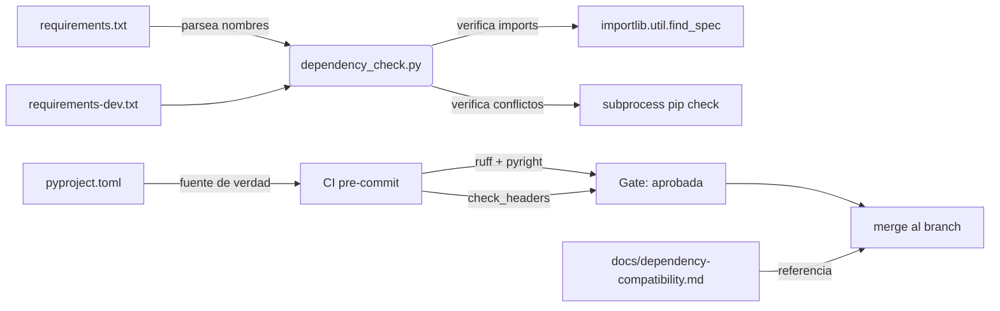
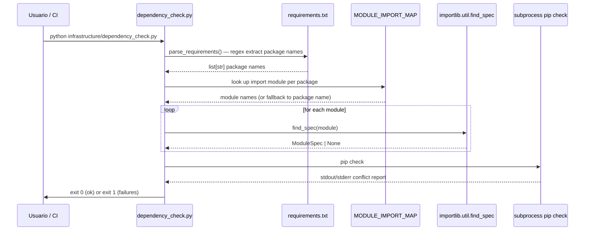

# Diseño Técnico: Compatibilidad de Dependencias

## 1. Resumen

Este diseño define la implementación de una validación de compatibilidad para el conjunto de dependencias del proyecto AEGF. La solución consta de tres componentes: actualización de tres archivos de dependencias (`requirements.txt`, `requirements-dev.txt`, `pyproject.toml`), un script de validación ejecutable (`infrastructure/dependency_check.py`), y un documento de referencia (`docs/dependency-compatibility.md`). El enfoque prioritario es la inmutabilidad: todas las versiones directas usan pins exactos (`==`) y los rangos acotados (`>=x,<y`) se reservan exclusivamente para dependencias transitivas con historial de rupturas mayores.

## 2. Arquitectura del Sistema



### Flujo de validación del script



## 3. Estructura de Archivos

```
data_factory/
├── requirements.txt                  # MODIFICAR: agregar pins exactos
├── requirements-dev.txt              # MODIFICAR: remover openai de dev
├── pyproject.toml                    # MODIFICAR: actualizar [project].dependencies
├── infrastructure/                   # CREAR: directorio nuevo
│   └── dependency_check.py           # CREAR: script de validación (~150-200 LOC)
├── docs/
│   └── dependency-compatibility.md   # CREAR: documento de referencia
└── scripts/
    └── check_headers.py              # MODIFICAR: añadir "infrastructure/" a INCLUDE_PREFIXES
```

### Archivos de origen que necesitan `numpy` (ya resuelto con el pin)

Los siguientes archivos importan `numpy` actualmente sin que este esté en `requirements.txt`:
- `src/audit/eval_bpb.py` (línea 30)
- `scripts/benchmark/measure_performance.py` (línea 34)

El pin de `numpy==2.4.4` en `requirements.txt` resuelve los `ModuleNotFoundError` existentes.

## 4. Diseño de Componentes

### 4.1 Actualización de archivos de dependencias

#### requirements.txt

Agregar las siguientes líneas al final del archivo (después de las secciones existentes):

```python
# New dependencies — added for dependency-compatibility spec (2026-04-24)
dspy==3.2.0
langgraph==0.2.76
openai==2.32.0

# Bugfix: previously missing, required by src/audit/eval_bpb.py and scripts/benchmark/measure_performance.py
numpy==2.4.4

# Pinned to prevent 4.x API breakage (datasets 4.x changes core data format)
datasets==2.21.0

# Bounded ranges for known breaking-change transitive dependencies
packaging>=25.0,<26.0
fsspec>=2023.1.0,<2025.0.0
```

No se incluye `torch` (opcional, documentado en el doc de compatibilidad).

#### requirements-dev.txt

Eliminar la línea `openai>=1.0.0` (movida a runtime). El resto se mantiene:

```
# AEGF — Development & test dependencies
# Install with: pip install -r requirements-dev.txt
-r requirements.txt
pytest>=9.0
pytest-cov>=7.0
pytest-randomly>=3.0
pytest-asyncio>=0.24
psutil>=5.9
ruff>=0.9
```

Nota: `openai` se elimina completamente porque `dspy==3.2.0` lo requiere en runtime (ya incluido en `requirements.txt` como `openai==2.32.0`).

#### pyproject.toml

El bloque `[project].dependencies` se reemplaza por:

```toml
dependencies = [
    "PyYAML>=6.0",
    "pydantic>=2.0",
    "requests>=2.28",
    "google-genai>=1.0",
    "python-dotenv>=1.0",
    "tqdm>=4.64",
    "dspy>=3.2.0,<4.0.0",
    "langgraph>=0.2.76,<1.0.0",
    "openai==2.32.0",
    "numpy==2.4.4",
    "datasets==2.21.0",
    "httpx>=0.27",
    "huggingface-hub>=0.22",
    "tiktoken>=0.7",
    "click>=8.1",
]
```

Cambios clave:
- `dspy`: rango con `>=3.2.0,<4.0.0` (previene saltos mayores, `dspy` tiene cadencia de 1-3 meses)
- `langgraph`: rango con `>=0.2.76,<1.0.0` (previene saltos mayores, `langgraph` tiene cadencia rápida)
- `openai`, `numpy`, `datasets`: pins exactos
- Se mantienen las dependencias existentes que no fueron listadas explícitamente en requirements.txt pero sí en pyproject.toml: `httpx`, `huggingface-hub`, `tiktoken`, `click`
- Se eliminan: `PyYAML` y `pydantic` se mantienen, pero se agrega el orden coherente con requirements.txt

El bloque `[project.optional-dependencies].dev` se limpia de `openai` (ya no necesita estar en dev):

```toml
dev = [
    "pytest>=9.0",
    "pytest-cov>=7.0",
    "pytest-randomly>=3.0",
    "pytest-asyncio>=0.24",
    "psutil>=5.9",
    "ruff>=0.9",
]
```

#### pyproject.toml — Actualización de coverage

Añadir `infrastructure/` al bloque `[tool.coverage.run].source`:

```toml
source = ["src/audit", "src/utils", "src/factory", "src/curation", "src/discovery", "infrastructure"]
```

#### scripts/check_headers.py — Actualización

Añadir `"infrastructure/"` a `INCLUDE_PREFIXES`:

```python
INCLUDE_PREFIXES = (
    "src/",
    "tests/",
    "docs/",
    "scripts/",
    "deploy/",
    "diagnose/",
    "examples/",
    "legacy/",
    "infrastructure/",
)
```

### 4.2 infrastructure/dependency_check.py

Este es el componente central del diseño. Es un script ejecutable, no una biblioteca. No usa POO.

#### Definición de datos

```python
from __future__ import annotations

import logging
import re
import subprocess
import sys
from dataclasses import dataclass, field
from importlib.util import find_spec
from pathlib import Path
from types import ModuleType
from typing import NoReturn

__all__: list[str] = []

logger = logging.getLogger(__name__)


@dataclass(frozen=True)
class ImportResult:
    """Resultado de verificar si un módulo se puede importar.

    Attributes:
        package: Nombre del paquete en requirements.txt (p. ej. "dspy").
        module: Nombre del módulo para import-check (p. ej. "dspy" o "langchain_core").
        found: True si el módulo está disponible.
        spec: El ModuleSpec retornado por find_spec, o None si no se encontró.
    """
    package: str
    module: str
    found: bool
    spec: ModuleType | None = None  # type: ignore[assignment]  # ModuleType for pyright compat


@dataclass(frozen=True)
class CheckResult:
    """Resultado consolidado de una verificación.

    Attributes:
        ok: True si no hay fallos.
        failures: Lista de descripciones de fallos.
    """
    ok: bool
    failures: list[str] = field(default_factory=list)

    @classmethod
    def ok_result(cls) -> CheckResult:
        """Retorna una CheckResult exitosa sin fallos."""
        return cls(ok=True, failures=[])

    def add_failure(self, msg: str) -> CheckResult:
        """Añade un fallo y retorna un nuevo CheckResult (inmutabilidad)."""
        return CheckResult(ok=False, failures=self.failures + [msg])
```

#### Mapa de paquetes a módulos

```python
# Mapeo de nombre de paquete (requirements.txt) a nombre de módulo Python.
# Si un paquete no está aquí, se asume que package_name == module_name.
PACKAGE_IMPORT_MAP: dict[str, tuple[str, ...]] = {
    "dspy": ("dspy",),
    "langgraph": ("langgraph", "langgraph.checkpoint.memory"),
    "langgraph-prebuilt": ("langgraph_prebuilt",),
    "langchain-core": ("langchain_core",),
    "google-genai": ("google_genai", "google.genai"),
    "huggingface-hub": ("huggingface_hub",),
    "python-dotenv": ("dotenv",),
    "pydantic": ("pydantic",),
    "pyyaml": ("yaml",),
    "pytest-cov": ("coverage",),
    "psutil": ("psutil",),
    "openai": ("openai",),
    "numpy": ("numpy",),
    "datasets": ("datasets",),
    "tiktoken": ("tiktoken",),
    "httpx": ("httpx",),
    "click": ("click",),
    "tqdm": ("tqdm",),
    "requests": ("requests",),
}
```

#### Funciones

```python
def parse_requirements(path: Path) -> list[str]:
    """Extraer nombres de paquetes de un archivo requirements.txt.

    Parsea cada línea con regex, ignorando comentarios, includes (-r),
    opciones (--index-url) y líneas vacías. Los nombres de paquete se
    devuelven sin versiones (solo el nombre canonical).

    Args:
        path: Ruta al archivo requirements.txt.

    Returns:
        Lista de nombres de paquete en lowercase canonical.

    Raises:
        FileNotFoundError: Si el archivo no existe.
        PermissionError: Si no se puede leer el archivo.
    """
    pattern = re.compile(
        r"^([a-zA-Z0-9_][a-zA-Z0-9._-]*)"  # package name (PEP 503-ish)
        r"(?:[><=!~].*)?"                    # optional version spec
        r"\s*$"                              # optional whitespace
    )
    lines = path.read_text(encoding="utf-8").splitlines()
    packages: list[str] = []
    for line in lines:
        stripped = line.strip()
        if not stripped or stripped.startswith("#") or stripped.startswith("-"):
            continue
        match = pattern.match(stripped)
        if match:
            packages.append(match.group(1).lower())
    return packages
```

```python
def _resolve_module(package_name: str) -> tuple[str, ...]:
    """Resolver nombre(s) de módulo para un paquete.

    Args:
        package_name: Nombre canónico del paquete (p. ej. "dspy", "huggingface-hub").

    Returns:
        Tuple de nombres de módulo para verificar. Si el paquete no está en
        PACKAGE_IMPORT_MAP, retorna (package_name,).
    """
    return PACKAGE_IMPORT_MAP.get(package_name, (package_name,))
```

```python
def check_imports(packages: list[str]) -> CheckResult:
    """Verificar que cada paquete de requirements.txt puede importarse.

    Para cada paquete, intenta find_spec para cada módulo mapeado.
    No ejecuta import — solo verifica la existencia del módulo.

    Args:
        packages: Lista de nombres de paquete desde parse_requirements().

    Returns:
        CheckResult con detalles de fallos (si los hay).
    """
    results: list[ImportResult] = []
    failures: list[str] = []

    for package in packages:
        modules = _resolve_module(package)
        for module_name in modules:
            spec = find_spec(module_name)
            found = spec is not None
            results.append(ImportResult(
                package=package,
                module=module_name,
                found=found,
                spec=spec,
            ))
            if not found:
                failures.append(
                    f"import no encontrado: módulo '{module_name}' "
                    f"(paquete: '{package}')"
                )

    return CheckResult(ok=len(failures) == 0, failures=failures)
```

```python
def check_pip_conflicts() -> CheckResult:
    """Verificar conflictos de versión con `pip check`.

    Ejecuta `python -m pip check` en el entorno actual. Si pip reporta
    conflictos, parsea la salida para construir una CheckResult con
    mensajes de fallo descriptivos.

    Returns:
        CheckResult.ok=True si no hay conflictos, CheckResult.ok=False
        con lista de mensajes de conflicto.
    """
    try:
        proc = subprocess.run(
            [sys.executable, "-m", "pip", "check"],
            capture_output=True,
            text=True,
            timeout=120,
        )
    except FileNotFoundError:
        return CheckResult(
            ok=False,
            failures=["pip no encontrado en el entorno"],
        )
    except subprocess.TimeoutExpired:
        return CheckResult(
            ok=False,
            failures=["pip check excedió el tiempo límite (120s)"],
        )

    if proc.returncode != 0:
        # Parse output: "package X requires Y, but you haven't installed Z."
        errors: list[str] = []
        for line in proc.stderr.splitlines() + proc.stdout.splitlines():
            line_stripped = line.strip()
            if line_stripped and not line_stripped.startswith("#"):
                errors.append(line_stripped)
        return CheckResult(ok=False, failures=errors)

    return CheckResult.ok_result()
```

```python
def main(argv: list[str] | None = None) -> int:
    """Punto de entrada principal. Configura logging y ejecuta verificaciones.

    Args:
        argv: Argumentos de línea de comando (para testing).

    Returns:
        0 si todas las verificaciones pasan, 1 si hay fallos.
    """
    logging.basicConfig(
        format="%(asctime)s [%(levelname)s] %(name)s: %(message)s",
        level=logging.INFO,
    )

    project_root = Path(__file__).resolve().parent.parent
    requirements_path = project_root / "requirements.txt"

    logger.info("Iniciando verificación de dependencias")

    # 1. Parse requirements.txt
    try:
        packages = parse_requirements(requirements_path)
    except (FileNotFoundError, PermissionError) as exc:
        logger.error("No se pudo leer %s: %s", requirements_path, exc)
        print(f"ERROR: {exc}", file=sys.stderr)
        return 1

    logger.info("Paquetes encontrados en requirements.txt: %d", len(packages))

    # 2. Check imports
    import_result = check_imports(packages)
    if not import_result.ok:
        logger.error("Fallos de import: %s", import_result.failures)
        for msg in import_result.failures:
            print(f"  FAIL: {msg}", file=sys.stderr)
        return 1

    logger.info("Todas las importaciones verificadas correctamente")

    # 3. Check pip conflicts
    pip_result = check_pip_conflicts()
    if not pip_result.ok:
        logger.error("Conflictos de pip: %s", pip_result.failures)
        for msg in pip_result.failures:
            print(f"  FAIL: {msg}", file=sys.stderr)
        return 1

    logger.info("Sin conflictos de versiones detectados")
    print("OK: Todas las verificaciones de dependencia pasaron.")
    return 0


if __name__ == "__main__":
    raise SystemExit(main())
```

#### Resumen de funciones

| Función | Input | Output | Propósito |
|---------|-------|--------|-----------|
| `parse_requirements(path: Path)` | Ruta al archivo | `list[str]` | Extraer nombres de paquetes desde requirements.txt |
| `_resolve_module(package: str)` | Nombre de paquete | `tuple[str, ...]` | Resolver nombres de módulo desde el mapa |
| `check_imports(packages: list[str])` | Lista de paquetes | `CheckResult` | Verificar que cada módulo es importable |
| `check_pip_conflicts()` | (ninguno) | `CheckResult` | Ejecutar `pip check` para conflictos |
| `main(argv: list[str] | None)` | Args opcionales | `int` | Orquestación, logging, exit code |

#### Detalles de diseño crítico

1. **Sin POO**: No hay clases, solo `@dataclass(frozen=True)` para datos inmutables y funciones puras.
2. **Sin efectos secundarios en import**: Todo el código de ejecución está dentro de `if __name__ == "__main__"`. Las importaciones (`importlib.util.find_spec`) se lladan solo dentro de funciones.
3. `find_spec` en lugar de `importlib.import_module`: `find_spec` verifica existencia sin ejecutar código del módulo. `import_module` ejecutaría el módulo importado (efectos secundarios).
4. `CheckResult` es inmutable (frozen dataclass) — `add_failure` retorna un nuevo objeto.
5. **Extensibilidad**: Los paquetes se leen de `requirements.txt` en tiempo de ejecución. `PACKAGE_IMPORT_MAP` es un dict de solo lectura que se puede ampliar sin cambiar lógica.
6. **Sin bare except**: Cada bloque `except` especifica tipos concretos (`FileNotFoundError`, `PermissionError`, `subprocess.TimeoutExpired`, `FileNotFoundError`).

### 4.3 docs/dependency-compatibility.md

El documento debe tener la siguiente estructura de secciones:

```
# Documentación de Compatibilidad de Dependencias

1. Tabla de dependencias (directas e indirectas)
   - Nombre | Versión | Tipo (directo/transitivo) | Archivo de origen | Notas
2. CVE y Seguridad
   - 6 CVEs de litellm 1.82.6 (IDs, severidad, estado)
   - Estado del decision gate
3. Racional de Versionado
   - Por qué `==` para paquetes directos
   - Por qué rangos acotados para packaging y fsspec
   - Cadencias de release de cada paquete
4. Downgrades Esperados
   - packaging 26.0→25.0 (causa: langgraph<1.0 constraint)
   - fsspec 2026.3.0→2024.6.1 (causa: datasets==2.21.0)
5. Caveats de Python 3.14
   - tokenizers: sin wheels
   - tiktoken: sin wheels, requiere Rust en CI
6. Instrucciones de Instalación
   - Instalación base (sin torch)
   - Instalación con torch CPU
   - Instalación completa con torch GPU
7. Baselines Medidos
   - Tiempo de instalación
   - Uso de disco
8. Paquetes Opcionales
   - torch: cómo instalar, por qué no está en requirements.txt
9. Monitoreo y Mantenimiento
   - Cómo actualizar pins
   - Cuándo revisar el decision gate
   - Dependabot / monitoreo de CVEs
```

## 5. Decisiones Técnicas

### 5.1 importlib.util.find_spec vs importlib.import_module

**Decisión:** Usar `find_spec`.

**Justificación:** `import_module` ejecuta el código del módulo importado, lo que podría tener efectos secundarios (inicialización de conexiones, carga de modelos, I/O). `find_spec` solo verifica que el módulo existe en `sys.path` sin ejecutar nada. Esto es crítico para un script de verificación que debe ser seguro ejecutar en cualquier estado del entorno.

**Alternativa rechazada:** `importlib.import_module` — ejecutaría el módulo, violando la regla de "no efectos secundarios en import".

### 5.2 Dataclasses frozen vs clases simples

**Decisión:** `@dataclass(frozen=True)`.

**Justificación:** Los datos de resultado son inmutables por naturaleza — una vez que se determina que un módulo se puede o no importar, ese resultado no cambia. `frozen=True` asegura que `pyright --strict` verifique que no haya mutaciones.

**Alternativa rechazada:** Named tuples — menos descriptivos, sin tipado fuerte de campos, sin `field(default_factory=...)`.

### 5.3 Regex para parsear requirements.txt vs pip-parse

**Decisión:** Regex simple para extraer nombres de paquetes.

**Justificación:** requirements.txt tiene una sintaxis lineal simple (nombre + versión opcional). Un regex captura lo esencial sin necesidad de parsers externos ni ejecución de pip. Es predecible, rápido y no tiene dependencias adicionales.

**Alternativa rechazada:** Usar `pip freeze` o `pkg_resources` — añade complejidad y dependencias externas innecesarias.

### 5.4 subprocess.run para pip check vs pip API

**Decisión:** Ejecutar `python -m pip check` vía `subprocess.run`.

**Justificación:** `pip` no expone una API Python pública para verificar conflictos. `pip check` es la forma oficial y su salida es bien definida. Ejecutarlo como subprocess garantiza que use el mismo entorno Python que el script.

**Alternativa rechazada:** Parsear `pip list --outdated` o `pip show` — no verifican conflictos de versión entre paquetes instalados.

### 5.5 PACKAGE_IMPORT_MAP como dict vs tuple hard-coded

**Decisión:** Dict `PACKAGE_IMPORT_MAP` con fallback.

**Justificación:** La revisión adversaria (Amelia) identificó que un tuple hard-coded de paquetes a verificar viola el criterio de aceptabilidad de ser "extensible". El mapa permite agregar nuevos paquetes sin cambiar la lógica de `check_imports`. El fallback (asumir que nombre de paquete == nombre de módulo) cubre el 80% de los casos sin necesidad de mapeo.

**Alternativa rechazada:** Tuple hard-coded — rígido, no escalable, requeriría modificar código para cada nuevo paquete.

### 5.6 Subproceso `pip check` con timeout de 120s

**Decisión:** Timeout de 120 segundos.

**Justificación:** En entornos con pip lento o redes lentas, `pip check` puede tardar varios segundos. 120s es un margen generoso pero razonable. Se captura `TimeoutExpired` como error explícito en lugar de dejar que el subprocess se ejecute indefinidamente.

## 6. Manejo de Errores

### 6.1 dependency_check.py

| Escenario | Tipo de error | Acción |
|-----------|--------------|--------|
| requirements.txt no encontrado | `FileNotFoundError` | `logger.error` + mensaje en stderr + exit 1 |
| Sin permiso de lectura | `PermissionError` | `logger.error` + mensaje en stderr + exit 1 |
| Módulo no encontrado | Lógica normal (no error) | Reportar en `CheckResult.failures` + exit 1 |
| pip no instalado | `FileNotFoundError` (subprocess) | `CheckResult.failures` con mensaje descriptivo + exit 1 |
| pip check excede timeout | `subprocess.TimeoutExpired` | `CheckResult.failures` con mensaje "timeout" + exit 1 |
| Salida de pip check con conflictos | Retorno code != 0 | Parsear stdout/stderr, reportar cada conflicto |
| Línea malformed en requirements.txt | Regex no matching | Se salta silenciosamente (comentarios, líneas vacías) |

### 6.2 check_headers.py

| Escenario | Tipo de error | Acción |
|-----------|--------------|--------|
| Archivo no existe | IOError | `except Exception` (ya existe en la implementación) |
| git no disponible | `subprocess.CalledProcessError` | Fallback a `Path.rglob` |

## 7. Estrategia de Pruebas

### 7.1 Unit tests para dependency_check.py

```
tests/test_infrastructure/
├── __init__.py
├── test_dependency_check.py
```

#### Casos de test

| Test | Qué verifica | Mock/fixture |
|------|-------------|--------------|
| `test_parse_requirements_empty` | Archivo vacío retorna lista vacía | `Path.read_text` → `""` |
| `test_parse_requirements_with_comments` | Ignora comentarios y líneas vacías | `Path.read_text` → `# comment\n\ndspy==3.2.0` |
| `test_parse_requirements_with_versions` | Extrae solo nombres, no versiones | `Path.read_text` → `"dspy==3.2.0\nnumpy>=1.0"` |
| `test_parse_requirements_excludes_includes` | Ignora líneas que comienzan con `-` | `Path.read_text` → `"-r other.txt\ndspy==3.2.0"` |
| `test_parse_requirements_file_not_found` | Raise `FileNotFoundError` | `Path.read_text` → raise |
| `test_resolve_module_known` | Paquete conocido retorna módulos correctos | `_resolve_module("dspy")` → `("dspy",)` |
| `test_resolve_module_unknown` | Paquete desconocido retorna (package,) | `_resolve_module("alguien")` → `("alguien",)` |
| `test_check_imports_all_found` | CheckResult.ok=True cuando todos están | `find_spec` retorna spec para todos |
| `test_check_imports_missing_one` | CheckResult.ok=False con mensaje | `find_spec` retorna None para "dspy" |
| `test_check_pip_conflicts_clean` | CheckResult.ok=True con retorno 0 | `subprocess.run` → returncode=0 |
| `test_check_pip_conflicts_has_conflicts` | CheckResult.ok=False con mensajes | `subprocess.run` → returncode=1, stderr con conflictos |
| `test_check_pip_conflicts_pip_missing` | CheckResult.ok=False con "pip no encontrado" | `subprocess.run` → FileNotFoundError |
| `test_main_success` | main() retorna 0 con todo limpio | Patch de todas las funciones internas |
| `test_main_import_failure` | main() retorna 1 con import faltante | `check_imports` retorna CheckResult.ok=False |

#### Cobertura objetivo

`infrastructure/dependency_check.py` debe alcanzar >=85% de cobertura (coherente con `pyproject.toml [tool.coverage.report].fail_under = 85`).

### 7.2 Integración con CI

```yaml
# En el workflow de CI, después de instalar dependencias:
- name: Verify dependency compatibility
  run: python infrastructure/dependency_check.py
```

El script debe pasar en el mismo entorno donde se ejecutan los tests.

## 8. Plan de Integración

### 8.1 Orden de implementación

1. **Crear** `infrastructure/` directorio
2. **Crear** `infrastructure/dependency_check.py` con el código completo
3. **Actualizar** `requirements.txt` — agregar nuevos pins
4. **Actualizar** `requirements-dev.txt` — eliminar `openai`
5. **Actualizar** `pyproject.toml` — actualizar `[project].dependencies` y `[tool.coverage.run].source`
6. **Actualizar** `scripts/check_headers.py` — añadir `"infrastructure/"` a `INCLUDE_PREFIXES`
7. **Crear** `docs/dependency-compatibility.md` con toda la documentación
8. **Validar** con `ruff check infrastructure/` y `pyright --strict infrastructure/dependency_check.py`
9. **Ejecutar** `python infrastructure/dependency_check.py` para verificar que pasa
10. **Ejecutar** `pip install -r requirements.txt` para verificar cero warnings
11. **Firmar** el decision gate de litellm CVEs antes de merge

### 8.2 Archivos afectados por el cambio

| Archivo | Acción | Líneas estimadas |
|---------|--------|-----------------|
| `requirements.txt` | Modificar | +7 líneas |
| `requirements-dev.txt` | Modificar | -1 línea |
| `pyproject.toml` | Modificar | +7 líneas en dependencies, +1 en source |
| `infrastructure/dependency_check.py` | Crear | ~180 líneas |
| `docs/dependency-compatibility.md` | Crear | ~200-300 líneas |
| `scripts/check_headers.py` | Modificar | +1 línea en INCLUDE_PREFIXES |

### 8.3 Verificación pre-merge

Antes de merge, ejecutar en secuencia:

```bash
# 1. Instalar nuevas dependencias
pip install -r requirements.txt

# 2. Verificar que no hay warnings de conflicto
pip install -r requirements-dev.txt

# 3. Ejecutar script de validación
python infrastructure/dependency_check.py

# 4. Validar tipado estricto
pyright --strict infrastructure/dependency_check.py

# 5. Validar linting
ruff check infrastructure/

# 6. Validar cabeceras
python scripts/check_headers.py --check

# 7. Ejecutar suite de tests existente
pytest -v

# 8. Verificar que numpy imports funcionan
python -c "import numpy; print(numpy.__version__)"
python -c "import dspy; print(dspy.__version__)"
python -c "import langgraph; print(langgraph.__version__)"
```

### 8.4 Riesgos y mitigaciones

| Riesgo | Probabilidad | Impacto | Mitigación |
|--------|-------------|---------|------------|
| `dspy==3.2.0` tiene bugs no descubiertos | Media | Alto | Monitorizar issues de DSPy; el decision gate captura riesgos conocidos |
| `torch` no se instala por defecto y un usuario lo necesita | Alta | Medio | Documentación clara en `docs/dependency-compatibility.md`; mensaje de error claro si intenta importar |
| `pip install` falla en CI por falta de Rust (tiktoken/tokenizers) | Media (Python 3.14) | Alto | Documentar en `docs/dependency-compatibility.md`; agregar Rust toolchain si se usa Python 3.14 en CI |
| `pip check` es lento en CI | Baja | Bajo | Timeout de 120s ya configurable; en CI real probablemente <5s |

## 9. Decision Gate: litellm CVEs

Este documento identifica un riesgo de seguridad crítico que requiere acción humana antes del merge:

- **Paquete vulnerable:** `litellm==1.82.6` (transitivo vía `dspy==3.2.0`)
- **CVEs:** 6 (2 Críticos, 4 Altos)
- **Versión parcheada:** `litellm>=1.83.7`
- **Bloqueo:** `dspy<=3.2.0` restringe `litellm<=1.82.6`
- **Opciones:** (A) Aceptar riesgo y monitorear; (B) Parchear dspy manualmente; (C) Bloquear merge; (D) Aceptar con monitoreo automático

**El merge de este spec debe esperar la firma del decision gate.** El script `dependency_check.py` no verifica CVEs — eso queda documentado en `docs/dependency-compatibility.md` para seguimiento humano.
