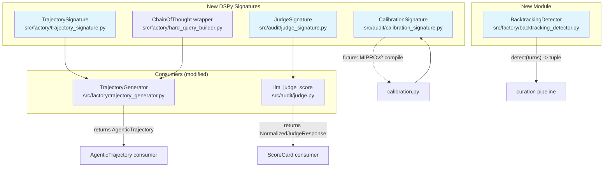
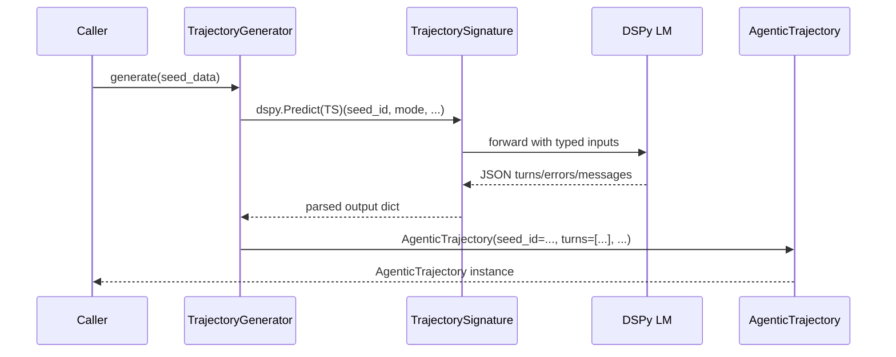
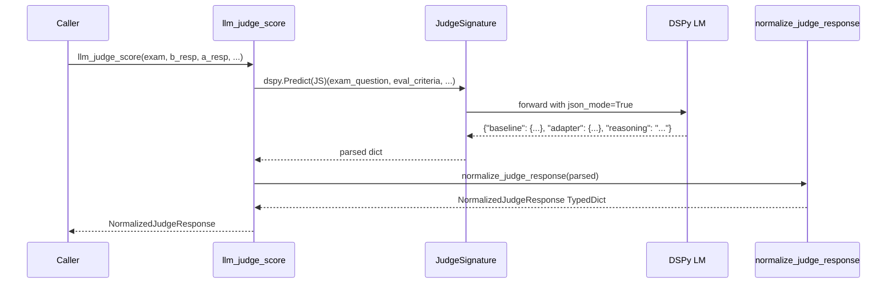

# Design: DSPy Integration — Signature Conversion

## Overview

Convert 4 `.example.yaml` prompt templates into DSPy Signatures (TrajectorySignature, JudgeSignature, CalibrationSignature) plus dspy.ChainOfThought for Hard Query, fixing 7 known source bugs. The approach is minimal: new signature files with typed InputField/OutputField declarations, consumers wired to dspy.Predict at runtime, structural output compatible with existing Pydantic models and TypedDicts. No behavioral change — refactor only.

## Architecture



## Components

### TrajectorySignature
**File**: `src/factory/trajectory_signature.py`
**Purpose**: Typed DSPy Signature for trajectory generation. Replaces hardcoded template strings.
**Source docstring**: `src/factory/prompts_trajectory.example.yaml`
**Input fields**:
- `seed_id: str` — seed identifier
- `mode: str` — "hard_query", "explicit", or "no_call"
- `use_case: str` — domain (e.g., "home_assistant")
- `question: str` — the seed question
- `context: str` — background context
- `error_probability: float` — error injection probability
- `has_error: bool` — whether to inject an error turn
- `is_cascade: bool` — whether error is cascade type
- `tool_format: str` — "json" or "xml"

**Output fields**:
- `turns_json: str` — JSON string representing turns array (each turn with turn_index, turn_type, content, tool_name, tool_args, tool_result, reasoning)
- `errors_json: str` — JSON string representing errors array
- `messages_json: str` — JSON string representing ChatML messages
- `use_case: str` — domain string (echoed)

**Rationale**: The output is a single structured trajectory. JSON string outputs let the consumer parse into Pydantic models. This matches how `llm_judge_score` already handles judge output (json.loads + normalize). Using typed `dict[str, float]` for scores is supported in DSPy 3.2.0, but for complex nested structures (turns with enums, nested dicts), a JSON string is more robust and the consumer already handles parsing.

### JudgeSignature
**File**: `src/audit/judge_signature.py`
**Purpose**: Typed DSPy Signature for LLM-as-Judge scoring. Replaces hardcoded `professor_judge` prompt.
**Source docstring**: `src/audit/prompts_judge.example.yaml` (professor_judge section)
**Input fields**:
- `exam_question: str`
- `eval_criteria: str` — newline-separated criteria
- `target_patterns: str` — newline-separated patterns
- `baseline_response: str` — truncated
- `adapter_response: str` — truncated

**Output fields**:
- `baseline: dict[str, float]` — scores per dimension (5 dimensions)
- `adapter: dict[str, float]` — scores per dimension (5 dimensions)
- `reasoning: str` — why the delta is positive/negative

**Rationale**: Output types must match `NormalizedJudgeResponse` TypedDict exactly. DSPy 3.2.0 supports `dict[str, float]` typed output fields. The consumer (`llm_judge_score`) already uses `json_mode=True` and `json.loads` + `normalize_judge_response()`. This is a direct 1:1 replacement.

**Bug fix #1**: Docstring says "Architecture 2026" not "Architecture architecture".

### CalibrationSignature
**File**: `src/audit/calibration_signature.py`
**Purpose**: Typed DSPy Signature for calibration parameter optimization. Models the grid search process.
**Source docstring**: `src/audit/prompts_calibration.example.yaml`
**Input fields**:
- `parameter_target: list[str]` — structured field (NOT embedded in .system text). Values from `VALID_PARAMETERS` in calibration_schema.py
- `evaluation_focus: str` — what aspect to evaluate
- `question: str` — the calibration question
- `temperature: float`
- `top_k: int`
- `min_p: float`
- `quality_target: str` — quality threshold description
- `judge_scores: dict[str, float]` — scores from prior evaluation
- `composite_score: float`

**Output fields**:
- `best_profile_json: str` — JSON with temperature, top_k, min_p, repetition_penalty, presence_penalty
- `composite_score: float` — final adjusted score
- `reasoning: str` — why this profile is best
- `parameter_effectiveness: float` — 0.0 to 1.0

**Rationale**: The signature models the optimization process (grid search → best params). Bug #2 fix: `parameter_target` is a structured `list[str]` InputField, not embedded in `.system` text. Output includes `best_profile_json` as a JSON string (consumer constructs `SamplingProfile` from it).

### BacktrackingDetector
**File**: `src/factory/backtracking_detector.py`
**Purpose**: Standalone utility to detect ERROR→CORRECT patterns in trajectory turns. Independent of DSPy.
**Input**: `turns: list[Turn]` from `src.factory.schema`
**Output**: `tuple[bool, list[int], str]` — (has_backtracking, backtracking_turn_indices, strategy)

**Methods**:
- `detect(turns: list[Turn]) -> tuple[bool, list[int], str]` — main detection
- `detect_from_messages(messages: list[Message]) -> tuple[bool, list[int], str]` — convenience, converts messages to turns first

**Detection logic**:
1. Find consecutive ERROR→CORRECT pairs (TurnType.ERROR followed by TurnType.CORRECT)
2. Return indices of both turns + strategy description
3. Strategy classification: "error_recovery" for ERROR→CORRECT, "cascade_recovery" for ERROR→ACTION→CORRECT

**Constraint**: Must NOT import `dspy`. Pure utility.

### Hard Query ChainOfThought
**File**: `src/factory/hard_query_builder.py` (modified)
**Purpose**: Replace hardcoded Spanish category→objective mapping with `dspy.ChainOfThought`.

**Change**: `_transform_to_abstract(category, context)` becomes:
```python
cot_sig = dspy.Signature("category: str, context: str -> abstract_objective: str")
cot = dspy.ChainOfThought(cot_sig)
result = cot(category=category, context=context)
return result.abstract_objective  # ChainOfThought adds reasoning field, we extract the final output
```

**Bug fix #6**: Comment documenting that `forbidden_terms` are literal match strings, NOT translatable prompt content.

## File Structure

| File | Action | Purpose |
|------|--------|---------|
| `src/factory/trajectory_signature.py` | **Create** | TrajectorySignature DSPy Signature |
| `src/audit/judge_signature.py` | **Create** | JudgeSignature DSPy Signature |
| `src/audit/calibration_signature.py` | **Create** | CalibrationSignature DSPy Signature |
| `src/factory/backtracking_detector.py` | **Create** | BacktrackingDetector utility |
| `src/factory/trajectory_generator.py` | **Modify** | Import TrajectorySignature, use dspy.Predict when LM available |
| `src/audit/judge.py` | **Modify** | Import JudgeSignature, use dspy.Predict alongside existing PromptManager fallback |
| `src/factory/hard_query_builder.py` | **Modify** | Replace `_transform_to_abstract` with dspy.ChainOfThought, add bug #6 comment |
| `src/export/frontend_taxonomy_prompts.py` | **Delete** | Dead code, 0 imports in src/ |

## Data Flow





## Technical Decisions

| Decision | Options Considered | Choice | Rationale |
|----------|-------------------|--------|-----------|
| Output format for complex structures | (A) Typed dict fields, (B) JSON string + consumer parsing, (C) Pydantic models as output fields | (B) | DSPy 3.2.0 handles `dict[str, float]` well but nested structures with enums (TurnType) and optional fields are fragile via LLM output. JSON string lets consumer use `json.loads()` + Pydantic validation — same pattern `llm_judge_score` already uses. |
| Prompt source: YAML or docstring | (A) Embed in docstring, (B) Load from YAML at module level, (C) Load from YAML at consumer runtime via `with_instructions()` | (C) | Signatures stay pure Python (schema only). YAML loading happens in consumers where they already know the path. `with_instructions()` returns new class — no mutation. Testable: unit tests pass hardcoded instructions, integration tests load YAML. |
| Backtracking detector location | (A) `src/factory/`, (B) `src/curation/` | (A) | Spec explicitly requires `src/factory/backtracking_detector.py`. Curation has backtracking *rewriter*; factory needs backtracking *detector*. Separate concerns. |
| Integration pattern | (A) Full replacement, (B) Dual path with fallback, (C) Parallel then switch | (C) | DSPy LM requires API key/config. If `dspy.LM` is not configured, fall back to existing template-based path. Zero behavioral risk. |
| ChainOfThought return type | (A) Extract `abstract_objective` directly, (B) Return full CoT result dict | (A) | `_transform_to_abstract()` return type is `str`. Consumer passes return value to `template_str.format(objective=...)`. Must return string only. |
| JudgeSignature output types | (A) `dict[str, float]`, (B) Pydantic `ScoreModel` sub-models, (C) JSON string | (A) | `NormalizedJudgeResponse` is a TypedDict with `dict[str, float]`. DSPy 3.2.0 supports this type natively. Verified via quick test. |
| Dead code deletion scope | (A) Delete only, (B) Delete + update prompts_frontend.example.yaml reference | (A) | Only Python imports matter. The `.yaml` reference is documentation. If someone reads the YAML, they'll find the code deleted — that's fine, it signals the pattern was removed. |
| CalibrationSignature modeling | (A) Direct parameter→score mapping, (B) Grid search process modeling | (B) | Actual `calibration.py` uses brute-force Cartesian product grid search. The signature should model the optimization process, not a simple function. Output: best_profile_json, composite_score, reasoning. |

## Error Handling

| Error Scenario | Handling Strategy | User Impact |
|----------------|-------------------|-------------|
| `dspy.LM` not configured | Fall back to existing template-based path (TrajectoryGenerator) / existing PromptManager path (judge.py) | No change — production behavior preserved |
| DSPy JSON parsing fails | Try `json.loads` fallback to `normalize_judge_response()` — same as existing error path | Same error as before: `PromptGenerationError` raised |
| `_transform_to_abstract` returns non-English text | `validate_prompt()` + `build_with_validation()` retry logic unchanged | Same retry behavior, may raise ValueError after 3 retries |
| `BacktrackingDetector.detect` receives empty turns list | Return `(False, [], "no_turns")` | No crash, pipeline continues |
| CalibrationSignature produces invalid `best_profile_json` | Consumer catches `json.JSONDecodeError`, logs warning, falls back to grid search best | Same as before: grid search baseline still available |

## Edge Cases

- **Empty trajectory turns**: BacktrackingDetector handles `len(turns) == 0` gracefully.
- **Non-error mode trajectory**: ERROR→CORRECT detection only fires when `TurnType.ERROR` and `TurnType.CORRECT` exist. Non-error trajectories pass through with `has_backtracking=False`.
- **DSPy LM unavailable**: Both TrajectoryGenerator and judge.py check for `dspy.LM` availability before using signatures. If unavailable, fall back to existing code path.
- **Hard query forbidden terms**: The forbidden terms list contains Spanish literal match strings. DSPy comment documents these are NOT translatable — they are the actual text patterns to find.
- **Whitespace before `</s>`/`</think>`**: Bug #4 fix — normalize in signature docstrings by stripping trailing whitespace before special tokens.
- **parameter_target format**: Bug #2 fix — the `.example.yaml` stores `parameter_target` as a comma-separated string in the `.system` key. The Signature uses it as a structured `list[str]` InputField.

## Test Strategy

### Test Double Policy

| Component | Test double | When to use |
|---|---|---|
| TrajectorySignature | Stub LM response | Own DSPy signature — test schema + parse logic. Stub LM output for predict tests. |
| JudgeSignature | Stub LM response | Own DSPy signature — test schema + parse logic. Stub LM output. |
| CalibrationSignature | Stub LM response | Own DSPy signature — test schema + parse logic. Stub LM output. |
| TrajectoryGenerator | Stub DSPy Predict | Integration test — assert returned `AgenticTrajectory` structure. |
| llm_judge_score | Stub DSPy Predict | Integration test — assert returned `NormalizedJudgeResponse` shape. |
| HardQueryBuilder | Stub DSPy ChainOfThought | Unit test — assert `_transform_to_abstract` calls CoT with correct params. |
| BacktrackingDetector | None | Pure logic — no I/O, no external dependency. Test real. |

### Mock Boundary

| Component (from this design) | Unit test | Integration test | Rationale |
|---|---|---|---|
| TrajectorySignature | Stub LM response | Stub LM response | DSPy LM is external I/O — always stub for tests |
| JudgeSignature | Stub LM response | Stub LM response | DSPy LM is external I/O — always stub for tests |
| CalibrationSignature | Stub LM response | Stub LM response | DSPy LM is external I/O — always stub for tests |
| TrajectoryGenerator | Real | Real with stubbed LM | Business logic is the generator itself; LM is I/O boundary |
| llm_judge_score | Real | Real with stubbed LM | Score normalization is own logic; LM is I/O boundary |
| HardQueryBuilder._transform_to_abstract | Real (no DSPy) | Stub ChainOfThought | Unit test the pure mapping; integration test the CoT integration |
| BacktrackingDetector | None | None | Pure logic on Turn objects — no doubles needed |

### Fixtures & Test Data

| Component | Required state | Form |
|---|---|---|
| TrajectorySignature | 5-turn trajectory with observation/reasoning/action/error/correct turns, XML tool call | Factory fn `build_turns_for_trajectory()` in test fixture |
| JudgeSignature | Exam record with eval_criteria, target_patterns, baseline/adapter responses | Inline dict fixtures in test file |
| CalibrationSignature | CalibrationPrompt with parameter_target as list[str], evaluation_focus, question | Fixture fn `build_calibration_prompt(id="p1", ...)` |
| BacktrackingDetector | Turns list with ERROR→CORRECT pair; Turns list without errors; Empty turns list | Inline list literals in test methods |
| HardQueryBuilder | Seed data with category, context, question; forbidden_terms list | Fixture from existing test fixtures (reuse `tests/factory/test_hard_query_builder.py`) |

### Test Coverage Table

| Component / Function | Test type | What to assert | Test double |
|---|---|---|---|
| TrajectorySignature.input_fields | unit | All required fields present with correct annotations | none |
| TrajectorySignature.output_fields | unit | `turns_json: str`, `errors_json: str`, `messages_json: str`, `use_case: str` | none |
| TrajectorySignature → TrajectoryGenerator.generate() | integration | Returns `AgenticTrajectory` with correct structure | Stub LM (return shaped JSON) |
| JudgeSignature.input_fields | unit | `exam_question`, `eval_criteria`, `target_patterns`, `baseline_response`, `adapter_response` present | none |
| JudgeSignature.output_fields | unit | `baseline: dict[str, float]`, `adapter: dict[str, float]`, `reasoning: str` present | none |
| JudgeSignature → llm_judge_score() | integration | Returns `NormalizedJudgeResponse` with 5 dimensions per score dict | Stub LM (return shaped JSON) |
| CalibrationSignature.input_fields | unit | `parameter_target: list[str]` structured, not in system text | none |
| CalibrationSignature.output_fields | unit | `best_profile_json: str`, `composite_score: float`, `reasoning: str` | none |
| CalibrationSignature → calibration.py | integration | Output parsed into `SamplingProfile` + `CalibrationResult` | Stub LM |
| BacktrackingDetector.detect(ERROR→CORRECT) | unit | `has_backtracking=True`, `backtracking_turns=[3,4]`, `strategy="error_recovery"` | none |
| BacktrackingDetector.detect(no errors) | unit | `has_backtracking=False`, `backtracking_turns=[]`, `strategy="none"` | none |
| BacktrackingDetector.detect(empty turns) | unit | `has_backtracking=False`, empty lists | none |
| BacktrackingDetector.detect_from_messages | unit | Converts Message list to turn indices correctly | none |
| HardQueryBuilder._transform_to_abstract | unit | Uses `dspy.ChainOfThought` (assert via inspect), returns string | Stub ChainOfThought |
| HardQueryBuilder.validate_prompt(forbidden_terms) | unit | Returns False when forbidden term found (literal match) | none |
| HardQueryBuilder.build_with_validation | integration | Returns valid abstract query after CoT transformation | Stub ChainOfThought |
| Spearman correlation (old vs new judge) | integration | Spearman > 0.8 on same inputs | Both paths run in parallel |

### Test File Conventions

- **Test runner**: `pytest` (in `pyproject.toml`, installed in dev deps, `python -m pytest` works)
- **Test file location**: Co-located `tests/factory/*.py`, `tests/audit/*.py`, flat `tests/test_audit_*.py`
- **Integration test pattern**: No separate convention — tests mix unit/integration in same file. Use `@pytest.mark.asyncio` for async tests.
- **Mock cleanup**: `unittest.mock.patch` context managers, no global mock state to clean up
- **Fixture/factory location**: `tests/factory/` directory, fixtures defined as `@pytest.fixture` functions

### Spearman Correlation Test Harness

```python
def test_spearman_judge_correlation() -> None:
    """Verify old and new judge produce > 0.8 Spearman correlation."""
    samples = load_anchor_samples()[:10]  # Use 10 anchor samples
    old_scores = []
    new_scores = []
    for sample in samples:
        old_scores.append(run_old_judge(sample))  # PromptManager + json_mode
        new_scores.append(run_new_judge(sample))   # JudgeSignature + dspy.Predict
    # Both return NormalizedJudgeResponse — extract composite score
    old_composites = [weighted_sum(s["adapter"]) for s in old_scores]
    new_composites = [weighted_sum(s["adapter"]) for s in new_scores]
    from scipy.stats import spearmanr
    corr, _ = spearmanr(old_composites, new_composites)
    assert corr > 0.8, f"Spearman correlation {corr} < 0.8 threshold"
```

## Performance Considerations

- **DSPy Predict overhead**: Adding `dspy.Predict` call per trajectory/judge adds one LLM API call. No additional computation. Cold start of DSPy modules is cached after first call.
- **JSON parsing overhead**: Trajectory outputs parsed via `json.loads()` — negligible (< 1ms for typical payload sizes).
- **BacktrackingDetector**: O(n) scan through turns. For 3-10 turns per trajectory, effectively O(1). No performance concern.

## Security Considerations

- **No new secrets**: DSPy LM config uses existing environment variables (already in use by inference router).
- **No new I/O boundaries**: All new files read from existing paths or use existing LM infrastructure.
- **Forbidden terms**: Spanish literal match strings in `hard_query_builder.py` are NOT user input — they are code constants. No injection risk.

## Existing Patterns to Follow

- **Pydantic v2 models**: All schema models use `model_config = {"frozen": True}` + `Field()` descriptions. New signature outputs must produce data compatible with these models.
- **YAML prompt loading**: `PromptLoader` pattern in trajectory_generator.py — load YAML, access via `.get("key", {}).get("template", default)`. New signatures follow `with_instructions()` pattern.
- **Error handling**: `llm_judge_score` uses `PromptGenerationError` on failure. New code should not change this contract.
- **Test fixtures**: Existing tests use `@pytest.fixture` with dict seed data. New tests follow same pattern.
- **Logging**: `logger = logging.getLogger(__name__)` pattern throughout. No new logging needed in signature files (pure schema).

## Unresolved Questions

- **YAML instruction loading**: Should TrajectorySignature load instructions from its `.example.yaml` at module level, or should the consumer pass YAML content to `with_instructions()` at runtime? Decision: Consumer passes at runtime (more testable, avoids circular imports).
- **Backtracking detector API shape**: Spec says `detect()` returns `tuple[str, list[int], str]`. The first `str` is ambiguous — strategy string or `has_backtracking`? Decision: `(has_backtracking: bool, backtracking_turns: list[int], strategy: str)` for type safety.

## Implementation Steps

1. Create `src/factory/trajectory_signature.py` with TrajectorySignature DSPy Signature
2. Create `src/audit/judge_signature.py` with JudgeSignature DSPy Signature (fix bug #1 typo)
3. Create `src/audit/calibration_signature.py` with CalibrationSignature DSPy Signature (fix bug #2 parameter_target)
4. Create `src/factory/backtracking_detector.py` with BacktrackingDetector class
5. Modify `src/factory/trajectory_generator.py` to import TrajectorySignature, add dual path (DSPy + template fallback)
6. Modify `src/audit/judge.py` to import JudgeSignature, add dual path (DSPy + PromptManager fallback)
7. Modify `src/factory/hard_query_builder.py` to replace `_transform_to_abstract` with dspy.ChainOfThought, add bug #6 comment
8. Delete `src/export/frontend_taxonomy_prompts.py` (bug #7)
9. Fix placeholder syntax to `{var}` in all signature docstrings (bug #3)
10. Fix whitespace before special tokens in docstrings (bug #4)
11. Run Spearman correlation test between old and new judge outputs
12. Run full test suite to verify no regressions
