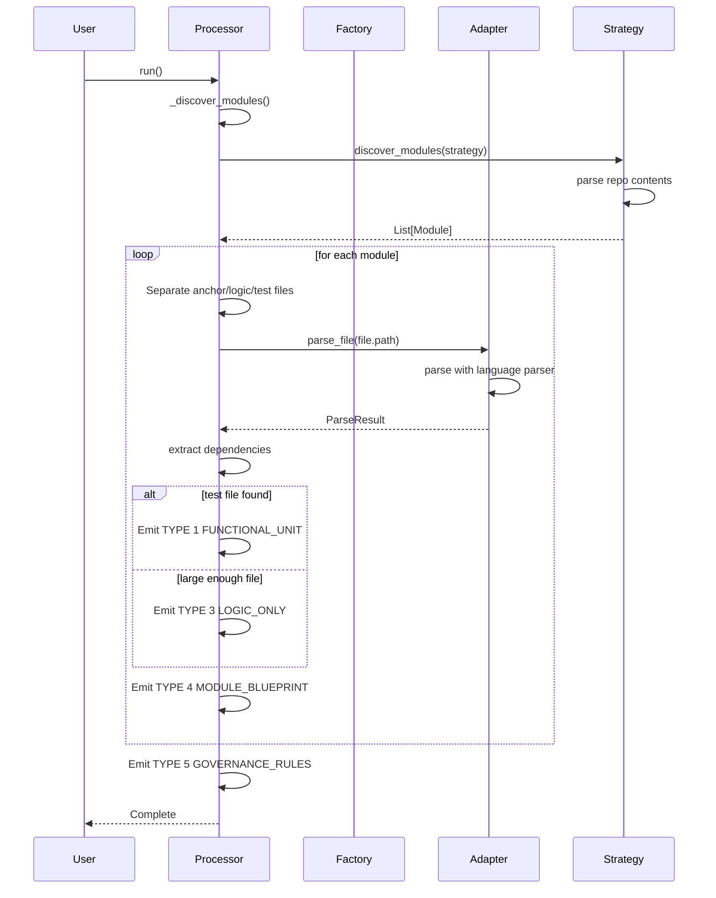

# Design: Frontend Discovery Enhancement

## Overview

This design documents the adapter-based discovery architecture that processes Python, TypeScript, PHP, and YAML repositories with per-file adapter selection. The system uses the `ExtractorAdapter` protocol to parse files and extract dependencies, combined with discovery strategies (manifest, init, typescript, yaml, filesystem) to aggregate modules and emit fragments.

## Architecture

```mermaid
graph TB
    subgraph "Data Factory Core"
        A[RepoProcessor] --> B[Discovery Strategy Dispatcher]
        B --> C1[manifest strategy]
        B --> C2[init strategy]
        B --> C3[typescript strategy]
        B --> C4[yaml strategy]
        B --> C5[filesystem strategy]
        
        C1 --> D[Module List]
        C2 --> D
        C3 --> D
        C4 --> D
        C5 --> D
        
        D --> E[Module Emitter]
        E --> F[Type 1: FUNCTIONAL_UNIT]
        E --> G[Type 3: LOGIC_ONLY]
        E --> H[Type 4: MODULE_BLUEPRINT]
        E --> I[Type 5: GOVERNANCE_RULES]
    end
    
    subgraph "Adapter Registry"
        J[Factory.get_adapter(ext)] --> K1[PythonAstAdapter]
        J --> K2[TypeScriptAdapter]
        J --> K3[PhpLegacyAdapter]
        J --> K4[YamlAdapter]
    end
    
    E -.->|per-file adapter selection | K1
    E -.->|per-file adapter selection | K2
    E -.->|per-file adapter selection | K3
    E -.->|per-file adapter selection | K4
```

## Components

### RepoProcessor

**Purpose**: Orchestrates repository processing, module discovery, and fragment emission.

**Responsibilities**:
- Dispatch repository processing to appropriate discovery strategy
- Emit Type 1-5 fragments based on module analysis
- Handle parse errors with configurable policies
- Collect metrics and track processing stats

**Interfaces**:
```python
class RepoProcessor:
    def run(self) -> None          # Entry point for category processing
    def _process_repository(...)   # Process single repository
    def _discover_modules(...)     # Discover modules via strategy
    def _emit_module(...)          # Emit fragments for module
```

### Discovery Strategy Dispatcher

**Purpose**: Routes module discovery to appropriate algorithm based on repository type.

**Responsibilities**:
- Auto-detect strategy based on repo contents (manifest.json, __init__.py, .ts, .yaml, .php)
- Apply configured strategy when explicitly set
- Return list of Module objects for downstream processing

**Strategies**:

| Strategy | Detection | Use Case |
|----------|-----------|----------|
| manifest | manifest.json present | Home Assistant integrations |
| init | __init__.py present | Python packages |
| typescript | >50 .ts/.tsx files | TypeScript/TSX repos |
| yaml | >5 .yaml/.yml/.jinja files | Home Assistant YAML/Jinja |
| filesystem | .php files present | PHP legacy repos |

**Interfaces**:
```python
def discover_modules(
    root: Path,
    strategy: str,
    ignore_patterns: Set[str],
    extensions: Set[str],
    anchor_filenames: Set[str],
) -> List[Module]
```

### Adapter Factory

**Purpose**: Maps file extensions to adapter classes and provides cached instances.

**Responsibilities**:
- Lazy-loading of adapter classes to avoid import-time side effects
- Extension-based adapter selection (`.ts` → TypeScriptAdapter, etc.)
- Cache management for adapter instances

**Registry Mapping**:
```python
ADAPTER_REGISTRY = {
    ".ts": "typescript",
    ".tsx": "typescript",
    ".py": "python",
    ".php": "php_legacy",
    ".yaml": "yaml",
    ".yml": "yaml",
    ".jinja": "jinja",
    ".jinja2": "jinja",
}
```

**Interfaces**:
```python
def get_adapter(extension: str) -> ExtractorAdapter
def register_adapter(profile: str, adapter_path: str) -> None
def clear_cache() -> None
```

### ExtractorAdapter Protocol

**Purpose**: Defines interface for language-specific parsers.

**Responsibilities**:
- Parse files and return structured results
- Extract dependencies from source files
- Support error handling with ParseError

**Protocol**:
```python
@runtime_checkable
class ExtractorAdapter(Protocol):
    def parse_file(self, file_path: Path) -> ParseResult
    def extract_dependencies(self, file_path: Path) -> List[Dependency]
```

**Implementations**:

| Adapter | Language | Parsing | Dependency Extraction |
|---------|----------|---------|----------------------|
| PythonAstAdapter | Python | AST (ast module) | Import analysis |
| TypeScriptAdapter | TypeScript/TSX | tree-sitter + regex | Import/require analysis |
| PhpLegacyAdapter | PHP | Regex parsing | include/require analysis |
| YamlAdapter | YAML/Jinja | PyYAML + regex | service/trigger extraction |

### Module Emitter

**Purpose**: Analyzes module files and emits appropriate fragment types.

**Responsibilities**:
- Separate anchor, logic, and test files
- Detect test files for Type 1 pairing
- Apply size gates for Type 3 emission
- Aggregate blueprint context for Type 4
- Emit governance rules from repo root

**Processing Flow**:
1. Read all logic files content
2. For each file: detect test file → Type 1 if found
3. Apply size gates (MIN_SIZE, LOGIC_ONLY_MIN_CHARS)
4. Gold pattern filter for Python
5. Emit Type 3 LOGIC_ONLY for large files
6. Always emit Type 4 MODULE_BLUEPRINT from anchor files

**Interfaces**:
```python
def _emit_module(
    mod: Module,
    repo_root: Path,
    prefix: str,
    size_limit: int,
    repo_prefix: str,
) -> None
```

## Data Flow



1. **Repository Entry**: `RepoProcessor.run()` iterates over repositories
2. **Module Discovery**: `_discover_modules()` applies strategy (manifest, init, typescript, yaml, filesystem)
3. **File Processing**: For each module file:
   - Call `get_adapter(mf.path.suffix)` for per-file adapter selection
   - Call `adapter.parse_file(mf.path)` to extract content and dependencies
4. **Fragment Emission**:
   - Type 1: Logic + Test pairing (size gate bypass)
   - Type 3: Standalone files ≥ LOGIC_ONLY_MIN_CHARS
   - Type 4: Aggregate anchor files into blueprint
   - Type 5: Governance files from repo root
5. **Error Handling**: ParseError caught → policy applied (abort, skip, mark_and_continue, fallback)

## Technical Decisions

| Decision | Options Considered | Choice | Rationale |
|----------|-------------------|--------|-----------|
| **Adapter selection** | Profile-based vs extension-based | Extension-based (per-file) | FR-5 requires `.ts` → TypeScriptAdapter regardless of repo profile |
| **Discovery strategies** | Single strategy vs multi-strategy | Multi-strategy (5 strategies) | Different repo types require different module detection algorithms |
| **Parse error handling** | Single policy vs configurable | Configurable (abort, skip, mark_and_continue, fallback) | FR-9 requires policy configurability for different repositories |
| **Test file detection** | Exact match vs scored matching | Hybrid (exact + scored) | AC-1.2 requires exact name mirror with fallback for directory structure |
| **Type 2 removal** | Keep vs remove | Remove intentionally | Type 2 (FUNCTIONAL_UNIT_WITH_CONTEXT) removed; README folded into Type 4 |
| **Registry caching** | Eager vs lazy loading | Lazy loading | Avoids import-time side effects as per constitution requirements |
| **Module detection** | Depth-first vs breadth-first | Directory-based grouping | Groups files by parent directory for TypeScript/YAML/PHP repos |
| **README inheritance** | Per-module vs repo-level | Walk-up to repo root | FR-7 requires README inheritance when module lacks README |

## File Structure

| File | Action | Purpose |
|------|--------|---------|
| `src/utils/extractors/base.py` | Existing | Defines `ExtractorAdapter` protocol, `ParseError`, `ParseResult` |
| `src/utils/extractors/factory.py` | Existing | Maps extensions to adapter classes, lazy-loading registry |
| `src/utils/extractors/python_ast_adapter.py` | Existing | Python AST-based parsing |
| `src/utils/extractors/typescript_adapter.py` | Existing | TypeScript/TSX parsing with tree-sitter + regex |
| `src/utils/extractors/php_legacy_adapter.py` | Existing | PHP legacy parsing with 3-stage pipeline |
| `src/utils/extractors/yaml_adapter.py` | Existing | YAML/Jinja parsing |
| `src/discovery/file_scanner.py` | Existing | Discovery strategies, size constants, anchor file detection |
| `src/discovery/metadata_enricher.py` | Existing | `RepoProcessor` implementation, fragment emission |
| `src/discovery/fragment_parser.py` | Existing | `Module` data class, `build_module()`, dependency extraction |

## Error Handling

| Error Scenario | Handling Strategy | User Impact |
|----------------|-------------------|-------------|
| ParseError (malformed Python) | Policy-based: abort, skip, mark_and_continue, fallback | Repository processing continues with configurable tolerance |
| ParseError (TypeScript syntax) | Same as Python | Consistent error handling across all languages |
| Missing adapter for extension | Fallback to PythonAstAdapter | Graceful degradation, logged warning |
| Missing test file | Skip Type 1, apply size gate for Type 3 | File may be emitted as LOGIC_ONLY instead of FUNCTIONAL_UNIT |
| Large file exceeds size limit | Skip file | File excluded from output, counted in `skipped_size` |
| Gold pattern filter fails (Python) | Skip file | Counted in `skipped_gold`, not emitted |
| Repository-level abort | All remaining files skipped | Repository processing stops, added to `needs_manual_review` |

**Metrics Tracked**:
- `TYPE1_FUNCTIONAL_UNIT`: Count of functional units emitted
- `TYPE3_LOGIC_ONLY`: Count of standalone files emitted
- `TYPE4_MODULE_BLUEPRINT`: Count of blueprints emitted
- `TYPE5_GOVERNANCE_RULES`: Count of governance rules emitted
- `skipped_size`: Files excluded due to size gates
- `skipped_gold`: Python files failing gold pattern filter
- `parse_errors`: Total parse errors encountered
- `parse_errors_aborted`: Repositories aborted due to parse errors
- `needs_manual_review`: List of files requiring manual review

## Test Strategy

### Unit Tests

**Adapter Tests** (`tests/utils/extractors/`):
- `test_python_ast_adapter.py`: Parse Python files, extract imports, dependencies
- `test_typescript_adapter.py`: Parse TS/TSX, extract imports, Lit components
- `test_php_legacy_adapter.py`: Parse PHP, extract includes, function calls
- `test_yaml_adapter.py`: Parse YAML/Jinja, extract services, triggers
- `test_factory.py`: Extension-to-adapter mapping, caching behavior

**Discovery Strategy Tests** (`tests/discovery/`):
- `test_manifest_strategy.py`: manifest.json discovery
- `test_init_strategy.py`: __init__.py discovery
- `test_typescript_strategy.py`: .ts/.tsx directory grouping
- `test_yaml_strategy.py`: .yaml/.jinja directory grouping
- `test_filesystem_strategy.py`: .php directory grouping

### Integration Tests

**End-to-End Tests** (`tests/integration/`):
- `test_python_integration.py`: Python repo → TYPE 1, 3, 4, 5 emission
- `test_typescript_integration.py`: TypeScript repo → TYPE 3, 4 emission
- `test_yaml_integration.py`: YAML/Jinja repo → TYPE 3, 4 emission
- `test_php_integration.py`: PHP repo → TYPE 3, 4 emission

**Per-File Adapter Selection Tests**:
- Mixed-language repo: Python repo with TypeScript config files
- Verify `.ts` files → TypeScriptAdapter regardless of repo type
- Verify `.py` files → PythonAstAdapter regardless of repo type

### Verification Tests

**Fragment Type Verification** (`tests/verification/`):
- Verify all TYPE 1 bundles include `[ARCH_HEADER]` with dependencies
- Verify all TYPE 3 bundles pass size gate (≥800 chars)
- Verify all TYPE 4 bundles include `[MODULE_MAP]`, `[DEPENDENCIES]`, `[SCHEMA]`, `[VOCABULARY]`, `[README]`
- Verify all TYPE 5 bundles include `[GOVERNANCE_HEADER]` at repo root

**Acceptance Criteria Tests**:
- AC-1.1 to AC-1.4: Type 1 FUNCTIONAL_UNIT generation
- AC-2.1 to AC-2.4: Type 3 LOGIC_ONLY generation
- AC-3.1 to AC-3.7: Type 4 MODULE_BLUEPRINT generation
- AC-4.1 to AC-4.4: Type 5 GOVERNANCE_RULES generation
- AC-5.1 to AC-5.5: TypeScriptAdapter parsing
- AC-6.1 to AC-6.4: YamlAdapter parsing
- AC-7.1 to AC-7.4: PhpLegacyAdapter parsing
- AC-8.1 to AC-8.5: Per-file adapter selection

## Performance Considerations

- **Adapter Caching**: Single instance per adapter type in factory cache
- **Lazy Loading**: Adapter classes only imported when first requested
- **File Scanning**: `Path.rglob()` with early filtering for large repos
- **Parse Error Prevention**: Policy-based error handling prevents repository aborts
- **Memory**: <1000 concurrent files processed (NFR-2)

## Security Considerations

- **File Path Validation**: All paths validated before processing
- **Encoding Handling**: UTF-8 with `errors="ignore"` for robustness
- **No External Calls**: Processing is purely local filesystem operations
- **Regex Safety**: All regex patterns are compiled and tested for catastrophic backtracking

## Existing Patterns to Follow

Based on codebase analysis:

1. **Protocol-Based Architecture**: All adapters implement `ExtractorAdapter` protocol defined in `base.py`
2. **Factory Registry Pattern**: Extension-to-class mapping with lazy loading in `factory.py`
3. **ParseError-First Policy**: Parse errors are raised and caught by processor, not swallowed in adapter
4. **Constitution Compliance**: No import-time side effects (lazy loading, module-level constants only)
5. **Discovery Strategy Pattern**: Each strategy function follows same signature and returns `List[Module]`
6. **Metrics Integration**: All processing increments metrics via `get_metrics()`
7. **Logging Consistency**: All components use `logger = logging.getLogger(__name__)`
8. **Size Gate Constants**: `MIN_SIZE`, `LOGIC_ONLY_MIN_CHARS`, `MAX_SIZE_BACKEND`, `MAX_SIZE_FRONTEND` from `file_scanner.py`

## Unresolved Questions

- None. All requirements confirmed complete in Phase 7 fix.
