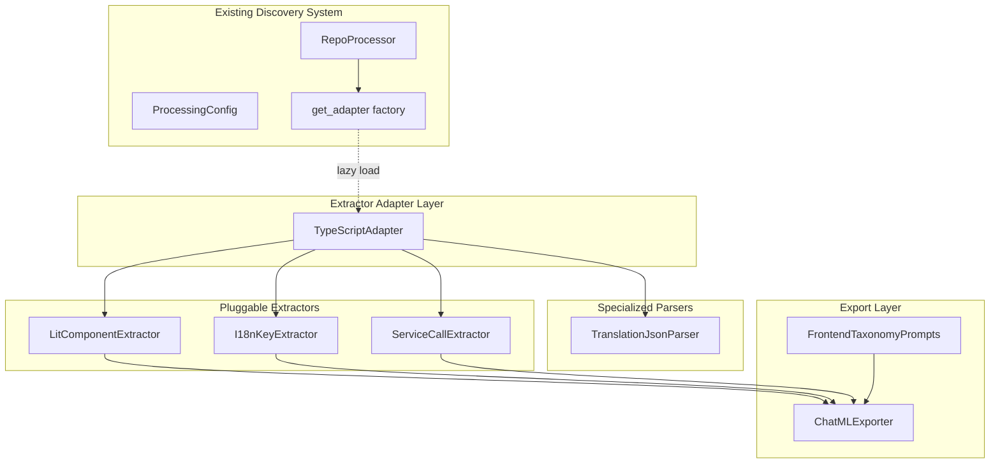
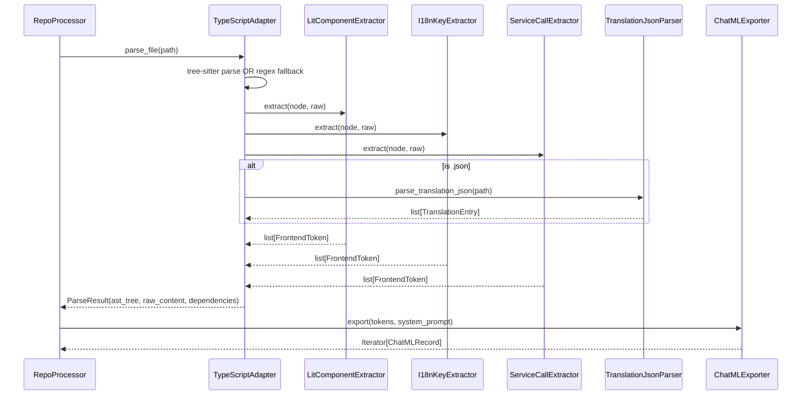

# Design: Frontend Discovery Enhancement

## Overview

Add TypeScript/Lit frontend parsing to the data factory via a new `TypeScriptAdapter` implementing the existing `ExtractorAdapter` protocol, with pluggable extractors for Lit components, i18n keys, and service calls. The adapter uses tree-sitter for AST parsing with regex fallback (~85% coverage v1), outputs structured `ParseResult` compatible with `RepoProcessor`, and generates ChatML JSONL for training.

## Architecture



## Components

### TypeScriptAdapter

**Purpose**: Base adapter implementing `ExtractorAdapter` protocol for `.ts`/`.tsx` files.

**Responsibilities**:
- Parse TypeScript/TSX via tree-sitter (primary) or regex fallback
- Route to pluggable extractors for domain-specific extraction
- Return `ParseResult` with extracted modules

**Interface**:
```python
class TypeScriptAdapter:
    def __init__(
        self,
        extractors: list[TypeScriptExtractor] | None = None,
        use_regex_fallback: bool = True,
    ): ...

    def parse_file(self, file_path: Path) -> ParseResult: ...

    def extract_dependencies(self, file_path: Path) -> list[Dependency]: ...
```

### TypeScriptExtractor (Protocol)

**Purpose**: Pluggable extractor interface for domain-specific AST traversal.

```python
class TypeScriptExtractor(Protocol):
    def extract(self, node: tree_sitter.Node, raw: str) -> list[FrontendToken]: ...
```

**Implementations**:

| Extractor | Responsibility | Output Schema |
|-----------|---------------|---------------|
| `LitComponentExtractor` | @customElement, @property, @state | `{tag, class_name, properties[], states[], super_class, file_path}` |
| `I18nKeyExtractor` | localize(), hass.localize() | `{key, context, line_number}` |
| `ServiceCallExtractor` | hass.callService() | `{domain, service, entity_ids[], file_path, line_number}` |

### TranslationJsonParser

**Purpose**: Standalone parser for nested translation JSON files.

**Responsibilities**:
- Recursively flatten nested JSON to dot-path keys
- Identify leaf nodes (string values) vs intermediate categories
- Handle ICU message placeholders

**Interface**:
```python
@dataclass(frozen=True)
class TranslationEntry:
    key: str
    value: str
    file_path: Path
    is_leaf: bool

def parse_translation_json(file_path: Path) -> list[TranslationEntry]: ...
```

### ChatMLExporter

**Purpose**: Generate ChatML JSONL training data from extracted frontend knowledge.

**Interface**:
```python
@dataclass
class ChatMLRecord:
    messages: list[Message]

@dataclass
class Message:
    role: Literal["system", "user", "assistant"]
    content: str

class ChatMLExporter:
    def export(
        self,
        tokens: list[FrontendToken],
        system_prompt: str,
    ) -> Iterator[ChatMLRecord]: ...

    def to_jsonl(self, records: Iterator[ChatMLRecord], output: Path) -> None: ...
```

### FrontendTaxonomyPrompts

**Purpose**: System/user prompt templates covering all extractor output schemas.

**Structure**:
```python
@dataclass
class FrontendTaxonomyPrompts:
    system_lit_component: str  # Schema context for Lit components
    user_lit_extraction: str     # Extraction prompt with code snippet
    system_i18n: str
    user_i18n_extraction: str
    system_service_call: str
    user_service_call_extraction: str
```

## Data Flow



**Steps**:
1. `RepoProcessor` calls `TypeScriptAdapter.parse_file(path)` for `.ts`/`.tsx` files
2. Adapter parses via tree-sitter (AST) or regex fallback (~85% coverage)
3. Adapter routes AST to registered extractors (Lit, I18n, ServiceCall)
4. Each extractor walks the AST and emits `FrontendToken` objects
5. Adapter returns `ParseResult` with AST tree and extracted tokens
6. `ChatMLExporter` converts tokens to ChatML JSONL records

## Technical Decisions

| Decision | Options Considered | Choice | Rationale |
|----------|-------------------|--------|-----------|
| AST Library | tree-sitter, typescript-estree, @babel/parser, regex | **tree-sitter** with regex fallback | Most robust for TS/TSX; regex fallback achieves 85% for v1; no Node.js dependency |
| Constant resolution | resolve, mark "unresolved", skip | **mark "unresolved"** | v1 scope; constant references are ~15% of tag names; defer to future enhancement |
| Dynamic key handling | full AST analysis, prefix-only, skip | **prefix-only** | ~20% of keys use template literals; prefix conveys semantic grouping for training |
| Bundle granularity | per-component, per-file, per-module | **per-component** | Fine-grained for training; matches existing module discovery pattern |
| Regex fallback threshold | mandatory AST, 85% acceptable, configurable | **85% acceptable for v1** | Deployment flexibility; tree-sitter is stretch goal for v2 |

## File Structure

| File | Action | Purpose |
|------|--------|---------|
| `src/utils/extractors/typescript_adapter.py` | **Create** | TypeScriptAdapter implementing ExtractorAdapter protocol |
| `src/utils/extractors/extractors/lit_component.py` | **Create** | LitComponentExtractor plugin |
| `src/utils/extractors/extractors/i18n_key.py` | **Create** | I18nKeyExtractor plugin |
| `src/utils/extractors/extractors/service_call.py` | **Create** | ServiceCallExtractor plugin |
| `src/utils/extractors/extractors/base.py` | **Create** | TypeScriptExtractor protocol and FrontendToken types |
| `src/utils/extractors/parsers/translation_json.py` | **Create** | TranslationJsonParser standalone |
| `src/export/chatml_exporter.py` | **Create** | ChatMLExporter for JSONL generation |
| `src/export/frontend_taxonomy_prompts.py` | **Create** | Taxonomy prompt templates |
| `src/utils/extractors/factory.py` | **Modify** | Register "typescript" profile in _ADAPTER_REGISTRY |
| `configs/stage_1_discovery/examples/homeassistant_frontend.yaml` | **Create** | Frontend discovery config example |
| `configs/homeassistant.yaml` | **Modify** | Add homeassistant/frontend to static_repos, .ts/.tsx to extensions |
| `tests/unit/extractors/test_typescript_adapter.py` | **Create** | Unit tests for adapter |
| `tests/unit/extractors/extractors/test_lit_component.py` | **Create** | Unit tests for Lit extractor |
| `tests/unit/extractors/extractors/test_i18n_key.py` | **Create** | Unit tests for i18n extractor |
| `tests/unit/extractors/extractors/test_service_call.py` | **Create** | Unit tests for service call extractor |

## Unresolved Questions (Resolved)

1. **Tree-sitter vs typescript-estree**: Tree-sitter primary (robust AST), regex fallback for v1 (~85% coverage).
2. **Constant reference resolution**: Tag names resolved as constants marked "unresolved" in v1.
3. **Dynamic key prefix-only**: Prefix-only extraction acceptable (~20% use template literals).
4. **Per-component bundling**: Per-component granularity for training data alignment.
5. **Regex fallback threshold**: 85% acceptable for v1; tree-sitter AST is v2 stretch goal.

## Error Handling

| Error Scenario | Handling Strategy | User Impact |
|----------------|-------------------|-------------|
| Tree-sitter parse fails | Fall back to regex extraction | Partial coverage (~85%); logged warning |
| Regex extraction fails | Skip file, continue processing | No output for this file; logged error |
| Malformed JSON (translation) | Skip file, continue processing | No i18n entries; logged error |
| ICU placeholder parsing | Pass through raw placeholder | Placeholder preserved in value |
| File too large (>60KB) | Skip file | Not processed; logged at debug |

## Edge Cases

- **Aliased imports** (`import { customElement as ce }`): Resolved via import alias tracking.
- **Namespace imports** (`import * as helpers`): Not supported in v1; logged warning.
- **Nested decorators**: Only top-level `@customElement` on class declarations extracted.
- **Template literal keys** (` `ui.card.${action}` `): Extract static prefix only.
- **Dynamic callService targets** (`hass[x]()`): Not supported; logged at debug.
- **Mixed TS/TSX**: Handled via file extension routing.

## Test Strategy

### Unit Tests
- `test_typescript_adapter_parse_file`: Valid .ts file returns ParseResult
- `test_lit_component_extractor`: Decorator detection, property/state extraction
- `test_i18n_key_extractor`: localize() and hass.localize() detection, template literal prefix
- `test_service_call_extractor`: callService pattern, domain/service/entity_id extraction
- `test_translation_json_parser`: Flattening, leaf detection, ICU placeholder

### Integration Tests
- End-to-end parse of sample .ts file through TypeScriptAdapter
- ChatML JSONL output validation against schema
- Config loading with new profile

## Performance Considerations

- Tree-sitter parsing: <100ms for files <=60KB
- Regex fallback: <50ms for files <=60KB
- Parallel extractor execution via concurrent.futures (v2)
- Lazy-loaded extractors (created only when file matches extension)

## Security Considerations

- No arbitrary code execution; parsing only
- File path validation before read
- No network access required
- Output sanitization for JSONL generation

## Existing Patterns to Follow

Based on codebase analysis:
- `ExtractorAdapter` protocol in `src/utils/extractors/base.py`
- `PythonAstAdapter` implementation pattern with ParseResult return
- `get_adapter()` lazy-loading factory in `src/utils/extractors/factory.py`
- `ProcessingConfig` Pydantic model structure
- RepoProcessor error handling with `RepoAbortError`
- ChatML format uses `{messages: [{role, content}]}` (not instruction-tuned format)

## Integration Points

1. **Factory Registration**: Add `"typescript": "src.utils.extractors.typescript_adapter.TypeScriptAdapter"` to `_ADAPTER_REGISTRY` in `factory.py`
2. **Config Schema**: Add `.ts` and `.tsx` to `extensions` in `ProcessingConfig`
3. **Discovery Config**: Add `homeassistant/frontend` to `static_repos` in `homeassistant.yaml`
4. **Size Limits**: Already defined via `MAX_SIZE_FRONTEND = 60_000` in `file_scanner.py`
5. **Output Path**: Uses existing `output_subdir`/`output_category` path structure

## Implementation Steps

1. Create `src/utils/extractors/extractors/base.py` with `TypeScriptExtractor` protocol and `FrontendToken` types
2. Create `src/utils/extractors/extractors/lit_component.py` implementing `LitComponentExtractor`
3. Create `src/utils/extractors/extractors/i18n_key.py` implementing `I18nKeyExtractor`
4. Create `src/utils/extractors/extractors/service_call.py` implementing `ServiceCallExtractor`
5. Create `src/utils/extractors/parsers/translation_json.py` with `TranslationJsonParser`
6. Create `src/utils/extractors/typescript_adapter.py` implementing `ExtractorAdapter` protocol
7. Register "typescript" in `src/utils/extractors/factory.py` _ADAPTER_REGISTRY
8. Create `src/export/chatml_exporter.py` with ChatMLExporter
9. Create `src/export/frontend_taxonomy_prompts.py` with taxonomy prompt templates
10. Update `configs/homeassistant.yaml` with frontend repo and .ts/.tsx extensions
11. Write unit tests for each extractor
12. Integration test with sample HomeAssistant frontend files
