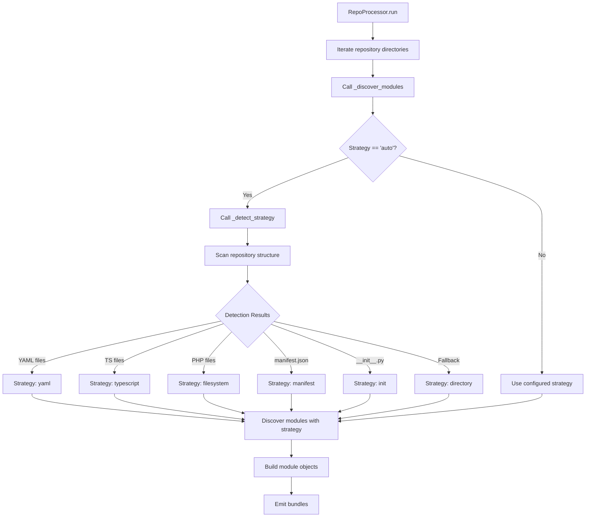

# Module Discovery Auto-Detection - Technical Design

**Spec Name:** `module-discovery-auto`  
**Version:** 1.0.0  
**Author:** Joao Maria Arranz Aparicio  
**Date:** 2026-04-01  
**Status:** Design Complete - Ready for Implementation

---

## Executive Summary

This document provides a comprehensive technical design for implementing an intelligent auto-detection module discovery strategy. The `auto` strategy automatically detects repository types based on file patterns and applies the appropriate discovery strategy without manual configuration.

### Key Goals

1. Implement `_detect_strategy()` function in `src/discovery/file_scanner.py`
2. Add `auto` strategy routing to `discover_modules()` function
3. Update `ProcessingConfig` to document all available strategies
4. Ensure performance < 1 second for repositories with 10,000+ files
5. Guarantee reliable fallback to `directory` strategy on detection failures

---

## 1. Architecture Overview

### 1.1 Component Placement

The auto-detection feature integrates into the existing module discovery architecture as follows:

```
┌─────────────────────────────────────────────────────────────────────┐
│                        RepoProcessor Layer                           │
│  ┌────────────────────────────────────────────────────────────────┐ │
│  │  _process_repository(repo_path)                                │ │
│  │    └─> _discover_modules(root)                                 │ │
│  │         └─> If strategy="auto":                                 │ │
│  │              └─> _detect_strategy(root)                        │ │
│  │              └─> Update config with detected strategy           │ │
│  │              └─> discover_modules(root, detected_strategy, ...)│ │
│  └────────────────────────────────────────────────────────────────┘ │
└─────────────────────────────────────────────────────────────────────┘
                              │
                              ▼
┌─────────────────────────────────────────────────────────────────────┐
│                      file_scanner.py Layer                           │
│  ┌────────────────────────────────────────────────────────────────┐ │
│  │  discover_modules(...)                                         │ │
│  │    └─> Route based on strategy:                                │ │
│  │         ├─> "auto" → call _detect_strategy() → reroute          │ │
│  │         ├─> "yaml" → _discover_by_yaml()                       │ │
│  │         ├─> "typescript" → _discover_by_typescript()           │ │
│  │         ├─> "filesystem" → _discover_by_filesystem()           │ │
│  │         ├─> "manifest" → _discover_by_manifest_and_init()      │ │
│  │         ├─> "init" → _discover_by_init()                       │ │
│  │         └─> "directory" → _discover_by_directory()             │ │
│  └────────────────────────────────────────────────────────────────┘ │
└─────────────────────────────────────────────────────────────────────┘
```

### 1.2 Data Flow



### 1.3 Integration Points

| Component | Location | Change Type |
|-----------|----------|-------------|
| Detection Algorithm | `src/discovery/file_scanner.py` | New function `_detect_strategy()` |
| Strategy Routing | `src/discovery/file_scanner.py` | Add `elif strategy == "auto"` |
| Config Description | `src/discovery/metadata_enricher.py` | Update field description |
| Auto Handling | `src/discovery/metadata_enricher.py` | Add auto case in `_discover_modules()` |

---

## 2. Component Design

### 2.1 `_detect_strategy()` Function

**Location:** `src/discovery/file_scanner.py` (after `_discover_by_yaml()`)

**Signature:**
```python
def _detect_strategy(root: Path) -> str:
    """Detect the most appropriate discovery strategy for a repository.

    Detection priority (evaluated in order):
    1. YAML-first (themes, templates, blueprints)
       - Scans for .yaml, .yml, .jinja, .jinja2 files
       - Excludes: node_modules, tests, test, __pycache__
    2. TypeScript-second (frontend components)
       - Scans for .ts, .tsx files
       - Excludes: node_modules, tests, test
    3. PHP-third (filesystem-based)
       - Scans for .php files
       - Excludes: vendor, node_modules, tests, cache
    4. Manifest-fourth (HA core style)
       - Checks for manifest.json presence
       - Higher priority than TypeScript for mixed repos
    5. Init-fifth (Python packages)
       - Checks for __init__.py presence
    6. Directory-sixth (fallback)
       - Used when no specific patterns detected

    Args:
        root: Repository root directory to scan

    Returns:
        Strategy name: 'yaml', 'typescript', 'filesystem',
                       'manifest', 'init', or 'directory'

    Performance:
        - O(n) single-pass scan where n = total files
        - Should complete in < 1 second for 10,000 files
        - No file content reading (only existence checks)

    Error Handling:
        - Never raises exceptions - always returns valid strategy
        - Catches PermissionError and continues scanning
        - Handles broken symlinks gracefully
        - Fallback to 'directory' if detection fails
    """
```

**Implementation:**
```python
def _detect_strategy(root: Path) -> str:
    """Detect the most appropriate discovery strategy for a repository.

    Detection priority:
    1. YAML-first (themes, templates, blueprints)
    2. TypeScript-second (frontend components)
    3. PHP-third (filesystem-based)
    4. Manifest-fourth (HA core style with metadata)
    5. Python-init (Python packages without manifest)
    6. Directory-sixth (fallback for directory structures)

    Args:
        root: Repository root directory to scan

    Returns:
        Strategy name: 'yaml', 'typescript', 'filesystem',
                       'manifest', 'init', or 'directory'
    """
    # 1. Check for YAML files (themes, templates, blueprints)
    yaml_count = 0
    try:
        for file_path in root.rglob("*"):
            if not file_path.is_file():
                continue
            if file_path.suffix in (".yaml", ".yml", ".jinja", ".jinja2"):
                # Exclude common non-source directories
                if not any(part in ("node_modules", "tests", "test", "__pycache__")
                         for part in file_path.parts):
                    yaml_count += 1
    except PermissionError as e:
        logger.warning("Permission denied during YAML scan: %s", e)

    if yaml_count > 0:
        return "yaml"

    # 2. Check for TypeScript files (frontend components)
    ts_count = 0
    try:
        for ts_file in list(root.rglob("*.ts")) + list(root.rglob("*.tsx")):
            if not any(part in ("node_modules", "tests", "test")
                     for part in ts_file.parts):
                ts_count += 1
    except PermissionError as e:
        logger.warning("Permission denied during TypeScript scan: %s", e)

    if ts_count > 0:
        return "typescript"

    # 3. Check for PHP files (filesystem-based)
    php_count = 0
    try:
        for php_file in root.rglob("*.php"):
            if not any(part in ("vendor", "node_modules", "tests", "cache")
                     for part in php_file.parts):
                php_count += 1
    except PermissionError as e:
        logger.warning("Permission denied during PHP scan: %s", e)

    if php_count > 0:
        return "filesystem"

    # 4. Check for manifest.json (HA core style)
    try:
        if any(root.rglob("manifest.json")):
            return "manifest"
    except PermissionError as e:
        logger.warning("Permission denied during manifest check: %s", e)

    # 5. Check for __init__.py (Python packages)
    try:
        if any(root.rglob("__init__.py")):
            return "init"
    except PermissionError as e:
        logger.warning("Permission denied during init check: %s", e)

    # 6. Fallback to directory strategy
    logger.debug("No patterns detected, using directory fallback")
    return "directory"
```

### 2.2 Strategy Routing in `discover_modules()`

**Location:** Lines 138-168 in `src/discovery/file_scanner.py`

**Current routing:**
```python
# Route to appropriate strategy
if strategy == "directory":
    return _discover_by_directory(...)
elif strategy == "typescript":
    return _discover_by_typescript(...)
elif strategy == "yaml":
    return _discover_by_yaml(...)
elif strategy == "filesystem":
    return _discover_by_filesystem(...)
elif strategy == "manual_mapping":
    ...
elif strategy == "init":
    ...
else:
    # Default: manifest strategy
    return _discover_by_manifest_and_init(...)
```

**Updated routing with auto support:**
```python
# Route to appropriate strategy
if strategy == "directory":
    return _discover_by_directory(...)
elif strategy == "typescript":
    return _discover_by_typescript(...)
elif strategy == "yaml":
    return _discover_by_yaml(...)
elif strategy == "filesystem":
    return _discover_by_filesystem(...)
elif strategy == "auto":
    # Auto-detect strategy based on repository structure
    detected_strategy = _detect_strategy(root)
    logger.info("Auto-detected strategy: %s for %s", detected_strategy, root)
    # Recursively call with detected strategy
    return discover_modules(
        root=root,
        strategy=detected_strategy,
        ignore_patterns=ignore_patterns,
        extensions=extensions,
        anchor_filenames=anchor_filenames,
        module_overrides=module_overrides,
        build_module_func=build_module_func,
    )
elif strategy == "manual_mapping":
    ...
elif strategy == "init":
    ...
else:
    # Default: manifest strategy
    return _discover_by_manifest_and_init(...)
```

**Key Design Decisions:**

1. **Recursive Re-routing:** The `auto` strategy calls `_detect_strategy()` then recursively invokes `discover_modules()` with the detected strategy. This ensures:
   - Single code path for all strategies
   - No duplication of discovery logic
   - Module overrides are applied correctly

2. **Single-Level Recursion:** Since `_detect_strategy()` returns a non-"auto" value, the recursive call always completes in one iteration, avoiding infinite loops.

3. **Logging:** INFO-level log of detected strategy for debugging and monitoring.

### 2.3 Integration with RepoProcessor

**Location:** `src/discovery/metadata_enricher.py`, `_discover_modules()` method

**Current implementation:**
```python
def _discover_modules(self, root: Path) -> List[Module]:
    """Discover modules using the configured strategy."""
    if self.cfg.module_discovery_strategy == "directory_scan":
        return self._discover_modules_directory_scan(root)
    return discover_modules(
        root=root,
        strategy=self.cfg.module_discovery_strategy,
        ignore_patterns=self.cfg.ignore_patterns,
        extensions=self.cfg.extensions,
        anchor_filenames=self.cfg.anchor_filenames,
        module_overrides=self.cfg.module_overrides,
        build_module_func=self._build_module,
    )
```

**Updated implementation:**
```python
def _discover_modules(self, root: Path) -> List[Module]:
    """Discover modules using the configured strategy."""
    if self.cfg.module_discovery_strategy == "directory_scan":
        return self._discover_modules_directory_scan(root)

    if self.cfg.module_discovery_strategy == "auto":
        # Detect and apply appropriate strategy
        from src.discovery.file_scanner import _detect_strategy
        detected_strategy = _detect_strategy(root)
        logger.info("Auto-detected strategy: %s for %s", detected_strategy, root)
        # Update config for consistent logging
        self.cfg.module_discovery_strategy = detected_strategy
        return discover_modules(
            root=root,
            strategy=detected_strategy,
            ignore_patterns=self.cfg.ignore_patterns,
            extensions=self.cfg.extensions,
            anchor_filenames=self.cfg.anchor_filenames,
            module_overrides=self.cfg.module_overrides,
            build_module_func=self._build_module,
        )

    return discover_modules(
        root=root,
        strategy=self.cfg.module_discovery_strategy,
        ignore_patterns=self.cfg.ignore_patterns,
        extensions=self.cfg.extensions,
        anchor_filenames=self.cfg.anchor_filenames,
        module_overrides=self.cfg.module_overrides,
        build_module_func=self._build_module,
    )
```

### 2.4 Configuration Update

**Location:** `src/discovery/metadata_enricher.py`, `ProcessingConfig` class

**Current field:**
```python
module_discovery_strategy: str = Field(
    default="manifest",
    description="Strategy for discovering modules: manifest, init, directory, manual_mapping",
)
```

**Updated field:**
```python
module_discovery_strategy: str = Field(
    default="manifest",
    description="Strategy for discovering modules: manifest, init, directory, filesystem, typescript, yaml, manual_mapping, auto",
)
```

---

## 3. Technical Decisions

### 3.1 Detection Algorithm Implementation

**Design Choice:** Single-pass directory traversal with early-exit optimization

**Rationale:**
1. Minimize I/O operations - use `Path.rglob()` for recursive traversal
2. Early exit on first match - don't continue scanning after detection
3. No file content reading - only file existence and extension checks
4. Memory efficient - count files rather than storing file paths

**Algorithm Structure:**
```
for priority_level in [1, 2, 3, 4, 5]:
    try:
        for file_path in root.rglob(pattern):
            if is_excluded(file_path):
                continue
            if matches_criteria(file_path):
                return detected_strategy
    except PermissionError:
        log_warning()
        continue

return "directory"  # Fallback
```

### 3.2 File System Traversal Optimization

**Optimization 1: Pattern-Specific Traversal**
```python
# Instead of: root.rglob("*") for all files
# Use: specific patterns per strategy
yaml_files: root.rglob("*") with suffix check
ts_files: root.rglob("*.ts") + root.rglob("*.tsx")  # Direct pattern
php_files: root.rglob("*.php")  # Direct pattern
```

**Optimization 2: Exclusion at Path Level**
```python
# Check parts before processing
if not any(part in _EXCLUDE_DIRS for part in file_path.parts):
    # Process file
```

**Optimization 3: Count-Based Detection**
```python
# For first three strategies, count matches then decide
yaml_count = 0
for file_path in root.rglob("*"):
    if matches_yaml(file_path):
        yaml_count += 1
if yaml_count > 0:
    return "yaml"
```

### 3.3 Error Handling Strategy

**Three-Level Error Handling:**

1. **Permission Errors (Handled)**
```python
try:
    for file_path in root.rglob("*"):
        ...
except PermissionError as e:
    logger.warning("Permission denied: %s", e)
    continue  # Continue scanning other directories
```

2. **Broken Symbolic Links**
```python
try:
    if file_path.is_file():  # Handles broken symlinks
        ...
except OSError:
    # Broken symlink, skip silently
    continue
```

3. **Detection Failures (Never Happens)**
```python
try:
    # Detection logic
    if condition:
        return "yaml"
    if condition:
        return "typescript"
    ...
except Exception:
    # Ultimate fallback - always returns valid strategy
    logger.warning("Detection failed, using directory fallback")
    return "directory"
```

### 3.4 Logging Strategy

**Log Levels and Messages:**

| Level | Message | When |
|-------|---------|------|
| INFO | `Auto-detected strategy: {strategy} for {root}` | Every detection |
| DEBUG | `Detection: YAML={n}, TS={n}, PHP={n}, manifest={n}, init={n} -> {strategy}` | Debug mode |
| WARNING | `Permission denied: {error}` | Permission errors during scan |
| WARNING | `Detection failed, using directory fallback` | Exception during detection |
| INFO | `filesystem discovery: found {n} modules in {root}` | Module discovery (existing) |

**Logging Integration:**
```python
logger = logging.getLogger(__name__)

# In _detect_strategy():
logger.info("Auto-detected strategy: %s for %s", detected_strategy, root)

# In DEBUG mode:
logger.debug(
    "Detection counts: YAML=%d, TS=%d, PHP=%d, manifest=%d, init=%d -> %s",
    yaml_count, ts_count, php_count, has_manifest, has_init, detected_strategy
)
```

---

## 4. File Structure

### 4.1 Files to Create

**None** - No new files needed. All changes are to existing files.

### 4.2 Files to Modify

#### 4.2.1 `src/discovery/file_scanner.py`

**Changes:**
1. Add `_detect_strategy()` function after `_discover_by_yaml()` (~line 649)
2. Add `"auto"` case to `discover_modules()` routing (~line 138-168)

**Exact Locations:**
- Insertion point for `_detect_strategy()`: After line 649 (after `_discover_by_yaml()` closing)
- Modification point for routing: Lines 138-168 (add elif block before final else)

#### 4.2.2 `src/discovery/metadata_enricher.py`

**Changes:**
1. Update `ProcessingConfig.module_discovery_strategy` description (~line 127-130)
2. Add auto case to `_discover_modules()` method (~line 274-286)

**Exact Locations:**
- Field description update: Lines 127-130
- Method addition: After existing `"directory_scan"` check (~line 274-286)

---

## 5. Error Handling

### 5.1 Permission Errors

**Scenario:** Repository contains directories with restricted access

**Handling:**
```python
try:
    for file_path in root.rglob("*.yaml"):
        if file_path.suffix in (".yaml", ".yml"):
            if not any(part in EXCLUDE_DIRS for part in file_path.parts):
                yaml_count += 1
except PermissionError as e:
    logger.warning("Permission denied accessing directory: %s", e)
    # Continue with other detection checks
```

**Outcome:** Partial detection, still returns valid strategy

### 5.2 Broken Symbolic Links

**Scenario:** Repository contains symlinks pointing to non-existent files

**Handling:**
```python
for file_path in root.rglob("*"):
    try:
        if file_path.is_file():  # Returns False for broken symlinks
            # Process file
    except OSError:
        # Silently skip broken symlinks
        continue
```

**Outcome:** Broken symlinks ignored, detection continues

### 5.3 Empty Repositories

**Scenario:** Repository with only `.git` directory, no source files

**Handling:**
```python
# Detection scan finds no patterns
# Falls through all conditions
return "directory"  # Fallback strategy
```

**Outcome:** Returns `directory` strategy, discovers no modules (expected)

### 5.4 Detection Failures

**Scenario:** Unexpected exception during detection

**Handling:**
```python
try:
    # Full detection logic
    ...
except Exception as e:
    logger.warning("Detection exception: %s, using fallback", e)
    return "directory"
```

**Outcome:** Always returns valid strategy, never raises exception

---

## 6. Test Strategy

### 6.1 Unit Tests for `_detect_strategy()`

#### Test T1: YAML Detection
```python
def test_detect_strategy_yaml():
    """Repository with only YAML files should detect as 'yaml'."""
    # Create temp directory with YAML files
    with tempfile.TemporaryDirectory() as tmpdir:
        root = Path(tmpdir)
        (root / "themes" / "dark.yaml").write_text("...")
        (root / "templates" / "automation.jinja").write_text("...")

        strategy = _detect_strategy(root)
        assert strategy == "yaml"
```

#### Test T2: TypeScript Detection
```python
def test_detect_strategy_typescript():
    """Repository with only TS files should detect as 'typescript'."""
    with tempfile.TemporaryDirectory() as tmpdir:
        root = Path(tmpdir)
        (root / "src" / "button.ts").write_text("...")
        (root / "src" / "card.tsx").write_text("...")

        strategy = _detect_strategy(root)
        assert strategy == "typescript"
```

#### Test T3: PHP Detection
```python
def test_detect_strategy_php():
    """Repository with PHP files should detect as 'filesystem'."""
    with tempfile.TemporaryDirectory() as tmpdir:
        root = Path(tmpdir)
        (root / "src" / "Service.php").write_text("<?php...")
        (root / "vendor" / "package.php").write_text("<?php...")  # Should be excluded

        strategy = _detect_strategy(root)
        assert strategy == "filesystem"
```

#### Test T4: Manifest Detection (Priority over TS)
```python
def test_detect_strategy_manifest_priority():
    """manifest.json has priority over TypeScript files."""
    with tempfile.TemporaryDirectory() as tmpdir:
        root = Path(tmpdir)
        (root / "custom_components" / "test" / "manifest.json").write_text("{}")
        (root / "src" / "frontend.ts").write_text("...")

        strategy = _detect_strategy(root)
        assert strategy == "manifest"  # Not "typescript"
```

#### Test T5: Init Detection
```python
def test_detect_strategy_init():
    """Repository with only __init__.py should detect as 'init'."""
    with tempfile.TemporaryDirectory() as tmpdir:
        root = Path(tmpdir)
        (root / "app" / "__init__.py").write_text("...")

        strategy = _detect_strategy(root)
        assert strategy == "init"
```

#### Test T6: Fallback to Directory
```python
def test_detect_strategy_fallback():
    """Empty repository should detect as 'directory'."""
    with tempfile.TemporaryDirectory() as tmpdir:
        root = Path(tmpdir)
        (root / ".git").mkdir()  # Only git directory

        strategy = _detect_strategy(root)
        assert strategy == "directory"
```

#### Test T7: Priority Order Verification
```python
def test_detect_strategy_priority_order():
    """Verify detection priority: YAML > TS > PHP > manifest > init > directory."""
    with tempfile.TemporaryDirectory() as tmpdir:
        root = Path(tmpdir)

        # All patterns present
        (root / "test.yaml").write_text("...")
        (root / "test.ts").write_text("...")
        (root / "test.php").write_text("...")
        (root / "manifest.json").write_text("{}")
        (root / "__init__.py").write_text("...")

        strategy = _detect_strategy(root)
        assert strategy == "yaml"  # Highest priority
```

### 6.2 Integration Tests

#### IT1: Full Discovery with Auto Strategy
```python
def test_auto_discovery_yaml():
    """Auto strategy should correctly discover YAML modules."""
    config = ProcessingConfig(
        raw_subdir="repos",
        output_subdir="output",
        category="yaml_repos",
        module_discovery_strategy="auto"
    )

    processor = RepoProcessor(config)
    modules = processor._discover_modules(repo_path)

    assert len(modules) > 0
    for mod in modules:
        assert mod.anchor_type == "yaml"
```

#### IT2: Auto Strategy TypeScript
```python
def test_auto_discovery_typescript():
    """Auto strategy should correctly discover TypeScript modules."""
    config = ProcessingConfig(
        raw_subdir="repos",
        output_subdir="output",
        category="ts_repos",
        module_discovery_strategy="auto"
    )

    processor = RepoProcessor(config)
    modules = processor._discover_modules(repo_path)

    for mod in modules:
        assert mod.anchor_type == "typescript"
```

#### IT3: Mixed Python/TypeScript
```python
def test_auto_discovery_mixed():
    """Mixed repo should prioritize Python over TypeScript."""
    config = ProcessingConfig(
        raw_subdir="repos",
        output_subdir="output",
        category="mixed_repos",
        module_discovery_strategy="auto"
    )

    processor = RepoProcessor(config)
    modules = processor._discover_modules(repo_path)

    # Only Python modules should be discovered
    for mod in modules:
        assert mod.anchor_type in ("manifest", "init")
```

### 6.3 Performance Tests

#### PT1: Detection Time Benchmark
```python
def test_detection_performance():
    """Detection should complete in < 1 second for 10,000 files."""
    import time

    with tempfile.TemporaryDirectory() as tmpdir:
        root = Path(tmpdir)

        # Create 10,000 files
        for i in range(10000):
            dir_path = root / f"dir_{i // 100}"
            dir_path.mkdir(parents=True, exist_ok=True)
            (dir_path / f"file_{i}.yaml").write_text(f"key_{i}: value_{i}")

        start = time.perf_counter()
        strategy = _detect_strategy(root)
        elapsed = time.perf_counter() - start

        assert strategy == "yaml"
        assert elapsed < 1.0, f"Detection took {elapsed:.2f}s, expected < 1s"
```

#### PT2: Repository Processing Time
```python
def test_auto_processing_performance():
    """Full auto discovery should be within acceptable time bounds."""
    import time

    config = ProcessingConfig(
        raw_subdir="repos",
        output_subdir="output",
        category="large_repo",
        module_discovery_strategy="auto"
    )

    processor = RepoProcessor(config)

    start = time.perf_counter()
    modules = processor._discover_modules(repo_path)
    elapsed = time.perf_counter() - start

    # Allow up to 2 seconds for processing large repos
    assert elapsed < 2.0, f"Processing took {elapsed:.2f}s, expected < 2s"
```

---

## 7. Edge Cases

### 7.1 Empty Repositories

**Case:** Repository with only `.git` directory

**Expected Behavior:**
- Detection finds no patterns
- Returns `"directory"` as fallback
- Results in empty module list (expected)

**Test Case:**
```python
repo/
  .git/
    ...
```
**Expected:** `"directory"` strategy

### 7.2 Mixed-Language Repositories

**Case:** Repository containing both Python and TypeScript files

**Expected Behavior:**
- Python (manifest) takes priority over TypeScript
- Only Python modules discovered, TypeScript ignored

**Test Case:**
```
repository/
  custom_components/
    my_integration/
      manifest.json
      __init__.py
  src/
    frontend/
      button.ts
```
**Expected:** `"manifest"` strategy, Python module only

### 7.3 Compiled-Only JavaScript Repositories

**Case:** Repository containing only `.js` files (no TypeScript source)

**Expected Behavior:**
- No patterns match
- Returns `"directory"` or `"manifest"` fallback
- No modules discovered (no source to bundle)

**Test Case:**
```
repository/
  bundle/
    bundle.js
```
**Expected:** No modules (or minimal if `manifest.json` present)

### 7.4 Repositories with Both YAML and TypeScript

**Case:** Repository with template files and frontend components

**Expected Behavior:**
- YAML takes priority (templates processed first)
- TypeScript files ignored

**Test Case:**
```
repository/
  themes/
    dark.yaml
  src/
    components/
      button.ts
```
**Expected:** `"yaml"` strategy, template modules only

### 7.5 Deep Directory Structures

**Case:** Repository with many nested directories

**Expected Behavior:**
- Detection scans all directories
- No performance degradation beyond single O(n) scan
- Early exit on first pattern match at higher priority

### 7.6 Large Repositories

**Case:** Repository with 10,000+ files

**Expected Behavior:**
- Detection completes in < 1 second
- Memory usage remains bounded
- No stack overflow from deep recursion

---

## 8. Acceptance Criteria

| ID | Criterion | Status |
|----|-----------|--------|
| AC1 | YAML-only repos detected as `yaml` | Pending |
| AC2 | TypeScript-only repos detected as `typescript` | Pending |
| AC3 | PHP repos detected as `filesystem` | Pending |
| AC4 | manifest.json takes priority over TypeScript | Pending |
| AC5 | __init__.py detected as `init` | Pending |
| AC6 | Empty repos return `directory` fallback | Pending |
| AC7 | Mixed Python/TS prioritizes Python | Pending |
| AC8 | Configuration accepts `auto` strategy | Pending |
| AC9 | Performance < 1 second for 10K files | Pending |
| AC10 | All error cases handled gracefully | Pending |

---

## 9. Implementation Checklist

### Phase 1: Core Implementation
- [ ] Add `_detect_strategy()` function to `src/discovery/file_scanner.py` (~line 649)
- [ ] Add `auto` case to `discover_modules()` routing (~line 148)
- [ ] Update `ProcessingConfig.module_discovery_strategy` description (~line 127)
- [ ] Add auto handling to `RepoProcessor._discover_modules()` (~line 274)

### Phase 2: Testing
- [ ] Create unit tests for all detection patterns (T1-T7)
- [ ] Create integration tests for full discovery flow (IT1-IT3)
- [ ] Create performance tests for large repositories (PT1-PT2)

### Phase 3: Documentation
- [ ] Verify all docstrings are complete
- [ ] Add examples to detection function
- [ ] Update config description with all strategies

---

## 10. Appendix: Complete Detection Algorithm

```python
def _detect_strategy(root: Path) -> str:
    """Detect the most appropriate discovery strategy for a repository.

    Detection priority:
    1. YAML (themes, templates, blueprints)
    2. TypeScript (frontend components)
    3. PHP (filesystem-based)
    4. Manifest (HA core style)
    5. Init (Python packages)
    6. Directory (fallback)

    Args:
        root: Repository root directory

    Returns:
        Strategy name
    """
    # 1. Check for YAML files
    yaml_count = 0
    for file_path in root.rglob("*"):
        if not file_path.is_file():
            continue
        if file_path.suffix in (".yaml", ".yml", ".jinja", ".jinja2"):
            if not any(part in ("node_modules", "tests", "test", "__pycache__")
                     for part in file_path.parts):
                yaml_count += 1

    if yaml_count > 0:
        return "yaml"

    # 2. Check for TypeScript files
    ts_count = 0
    for ts_file in list(root.rglob("*.ts")) + list(root.rglob("*.tsx")):
        if not any(part in ("node_modules", "tests", "test")
                 for part in ts_file.parts):
            ts_count += 1

    if ts_count > 0:
        return "typescript"

    # 3. Check for PHP files
    php_count = 0
    for php_file in root.rglob("*.php"):
        if not any(part in ("vendor", "node_modules", "tests", "cache")
                 for part in php_file.parts):
            php_count += 1

    if php_count > 0:
        return "filesystem"

    # 4. Check for manifest.json
    if any(root.rglob("manifest.json")):
        return "manifest"

    # 5. Check for __init__.py
    if any(root.rglob("__init__.py")):
        return "init"

    # 6. Fallback to directory
    return "directory"
```

---

*Last updated: 2026-04-01*
